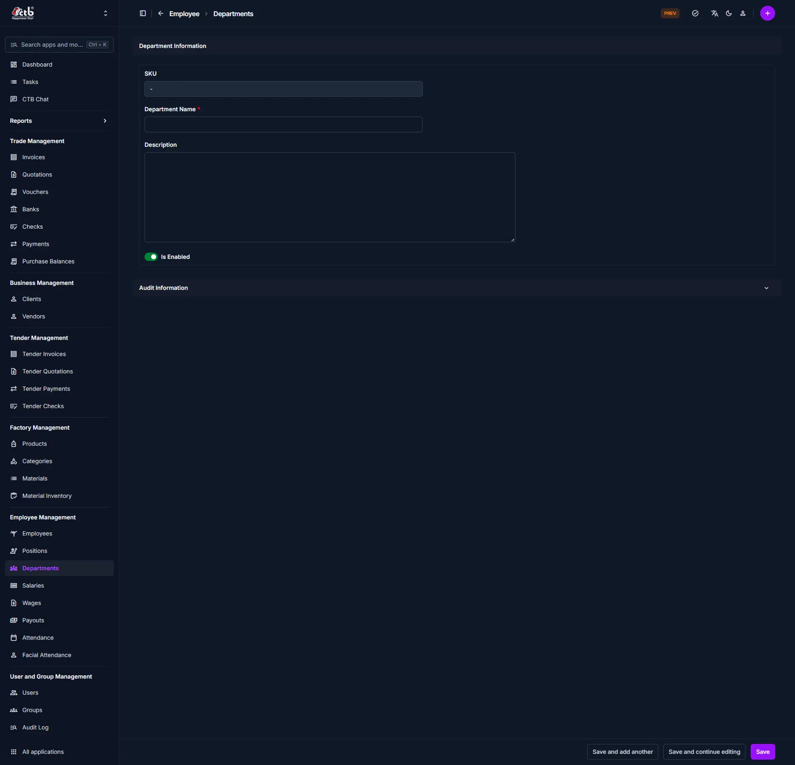

# Manage Department

<!-- metadata: owner: hr, last_updated: 2026-07-26, git_ref: main, staging_verified: true -->

## Summary

Use this page to create or update an organizational department in CTB Admin. Departments categorize employees by functional domain, facilitating team-based role management, reporting, and access control.

______________________________________________________________________

## When to use this page

- Creating a new operational department (e.g., Accounts, Sewing, Quality Control)
- Editing the display name, status, or description of an existing department
- Deactivating a department that is no longer operational

______________________________________________________________________

## How to access this page

From the sidebar, select **Employee → Departments** (`/admin/employee/workdepartment/`). Click **Add Department (+)** to create a record, or click an existing department row to edit.

______________________________________________________________________

## Prerequisites

- **Permissions:** `employee.add_workdepartment` / `employee.change_workdepartment` permission codenames (HR Manager or System Administrator role).
- **Active Records:** None.

______________________________________________________________________

## Step-by-step instructions

1. Open **Departments** from the **Employee** sidebar section.
1. Click **Add Department (+)** or select an existing department row.
1. Enter the **Department Name** and optional **Description**.
1. Set the **Is Enabled** toggle state.
1. Click **Save** to confirm changes.

______________________________________________________________________

## Verification and definition of done

- Confirmation message appears: `Work Department "Name" was added/changed successfully.`
- The department is listed under `/admin/employee/workdepartment/` and becomes selectable in employee assignment forms.

______________________________________________________________________

## Field reference

### Department information

| Step | Field           | Required | What to Do    | Description                                         |
| ---- | --------------- | -------- | ------------- | --------------------------------------------------- |
| 1    | SKU             | No       | View value    | System-generated department code                    |
| 2    | Department Name | Yes      | Enter name    | Unique name identifying the department              |
| 3    | Description     | No       | Enter text    | Detailed explanation of department responsibilities |
| 4    | Is Enabled      | Yes      | Toggle switch | Controls availability for employee assignment       |

______________________________________________________________________

## Exception handling and error recovery

| Symptom / Error Message                    | Root Cause                            | Remediation Action                                       |
| ------------------------------------------ | ------------------------------------- | -------------------------------------------------------- |
| `Department with this Name already exists` | Duplicate department name submitted   | Use a unique department name or edit the existing record |
| Cannot assign department to employee       | Department `Is Enabled` toggle is OFF | Open the department record and turn `Is Enabled` ON      |

______________________________________________________________________

## Related pages

- [Departments Overview](overview.md) — View department list and statistics
- [Manage Position](../positions/manage-position.md) — Define work positions within departments
- [Add Employee](../employees/add-employee.md) — Assign employees to departments
