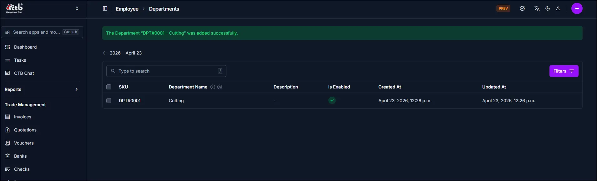

# Departments Overview

Use this page to view and manage all departments in CTB Admin. The Departments Overview lists every department record with its name, description, status, and timestamps. From here you can search for departments, add new ones, and open existing records to edit or delete them.

## When to use Departments Overview page

- Viewing all departments registered in the system
- Searching for a specific department by name
- Adding a new department to the organization
- Checking whether a department is active or disabled
- Reviewing when a department was created or last updated

## How to access this page

From the sidebar, go to **Employee Management → Departments**.

The system opens the **Departments Overview page**.

______________________________________________________________________

## Page Overview

The Departments Overview displays a list of all department records with the following columns:

| Column          | Description                                                    |
| --------------- | -------------------------------------------------------------- |
| SKU             | Auto-generated unique identifier for the department            |
| Department Name | The name of the department as entered in the system            |
| Description     | Optional description or notes about the department             |
| Is Enabled      | Green checkmark if active; empty if the department is disabled |
| Created At      | Date and time the department record was created                |
| Updated At      | Date and time the department record was last modified          |

______________________________________________________________________

## Searching for a Department

Use the **search bar** at the top of the list to filter departments by name:

1. Click the **Type to search** field
1. Enter the department name or partial name
1. The list filters in real time to show matching results

______________________________________________________________________

## Filtering the List

Click the **Filters** button in the top-right corner to narrow results by specific criteria such as status or date range.

______________________________________________________________________

## Tips and Common Issues

- **Green checkmark under Is Enabled** — Indicates the department is active and available for assignment to employees
- **Empty Is Enabled column** — The department is disabled and will not appear as a selectable option in employee records
- **Description shows a dash (-)** — No description was entered when the department was created; this field is optional
- **Success banner at the top** — Appears briefly after a department is added or updated successfully
- **SKU is auto-generated** — You do not need to enter a SKU manually; the system assigns it on creation

______________________________________________________________________

## Related Pages

- **Add Department** — Create a new department record
- **Department Detail** — View or edit an existing department
- **Employees** — Assign departments to employee profiles
- **Positions** — Manage job positions within departments
