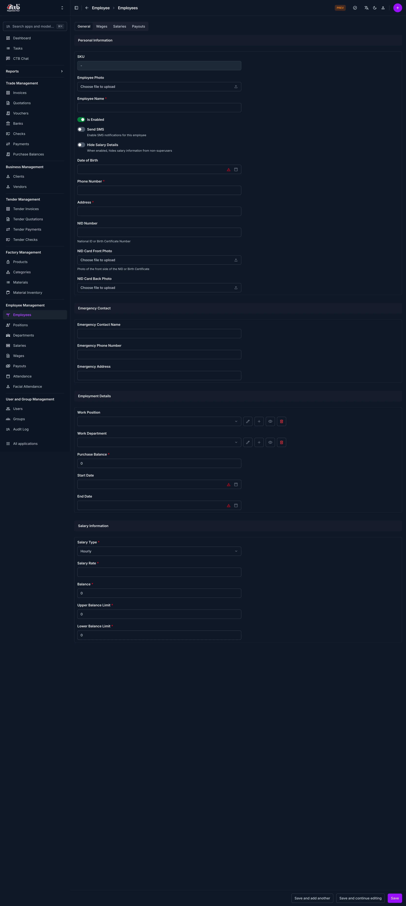

# Add Employee

Use this page to register a new employee in CTB Admin. An employee record stores personal information, emergency contact details, job assignment, and salary settings that are used for attendance, payroll, wages, and payouts.

## When to use this page

- Onboarding a new staff member before payroll starts
- Creating an employee profile before recording attendance or salary data
- Storing contact details, identity documents, and salary limits

## How to access this page

From the sidebar, go to **Employee → Employees**. On the Employees list page, click the **purple (+) icon** in the top-right corner.

The system opens the **Add Employee** page.

______________________________________________________________________

## General Information

Fill in the following fields:

| Step | Field                | What to Do                             | Description                                              |
| ---- | -------------------- | -------------------------------------- | -------------------------------------------------------- |
| 1    | SKU                  | Leave as generated                     | The system-generated employee code                       |
| 2    | Employee Photo       | Upload an image if available           | Employee profile photo used in lists and records         |
| 3    | Employee Name        | Enter the employee name                | The name used in employee records, payroll, and reports  |
| 4    | Is Enabled           | Turn ON or OFF                         | Controls whether the employee is active                  |
| 5    | Send SMS             | Enable if needed                       | Sends SMS notifications for employee-related activity    |
| 6    | Hide Salary Details  | Enable if required                     | Keeps salary information hidden in employee-facing views |
| 7    | Date of Birth        | Select the birth date                  | Used for personal records                                |
| 8    | Phone Number         | Enter the main contact number          | Primary phone number for communication                   |
| 9    | Address              | Enter the current address              | Employee location or mailing address                     |
| 10   | NID Number           | Enter the NID or identification number | Used for identity verification                           |
| 11   | NID Card Front Photo | Upload the front image                 | Front side of the employee’s NID card                    |
| 12   | NID Card Back Photo  | Upload the back image                  | Back side of the employee’s NID card                     |

!!! warning "Required Fields"
Fields marked with a **red star (\*)** are mandatory.

______________________________________________________________________

## Emergency Contact

| Step | Field                  | What to Do             | Description                         |
| ---- | ---------------------- | ---------------------- | ----------------------------------- |
| 1    | Emergency Contact Name | Enter the contact name | Person to call in case of emergency |
| 2    | Emergency Phone Number | Enter the phone number | Backup contact number               |
| 3    | Emergency Address      | Enter the address      | Emergency contact location          |

______________________________________________________________________

## Employment Details

| Step | Field            | What to Do                 | Description                                   |
| ---- | ---------------- | -------------------------- | --------------------------------------------- |
| 1    | Work Position    | Select a position          | Assigns the employee to a job role            |
| 2    | Work Department  | Select a department        | Places the employee in the correct department |
| 3    | Purchase Balance | Enter the starting balance | Used for employee purchase or ledger tracking |
| 4    | Start Date       | Select the start date      | The date the employee joined or became active |
| 5    | End Date         | Select if applicable       | Leave empty if the employee is still active   |

!!! note
The small action icons beside the position and department fields let you manage those linked records without leaving the page.

______________________________________________________________________

## Salary Information

| Step | Field               | What to Do                | Description                             |
| ---- | ------------------- | ------------------------- | --------------------------------------- |
| 1    | Salary Type         | Select the salary type    | Controls how salary is calculated       |
| 2    | Salary Rate         | Enter the rate            | Base amount used for salary calculation |
| 3    | Balance             | Enter the current balance | Current salary-related balance          |
| 4    | Upper Balance Limit | Set the maximum limit     | Highest allowed balance                 |
| 5    | Lower Balance Limit | Set the minimum limit     | Lowest allowed balance                  |

!!! warning "Required Fields"
Fields marked with a **red star (\*)** are mandatory.

______________________________________________________________________

## Saving the Employee

After completing all sections:

- Click **Save** to create the employee
- Click **Save and add another** to continue adding more employees
- Click **Save and continue editing** to save and stay on the page

______________________________________________________________________

!!! Tips and Common Issues

- Verify the **Phone Number** before enabling SMS notifications.
- Upload clear **NID images** so the record is easy to verify later.
- Leave **End Date** empty if the employee is still active.
- Review **Salary Type** and **Salary Rate** carefully before saving, because they affect payroll calculations.

______________________________________________________________________

## Related Pages

- **Edit Employee** — Update an existing employee record
- **Employee Detail** — Review the full employee profile
- **Record Attendance** — Track employee attendance
- **Generate Salary** — Create salary records for the employee
- **Create Payout** — Record employee payout transactions
