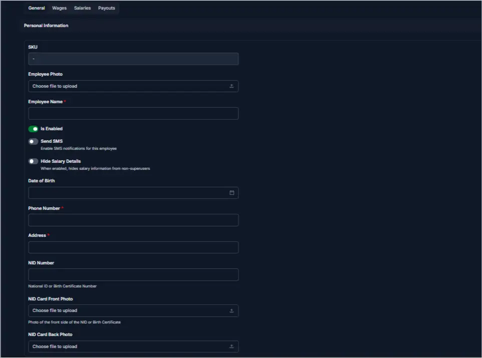
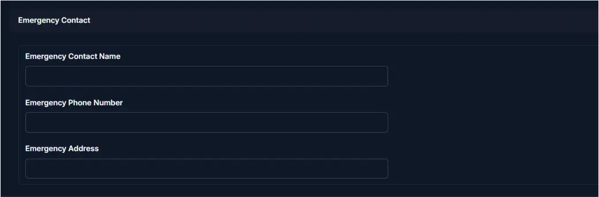
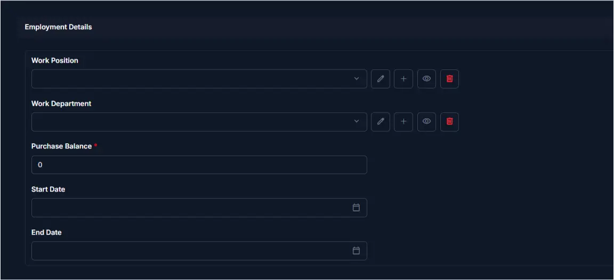
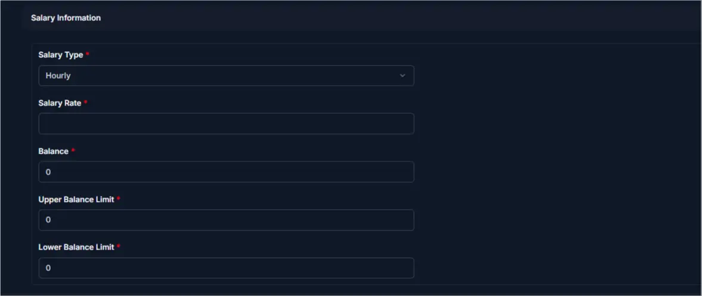

# Add Employee

<!-- metadata: owner: hr, last_updated: 2026-07-26, git_ref: main, staging_verified: true -->

## Summary

Use this page to register a new employee in CTB Admin. An employee record stores personal information, emergency contact details, job assignment, and salary settings that are used for attendance, payroll, wages, and payouts.

______________________________________________________________________

## When to use this page

- Onboarding a new staff member before payroll starts
- Creating an employee profile before recording attendance or salary data
- Storing contact details, identity documents, and salary limits

______________________________________________________________________

## How to access this page

From the sidebar, go to **Employee → Employees** (`/admin/employee/employee/`). On the Employees list page, click the **purple (+) icon** in the top-right corner.

______________________________________________________________________

## Prerequisites

- **Permissions:** `employee.add_employee` permission codename (HR Manager or Superuser role).
- **Active Records:** Active **Work Department** and **Work Position** records must exist in the system prior to employee assignment.

______________________________________________________________________

## Step-by-step instructions

1. Open **Add Employee** from the **Employee** section of the sidebar.
1. Fill in the **General information** section (name, phone, NID details).
1. Fill in the **Emergency contact** section (contact name and phone).
1. Select the **Employment details** (position, department, start date).
1. Set the **Salary information** (salary type, rate, balance limits).
1. Click **Save** to create the record, or **Save and continue editing** to stay on the page.

______________________________________________________________________

## Verification and definition of done

- System displays a confirmation alert: `Employee "Name" was added successfully.`
- The new employee appears in the **Employees** list (`/admin/employee/employee/`) with an `Enabled` status pill.
- Linked ledger records and salary calculation profiles initialize with specified starting parameters.

______________________________________________________________________

## Field reference

### General information

| Step | Field                | Required | What to Do         | Description                                                       |
| ---- | -------------------- | -------- | ------------------ | ----------------------------------------------------------------- |
| 1    | SKU                  | No       | Leave as generated | System-generated employee identification code                     |
| 2    | Employee Photo       | No       | Upload image       | Profile photo used across employee listings and detail views      |
| 3    | Employee Name        | Yes      | Enter full name    | Primary name used on payroll documents and reports                |
| 4    | Is Enabled           | Yes      | Toggle switch      | Controls whether the employee record is active                    |
| 5    | Send SMS             | No       | Toggle switch      | Enables automated SMS notifications for payouts and salary events |
| 6    | Hide Salary Details  | No       | Toggle switch      | Restricts salary information visibility in employee-facing views  |
| 7    | Date of Birth        | No       | Select date        | Birth date for personal record-keeping                            |
| 8    | Phone Number         | Yes      | Enter main phone   | Primary contact number for identity and notification lookup       |
| 9    | Address              | No       | Enter text         | Current residential address                                       |
| 10   | NID Number           | No       | Enter NID          | National identity card or passport number                         |
| 11   | NID Card Front Photo | No       | Upload image       | Front side scan or image of NID card                              |
| 12   | NID Card Back Photo  | No       | Upload image       | Back side scan or image of NID card                               |

### Emergency contact

| Step | Field                  | Required | What to Do    | Description                              |
| ---- | ---------------------- | -------- | ------------- | ---------------------------------------- |
| 1    | Emergency Contact Name | No       | Enter name    | Primary emergency contact person         |
| 2    | Emergency Phone Number | No       | Enter phone   | Primary emergency contact phone number   |
| 3    | Emergency Address      | No       | Enter address | Residential address of emergency contact |

### Employment details

| Step | Field            | Required | What to Do        | Description                                              |
| ---- | ---------------- | -------- | ----------------- | -------------------------------------------------------- |
| 1    | Work Position    | Yes      | Select position   | Job position assigned to the employee                    |
| 2    | Work Department  | Yes      | Select department | Department assignment for reporting and hierarchy        |
| 3    | Purchase Balance | No       | Enter balance     | Starting balance for internal purchase balance tracking  |
| 4    | Start Date       | Yes      | Select date       | Official employment start date                           |
| 5    | End Date         | No       | Select date       | Termination or contract end date (leave empty if active) |

### Salary information

| Step | Field               | Required | What to Do    | Description                                               |
| ---- | ------------------- | -------- | ------------- | --------------------------------------------------------- |
| 1    | Salary Type         | Yes      | Select type   | Calculation mode (`Monthly`, `Daily`, `Production-based`) |
| 2    | Salary Rate         | Yes      | Enter rate    | Base rate used for monthly or daily salary calculations   |
| 3    | Balance             | No       | Enter balance | Initial opening ledger balance                            |
| 4    | Upper Balance Limit | No       | Enter amount  | Maximum credit limit allowed for advances                 |
| 5    | Lower Balance Limit | No       | Enter amount  | Minimum threshold trigger for balance alerts              |

______________________________________________________________________

## Exception handling and error recovery

| Symptom / Error Message                          | Root Cause                                              | Remediation Action                                                        |
| ------------------------------------------------ | ------------------------------------------------------- | ------------------------------------------------------------------------- |
| `Employee with this Phone Number already exists` | Duplicate phone number entry in system database         | Verify employee identity; search existing list to avoid duplicate entries |
| `Department / Position is required`              | Form submitted without selecting position or department | Select valid options from dropdown lists before submitting                |
| `Invalid Date format`                            | Date fields typed manually in incorrect format          | Use the built-in date picker widget or format as `YYYY-MM-DD`             |

______________________________________________________________________

## Related pages

- [Edit Employee](edit-employee.md) — Update an existing employee profile
- [Employee Detail](employee-detail.md) — View full profile details and balances
- [Record Attendance](../attendance/record-attendance.md) — Log daily attendance entries
- [Generate Salary](../salary/generate-salary.md) — Process monthly or daily salary calculations
- [Create Payout](../payouts/create-payout.md) — Issue salary payouts and advances
