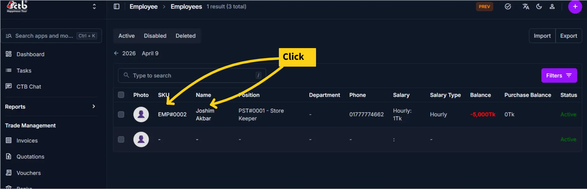
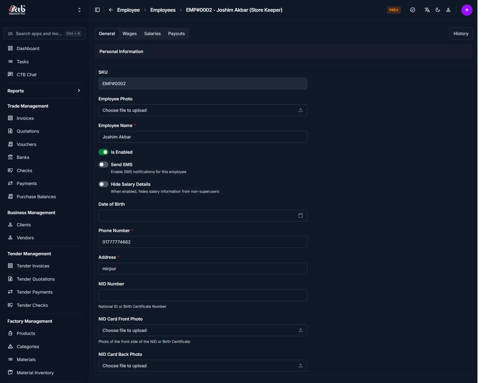
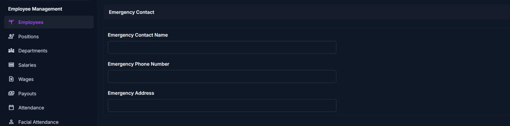
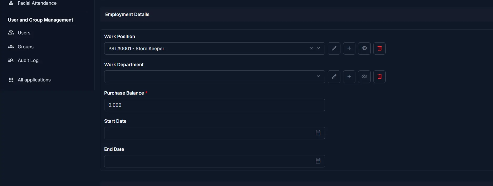
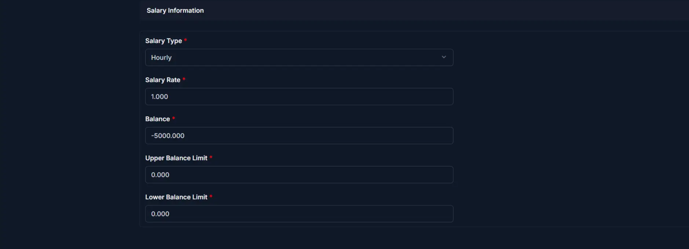

# Edit Employee

Use this page to update an existing employee’s information. The edit page contains the same core employee fields as the add page, but the values are already filled in and any changes affect attendance, payroll, wages, and payouts.

## When to use this page

- Updating employee contact or personal information
- Changing an employee’s status, position, or department
- Adjusting salary settings or balance limits
- Replacing identity documents or profile photos

## How to access this page

1. Go to **Employee → Employees** from the sidebar.
1. On the Employees list page, click the employee row or name.

The system opens the **Edit Employee** page.

______________________________________________________________________

## What’s different from Add Employee

- The fields are **pre-filled** with existing employee data.
- You are **modifying** an existing employee rather than creating a new record.
- Some values may already reflect historical payroll or attendance settings.
- Changes can affect future payroll and reporting.

______________________________________________________________________

## General Information

Update the following fields as needed:

| Field                | What you can change | Notes                                     |
| -------------------- | ------------------- | ----------------------------------------- |
| SKU                  | Read only           | System-generated employee code            |
| Employee Photo       | Replace             | Upload a new photo if needed              |
| Employee Name        | Edit                | Updates the name used across the system   |
| Is Enabled           | Toggle ON or OFF    | Disabling prevents use in new records     |
| Send SMS             | Enable or disable   | Controls notification behavior            |
| Hide Salary Details  | Enable or disable   | Hides salary information where applicable |
| Date of Birth        | Edit                | Update if the record needs correction     |
| Phone Number         | Edit                | Must be correct if SMS is enabled         |
| Address              | Edit                | Update the employee’s address             |
| NID Number           | Edit                | Used for identity verification            |
| NID Card Front Photo | Replace             | Upload an updated image if needed         |
| NID Card Back Photo  | Replace             | Upload an updated image if needed         |

______________________________________________________________________

## Emergency Contact

| Field                  | What you can change | Notes                         |
| ---------------------- | ------------------- | ----------------------------- |
| Emergency Contact Name | Edit                | Main emergency contact person |
| Emergency Phone Number | Edit                | Backup contact number         |
| Emergency Address      | Edit                | Emergency contact address     |

______________________________________________________________________

## Employment Details

| Field            | What you can change | Notes                                       |
| ---------------- | ------------------- | ------------------------------------------- |
| Work Position    | Change              | Updates the employee’s role                 |
| Work Department  | Change              | Updates the department assignment           |
| Purchase Balance | Adjust if required  | Affects employee purchase or ledger records |
| Start Date       | Edit                | Should reflect the real joining date        |
| End Date         | Set or update       | Leave empty if the employee is still active |

!!! warning

    Changing position, department, or balance-related fields can affect payroll and reporting.

______________________________________________________________________

## Salary Information

| Field               | What you can change | Notes                             |
| ------------------- | ------------------- | --------------------------------- |
| Salary Type         | Change              | Controls how salary is calculated |
| Salary Rate         | Edit                | Base rate used in payroll         |
| Balance             | Adjust if required  | Impacts salary tracking           |
| Upper Balance Limit | Modify              | Maximum allowed balance           |
| Lower Balance Limit | Modify              | Minimum allowed balance           |

______________________________________________________________________

## Saving Changes

After updating the required fields:

- Click **Save** to apply the changes
- Click **Save and add another** if you want to continue creating records
- Click **Save and continue editing** to keep working on the same employee

If your role allows it, you may also see a **Delete Employee** button.

______________________________________________________________________

## Tips and common issues

- Verify the **Phone Number** before enabling SMS notifications.
- Replace **NID images** only with clear and readable files.
- Avoid unnecessary changes to **Balance**, because it can affect financial reports.
- Use **End Date** only when the employee is no longer active.

______________________________________________________________________

## Related Pages

- **Add Employee** — Create a new employee record
- **Employee Detail** — Review the full employee profile
- **Generate Salary** — Create salary records for the employee
- **Record Attendance** — Track attendance for the employee
