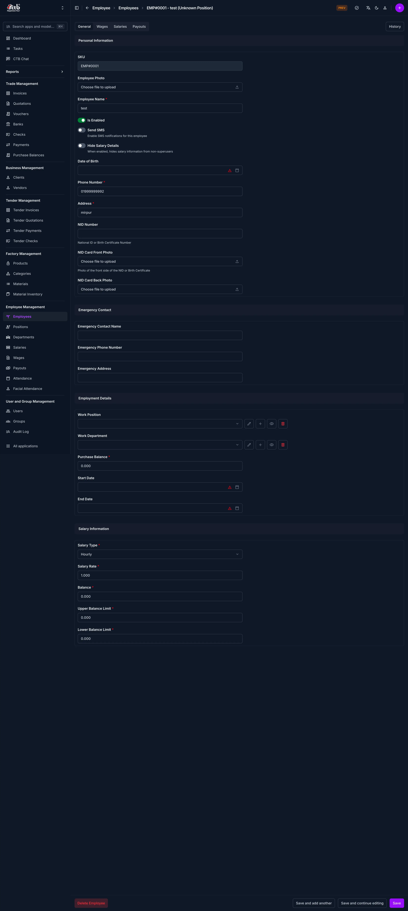
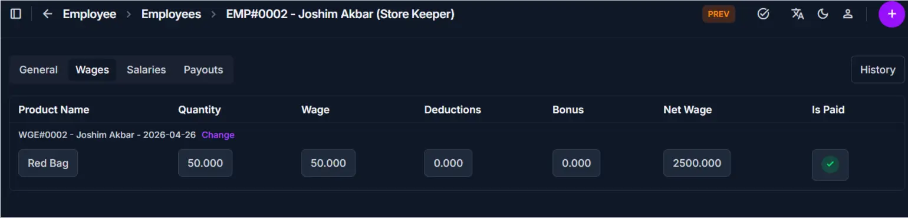
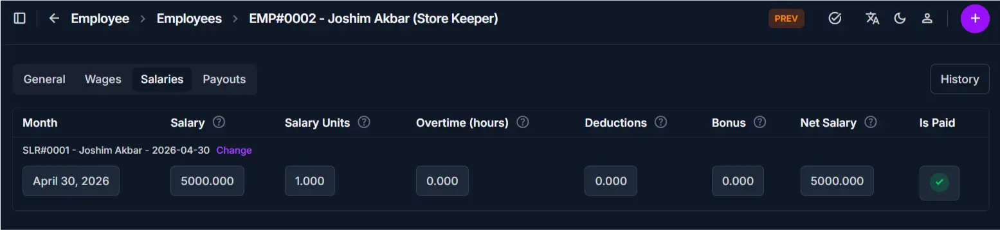
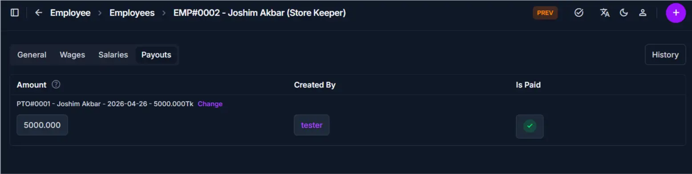

# Employee Detail

<!-- metadata: owner: hr, last_updated: 2026-07-26, git_ref: main, staging_verified: true -->

## Summary

Use this page to review an employee's comprehensive 360-degree profile. The detail view consolidates general personal information, employment assignment, salary configuration, wage history, generated salary vouchers, and payout records.

______________________________________________________________________

## When to use this page

- Reviewing complete employee profile details prior to monthly payroll processing
- Auditing employee balance limits, contact info, and identity document uploads
- Inspecting linked wages, salary generation vouchers, and payout payment histories

______________________________________________________________________

## How to access this page

1. Go to **Employee → Employees** (`/admin/employee/employee/`) from the sidebar.
1. Click the employee SKU or name on the list page.

______________________________________________________________________

## Prerequisites

- **Permissions:** `employee.view_employee` permission codename (HR staff, Accountant, or Superuser role).
- **Active Records:** Selected employee record must exist in the system.

______________________________________________________________________

## Step-by-step instructions

1. Open the **Employees** list from the sidebar.
1. Click the target employee row to open **Employee Detail**.
1. Use the top tab navigation bar (**General**, **Wages**, **Salaries**, **Payouts**) to inspect specific operational records.
1. Click **Edit Employee** in the upper right header to make any profile modifications.

______________________________________________________________________

## Verification and definition of done

- All tab panels load completely with verified historical records and current balances.
- Summary balance figures accurately reflect approved salary vouchers and payouts.

______________________________________________________________________

## Field reference

### General tab

| Field               | Required | What to Do  | Description                                               |
| ------------------- | -------- | ----------- | --------------------------------------------------------- |
| SKU                 | No       | View value  | System-generated unique employee identifier code          |
| Employee Photo      | No       | View image  | Profile avatar image                                      |
| Employee Name       | Yes      | View value  | Display name used in reports and documents                |
| Is Enabled          | Yes      | View status | Indicates whether employee is currently active            |
| Send SMS            | No       | View status | SMS notification setting                                  |
| Hide Salary Details | No       | View status | Privacy setting for salary rate visibility                |
| Date of Birth       | No       | View value  | Employee date of birth                                    |
| Phone Number        | Yes      | View value  | Primary contact phone number                              |
| Address             | No       | View value  | Residential address                                       |
| NID Number          | No       | View value  | National ID card or document number                       |
| Work Position       | Yes      | View value  | Assigned job role                                         |
| Work Department     | Yes      | View value  | Assigned organizational department                        |
| Purchase Balance    | No       | View value  | Current employee purchase ledger balance                  |
| Start Date          | Yes      | View value  | Official employment start date                            |
| Salary Type         | Yes      | View value  | Salary structure (`Monthly`, `Daily`, `Production-based`) |
| Salary Rate         | Yes      | View value  | Base salary rate                                          |
| Balance             | No       | View value  | Net ledger balance                                        |
| Upper Balance Limit | No       | View value  | Maximum credit limit                                      |
| Lower Balance Limit | No       | View value  | Minimum credit alert limit                                |

### Related tabs

- **Wages:** Lists historical wage entries, worked days/hours, and approved wage vouchers.
- **Salaries:** Displays generated monthly/daily salary calculation vouchers and Payout status.
- **Payouts:** Tracks advance payments, salary Payouts, and settlement transactions.

______________________________________________________________________

## Exception handling and error recovery

| Symptom / Error Message       | Root Cause                                                      | Remediation Action                                                         |
| ----------------------------- | --------------------------------------------------------------- | -------------------------------------------------------------------------- |
| Salary fields hidden or blank | `Hide Salary Details` is active or user lacks salary permission | Disable option on profile or request salary viewing permissions            |
| Tab entries missing           | No historical wage or salary records exist for this employee    | Create initial attendance or wage entries before expecting records in tabs |

______________________________________________________________________

## Related pages

- [Add Employee](add-employee.md) — Register a new employee record
- [Edit Employee](edit-employee.md) — Update profile details or rates
- [Record Attendance](../attendance/record-attendance.md) — Log daily attendance entries
- [Generate Salary](../salary/generate-salary.md) — Run salary calculations
