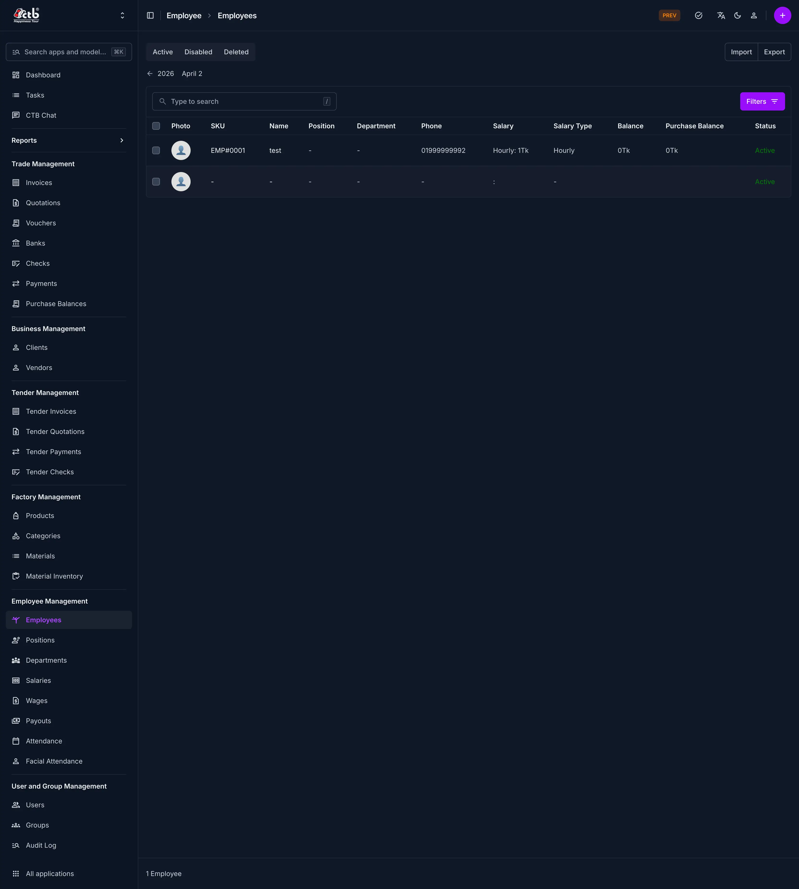

# Employees Overview

<!-- metadata: owner: hr, last_updated: 2026-07-26, git_ref: main, staging_verified: true -->

## Summary

Use the **Employees Overview** section to manage all staff profiles, track employee attributes, filter by employment status, and access linked payroll, attendance, and wage records.

______________________________________________________________________

## When to use this page

- Inspecting the master employee directory across all departments
- Searching for specific staff members by name, SKU, or phone number
- Filtering employees by active, disabled, or deleted states
- Performing bulk import or export operations for HR and payroll reporting

______________________________________________________________________

## How to access this page

From the sidebar navigation, select **Employee → Employees** (`/admin/employee/employee/`).

______________________________________________________________________

## Prerequisites

- **Permissions:** `employee.view_employee` permission codename (HR, Accountant, Manager, or Superuser role).
- **Active Records:** Active **Work Department** and **Work Position** definitions.

______________________________________________________________________

## Step-by-step instructions

1. Open **Employees** from the **Employee** section of the sidebar.
1. Filter the listing using the **Active**, **Disabled**, or **Deleted** tabs.
1. Use the search bar to locate specific staff members by SKU or name.
1. Click any employee SKU or row to open the full detail view or edit form.
1. Click **Import** or **Export** in the header to execute bulk data procedures.

______________________________________________________________________

## Verification and definition of done

- Master list correctly renders employee records with real-time status pills.
- Search query instantly filters rows matching SKU or name.
- Balance figures accurately indicate active ledger status.

______________________________________________________________________

## Field reference

### Table summary

| Column           | Required | What to Do     | Description                                                     |
| ---------------- | -------- | -------------- | --------------------------------------------------------------- |
| Photo            | No       | View thumbnail | Profile avatar photo                                            |
| SKU              | Yes      | Click link     | Unique identifier code (e.g., `EMP#0002`)                       |
| Name             | Yes      | Click link     | Full employee display name                                      |
| Position         | Yes      | View value     | Assigned job position                                           |
| Department       | Yes      | View value     | Assigned work department                                        |
| Phone            | Yes      | View value     | Primary contact phone number                                    |
| Salary           | Yes      | View value     | Salary rate and compensation structure                          |
| Salary Type      | Yes      | View value     | Compensation structure (`Monthly`, `Daily`, `Production-based`) |
| Balance          | No       | View value     | Net ledger balance (negative values highlighted in red)         |
| Purchase Balance | No       | View value     | Outstanding purchase balance                                    |
| Status           | Yes      | View pill      | Current record state (`Active`, `Disabled`, `Deleted`)          |

### Status tabs

| Tab      | Description                                               |
| -------- | --------------------------------------------------------- |
| Active   | Employees currently working and active in the system      |
| Disabled | Deactivated employees excluded from active processing     |
| Deleted  | Soft-deleted employee records preserved for audit history |

______________________________________________________________________

## Exception handling and error recovery

| Symptom / Error Message             | Root Cause                                                      | Remediation Action                                                            |
| ----------------------------------- | --------------------------------------------------------------- | ----------------------------------------------------------------------------- |
| Negative balance highlighted in red | Advance payouts or unpaid deductions exceed salary balance      | Reconcile payouts and salary vouchers under Employee Detail                   |
| Search returns no results           | Search term typo or active filter tab excluding target employee | Clear search input and verify across `Active`, `Disabled`, and `Deleted` tabs |

______________________________________________________________________

## Related pages

- [Add Employee](add-employee.md) — Register a new employee record
- [Edit Employee](edit-employee.md) — Update an existing employee profile
- [Employee Detail](employee-detail.md) — Review full employee history and profile tabs
- [Departments](../departments/manage-department.md) — Manage department hierarchy
- [Positions](../positions/manage-position.md) — Manage job position titles
