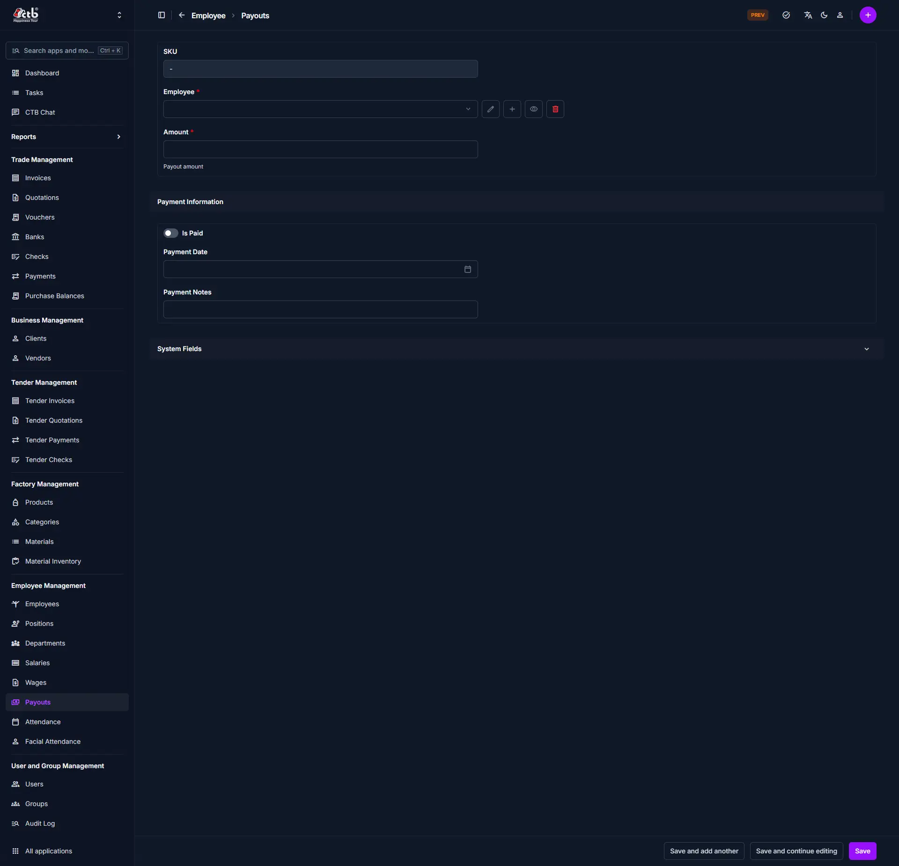

# Create Payout

<!-- metadata: owner: hr, last_updated: 2026-07-26, git_ref: main, staging_verified: true -->

## Summary

Use this page to issue salary Payouts, wage settlements, or advances to an employee in CTB Admin. Creating a payout updates the employee's net ledger balance and maintains audit trails for financial reconciliation.

______________________________________________________________________

## When to use this page

- Disbursing salary or wage payments to employees
- Issuing salary advances prior to regular monthly payroll runs
- Recording one-off bonus or adjustment payouts
- Documenting cash or bank transfer payment execution dates

______________________________________________________________________

## How to access this page

From the sidebar navigation, select **Employee → Payouts** (`/admin/employee/employeepayout/`). Click **Add Employee Payout (+)** in the top-right corner.

______________________________________________________________________

## Prerequisites

- **Permissions:** `employee.add_employeepayout` permission codename (HR Staff, Accountant, or Superuser role).
- **Active Records:** Active **Employee** profile.

______________________________________________________________________

## Step-by-step instructions

1. Open **Employee → Payouts** and click **(+) Add Employee Payout**.
1. Select the target **Employee**.
1. Enter the payout **Amount** in local currency.
1. Toggle **Is Paid** status if the payment is disbursed.
1. Select the **Payment Date** (`YYYY-MM-DD`).
1. Enter optional internal explanation in **Note**.
1. Click **Save** to confirm the transaction.

______________________________________________________________________

## Verification and definition of done

- System generates a unique payout SKU code (`PYT-YYYYMMDD-XXXX`).
- Payout transaction appears under `/admin/employee/employeepayout/`.
- Employee's net ledger balance updates automatically to reflect the payout Payout.

______________________________________________________________________

## Field reference

### Payout information

| Step | Field        | Required    | What to Do      | Description                                  |
| ---- | ------------ | ----------- | --------------- | -------------------------------------------- |
| 1    | Employee     | Yes         | Select employee | Staff member receiving payout                |
| 2    | Amount       | Yes         | Enter amount    | Disbursed payout amount                      |
| 3    | Payable      | No          | Read-only       | Auto-calculated payable amount               |
| 4    | Is Paid      | Yes         | Toggle switch   | Indicates whether payment was disbursed      |
| 5    | Payment Date | Conditional | Select date     | Payment date (required when `Is Paid` is ON) |
| 6    | Note         | No          | Enter text      | Explanation or reference notes               |

______________________________________________________________________

## Exception handling and error recovery

| Symptom / Error Message                         | Root Cause                                              | Remediation Action                          |
| ----------------------------------------------- | ------------------------------------------------------- | ------------------------------------------- |
| `Payment Date is required when Is Paid is true` | Form submitted with `Is Paid` toggled on without a date | Select transaction date in **Payment Date** |
| `Amount must be greater than 0`                 | Zero or negative payout amount entered                  | Enter a positive payment value              |

______________________________________________________________________

## Related pages

- [Payouts Overview](overview.md) — View master payout transactions list
- [Employee Detail](../employees/employee-detail.md) — Inspect employee ledger and payout history tab
- [Generate Salary](../salary/generate-salary.md) — Run salary calculations
