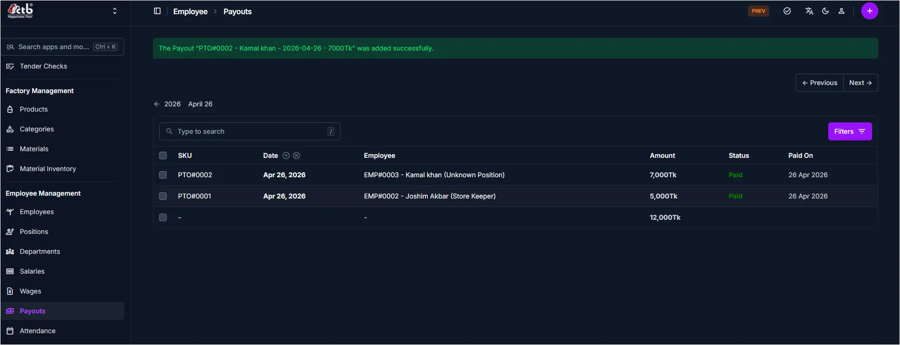

# Payouts Overview

<!-- metadata: owner: hr, last_updated: 2026-07-26, git_ref: main, staging_verified: true -->

## Summary

Use the **Payouts Overview** page to inspect and track all employee payout Payouts in CTB Admin. The listing provides a master audit view of advance payments, wage settlements, salary payouts, Payout dates, and status pills.

______________________________________________________________________

## When to use this page

- Auditing employee payout Payouts across the organization
- Filtering payout vouchers by status (`Paid` vs `Unpaid`)
- Searching for specific employee payout transactions by SKU or name
- Accessing payout creation forms

______________________________________________________________________

## How to access this page

From the sidebar navigation, select **Employee → Payouts** (`/admin/employee/employeepayout/`).

______________________________________________________________________

## Prerequisites

- **Permissions:** `employee.view_employeepayout` permission codename (HR, Accountant, Manager, or Superuser role).
- **Active Records:** None.

______________________________________________________________________

## Step-by-step instructions

1. Open **Payouts** from the **Employee** section of the sidebar.
1. Review listed payout vouchers and their payment status pills (`Paid` / `Unpaid`).
1. Use the search bar to locate vouchers by employee name or SKU.
1. Click **Filters** to narrow results by date range or payment status.
1. Click **Add Employee Payout (+)** to record a new payout.

______________________________________________________________________

## Verification and definition of done

- Master payout list correctly displays Payout amounts and settlement status badges.
- Search and status filters accurately isolate target vouchers for financial auditing.

______________________________________________________________________

## Field reference

### Table summary

| Column   | Required | What to Do  | Description                                     |
| -------- | -------- | ----------- | ----------------------------------------------- |
| SKU      | No       | View value  | Unique payout reference code (e.g., `PTO#0002`) |
| Date     | Yes      | View date   | Payout record date                              |
| Employee | Yes      | Click link  | Employee name and position                      |
| Amount   | Yes      | View amount | Payout transaction amount                       |
| Status   | Yes      | View pill   | Settlement state (`Paid` or `Unpaid`)           |
| Paid On  | No       | View date   | Payout payment timestamp                        |

______________________________________________________________________

## Exception handling and error recovery

| Symptom / Error Message                        | Root Cause                                         | Remediation Action                                                                        |
| ---------------------------------------------- | -------------------------------------------------- | ----------------------------------------------------------------------------------------- |
| Payout record missing from list                | Date range or status filter excluding target entry | Click **Filters** and reset filter parameters                                             |
| Payment status shows `Unpaid` for paid voucher | `Is Paid` toggle was not saved                     | Open record in [Create Payout](create-payout.md), toggle `Is Paid` ON, set date, and save |

______________________________________________________________________

## Related pages

- [Create Payout](create-payout.md) — Issue a new employee payout or advance
- [Salaries Overview](../salary/overview.md) — Review salary vouchers
- [Employee Detail](../employees/employee-detail.md) — View employee balance and payout history tab
