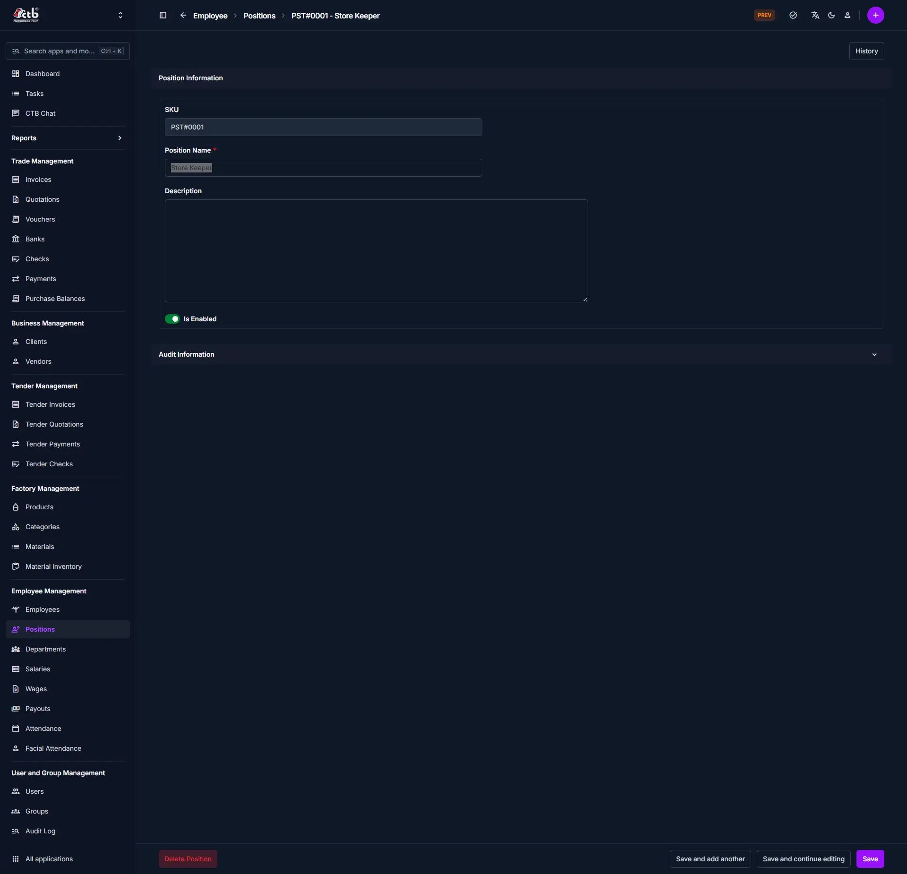

# Manage Position

## Summary

Use this page to add or edit a position within your organization. Positions define the job roles or titles held by employees, making it easier to manage responsibilities, reporting structures, and workforce organization.

______________________________________________________________________

## When to use this page

- Creating a new job position for your organization
- Editing the name, description, or status of an existing position
- Disabling or enabling a position as business needs change
- Reviewing audit information for compliance and change tracking

______________________________________________________________________

## How to access this page

From the sidebar, go to **Employee → Positions**. On the Positions List page, click the **purple (+) icon** in the top-right corner to add a new position, or select an existing position to edit.

The system opens the **Manage Position** page.

______________________________________________________________________

## Step-by-step instructions

1. Open **Manage Position** from the **Employee** section of the sidebar.
1. Complete the **Position information** section described below.
1. Follow **Saving the Position** below to finish.

______________________________________________________________________

## Field reference

### Position information

Fill in the following fields in the Position Information section:

| Field            | What to Do     | Description                                                       |
| ---------------- | -------------- | ----------------------------------------------------------------- |
| SKU              | Auto-generated | System-generated unique identifier for the position (read-only)   |
| Position Name \* | Enter name     | The official title or name of the position (required)             |
| Description      | Enter text     | Optional details about the position's responsibilities or purpose |
| Is Enabled       | Toggle on/off  | Set whether the position is active and available for assignment   |

!!! warning "Required Fields"

    Fields marked with a **red star (\*)** are mandatory.

______________________________________________________________________

## Audit information

The **Audit Information** section displays system-generated details about who created or last modified the position record. Click the section header to expand it. This section is read-only and helps with compliance and change tracking.

______________________________________________________________________

## Saving the Position

After completing all fields:

- Click **Save** to create or update the position
- Click **Save and continue editing** to save and remain on the page
- Click **Save and add another** to save and immediately add a new position

The position will now be available for employee assignment and reporting.

______________________________________________________________________

## Deleting a Position

A **Delete Position** button is available at the bottom-left of the page.

!!! warning "Restricted Action"

    A position can only be deleted if no employees are currently assigned to it. If the position is in use, remove the assignment from the relevant employee records first before attempting to delete.

______________________________________________________________________

## Tips and common issues

- **Position Name is required** — You must enter a unique name before saving
- **Is Enabled controls availability** — Only enabled positions can be assigned to employees
- **Use Description for clarity** — Add details to help others understand the role's responsibilities
- **History button** — Use the **History** button in the top-right corner to review all past changes made to this position record
- **SKU is auto-generated** — The system assigns a unique SKU on creation; you do not need to enter it manually

______________________________________________________________________

## Related pages

- **Positions Overview** — View and manage all positions in the system
- **Employees** — Assign positions to employee profiles
- **Departments** — Manage the departments positions belong to
- **Audit Log** — Review all changes made to position records
