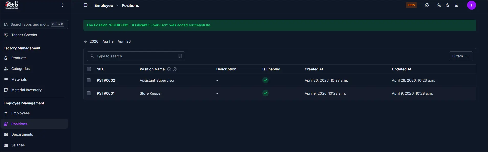

# Positions Overview

<!-- metadata: owner: hr, last_updated: 2026-07-26, git_ref: main, staging_verified: true -->

## Summary

Use the **Positions Overview** page to inspect and manage all job titles defined in CTB Admin. The listing provides a centralized view of position identifiers, titles, descriptions, and activation states.

______________________________________________________________________

## When to use this page

- Reviewing all job positions registered across the company
- Searching for specific positions by SKU or title
- Inspecting active/disabled status before assigning positions to staff
- Accessing position creation and management forms

______________________________________________________________________

## How to access this page

From the sidebar navigation, select **Employee → Positions** (`/admin/employee/workposition/`).

______________________________________________________________________

## Prerequisites

- **Permissions:** `employee.view_workposition` permission codename (HR, Accountant, Manager, or Superuser role).
- **Active Records:** None.

______________________________________________________________________

## Step-by-step instructions

1. Open **Positions** from the **Employee** section of the sidebar.
1. Review the listed position records and their **Is Enabled** checkmarks.
1. Use the search bar to filter positions by title or SKU.
1. Click **Add Position (+)** to create a new position, or select an existing row to edit details.

______________________________________________________________________

## Verification and definition of done

- Master position directory displays all configured job titles with accurate status indicators.
- Real-time search filters matching position rows instantaneously.

______________________________________________________________________

## Field reference

### Table summary

| Column        | Required | What to Do     | Description                                  |
| ------------- | -------- | -------------- | -------------------------------------------- |
| SKU           | No       | View value     | Unique identifier code (e.g., `PST#0001`)    |
| Position Name | Yes      | Click link     | Official job title                           |
| Description   | No       | View text      | Additional role responsibilities             |
| Is Enabled    | Yes      | View checkmark | Green checkmark if active; empty if disabled |
| Created At    | No       | View timestamp | Creation date and time                       |
| Updated At    | No       | View timestamp | Last modification date and time              |

______________________________________________________________________

## Exception handling and error recovery

| Symptom / Error Message               | Root Cause                                   | Remediation Action                                           |
| ------------------------------------- | -------------------------------------------- | ------------------------------------------------------------ |
| Position not visible in employee form | Position is disabled (`Is Enabled` is false) | Enable the position in [Manage Position](manage-position.md) |
| Search returns no positions           | Search query mismatch or filter restriction  | Clear search query and reset filters                         |

______________________________________________________________________

## Related pages

- [Manage Position](manage-position.md) — Create or update position titles
- [Departments Overview](../departments/overview.md) — Manage organizational departments
- [Employees Overview](../employees/overview.md) — Assign positions to employees
