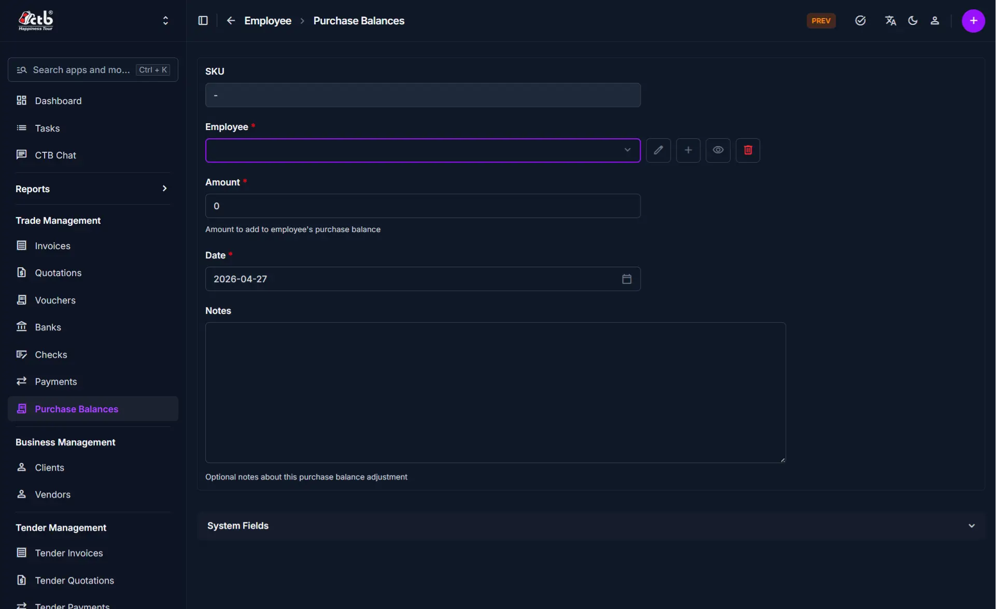

# Add Purchase Balance

<!-- metadata: owner: hr, last_updated: 2026-07-26, git_ref: main, staging_verified: true -->

## Summary

Use this page to record or adjust an employee's purchase balance in CTB Admin. Purchase balances track financial obligations, advances, store purchases, or adjustments between the company and staff members.

______________________________________________________________________

## When to use this page

- Logging employee advances or credit purchases made on company account
- Adjusting an employee's running purchase balance
- Documenting internal store purchases deducted from salary payouts

______________________________________________________________________

## How to access this page

From the sidebar navigation, select **Employee → Purchase Balances** (`/admin/employee/employeepurchasebalance/`). Click **Add Purchase Balance (+)** in the top-right corner.

______________________________________________________________________

## Prerequisites

- **Permissions:** `employee.add_employeepurchasebalance` permission codename (HR Staff, Accountant, or Superuser role).
- **Active Records:** Active **Employee** profile.

______________________________________________________________________

## Step-by-step instructions

1. Open **Purchase Balances** from the **Employee** section of the sidebar.
1. Click **Add Purchase Balance (+)**.
1. Select the target **Employee**.
1. Enter the balance **Amount** (positive for amount owed by employee).
1. Select the transaction **Date** (`YYYY-MM-DD`).
1. Enter optional explanation in **Notes**.
1. Click **Save** to confirm the record.

______________________________________________________________________

## Verification and definition of done

- System generates a unique purchase balance SKU (`PBAL-YYYYMMDD-XXXX`).
- Record appears under `/admin/employee/employeepurchasebalance/` and updates the employee's running purchase balance total.

______________________________________________________________________

## Field reference

### General information

| Step | Field    | Required | What to Do      | Description                               |
| ---- | -------- | -------- | --------------- | ----------------------------------------- |
| 1    | SKU      | No       | Read-only       | System-generated tracking identifier      |
| 2    | Employee | Yes      | Select employee | Target staff member                       |
| 3    | Amount   | Yes      | Enter amount    | Balance amount (positive = owed by staff) |
| 4    | Date     | Yes      | Select date     | Entry date (`YYYY-MM-DD`)                 |
| 5    | Notes    | No       | Enter text      | Internal explanation or reference notes   |

______________________________________________________________________

## Exception handling and error recovery

| Symptom / Error Message         | Root Cause                                   | Remediation Action                          |
| ------------------------------- | -------------------------------------------- | ------------------------------------------- |
| `Employee is required`          | Form submitted without selecting an employee | Select a valid employee from dropdown       |
| `Amount must be a valid number` | Non-numeric or invalid amount entered        | Enter a valid monetary number in **Amount** |

______________________________________________________________________

## Related pages

- [Purchase Balances Overview](overview.md) — View master list of purchase balances
- [Employee Detail](../employees/employee-detail.md) — Inspect employee profile purchase ledger
- [Create Payout](../payouts/create-payout.md) — Settle or process payouts
