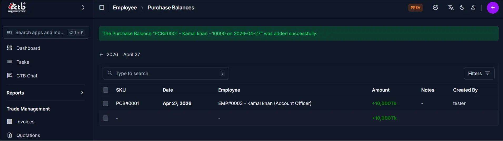

# Purchase Balances Overview

<!-- metadata: owner: hr, last_updated: 2026-07-26, git_ref: main, staging_verified: true -->

## Summary

Use the **Purchase Balances Overview** page to track and audit financial transactions between the company and employees in CTB Admin. The listing provides a real-time record of staff advance balances, loan ledgers, and purchase adjustments.

______________________________________________________________________

## When to use this page

- Auditing employee advances, credit purchases, and loan balances
- Searching for specific staff purchase ledgers by employee name or SKU
- Filtering purchase balances by transaction date range
- Accessing new purchase balance creation forms

______________________________________________________________________

## How to access this page

From the sidebar navigation, select **Employee → Purchase Balances** (`/admin/employee/employeepurchasebalance/`).

______________________________________________________________________

## Prerequisites

- **Permissions:** `employee.view_employeepurchasebalance` permission codename (HR, Accountant, Manager, or Superuser role).
- **Active Records:** Active **Employee** profiles.

______________________________________________________________________

## Step-by-step instructions

1. Open **Purchase Balances** from the **Employee** section of the sidebar.
1. Review the list of recorded purchase balances and amounts.
1. Use the search bar to locate records by employee name or SKU.
1. Click **Filters** to narrow results by transaction date range or amount.
1. Click **Add Purchase Balance (+)** to record a new transaction.

______________________________________________________________________

## Verification and definition of done

- Master list correctly displays purchase balance vouchers with accurate amount direction indicators.
- Filter criteria isolate transactions by specified date range and employee.

______________________________________________________________________

## Field reference

### Table summary

| Column     | Required | What to Do  | Description                                                         |
| ---------- | -------- | ----------- | ------------------------------------------------------------------- |
| SKU        | No       | View value  | Unique purchase balance tracking code (e.g., `PCB#0001`)            |
| Date       | Yes      | View date   | Transaction date                                                    |
| Employee   | Yes      | Click link  | Employee name and ID                                                |
| Amount     | Yes      | View amount | Balance amount (positive = owed by staff; negative = owed to staff) |
| Notes      | No       | View text   | Internal explanation or memo                                        |
| Created By | No       | View user   | Username of user who recorded entry                                 |

______________________________________________________________________

## Exception handling and error recovery

| Symptom / Error Message           | Root Cause                                    | Remediation Action                                                                       |
| --------------------------------- | --------------------------------------------- | ---------------------------------------------------------------------------------------- |
| Expected purchase balance missing | Active date filter excluding transaction date | Click **Filters** and widen or reset date range                                          |
| Balance direction reversed        | Incorrect positive/negative sign entered      | Edit record under [Add Purchase Balance](add-purchase-balance.md) to correct amount sign |

______________________________________________________________________

## Related pages

- [Add Purchase Balance](add-purchase-balance.md) — Record a new purchase balance or advance
- [Employees Overview](../employees/overview.md) — Inspect employee profile purchase ledger
- [Create Payout](../payouts/create-payout.md) — Process payout settlements
