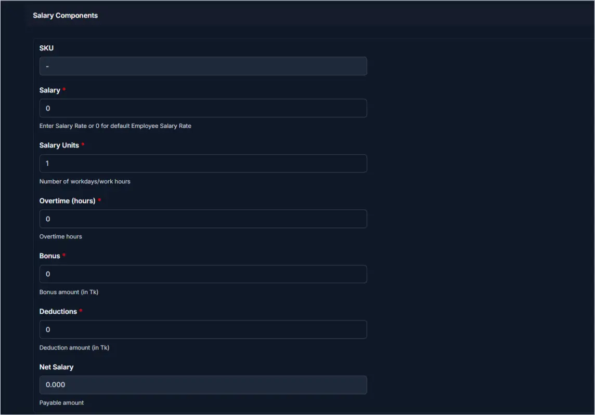
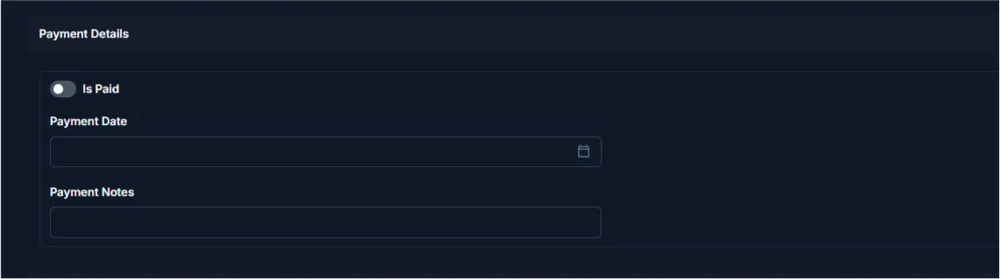

# Generate Salary

<!-- metadata: owner: hr, last_updated: 2026-07-26, git_ref: main, staging_verified: true -->

## Summary

Use this page to generate monthly salary records for staff in CTB Admin. A salary entry computes total compensation by combining base salary rate, attended work units, overtime hours, bonuses, and deductions into a net payable amount.

______________________________________________________________________

## When to use this page

- Generating individual or monthly payroll records for factory and office personnel
- Computing net compensation incorporating overtime, performance bonuses, or tardiness deductions
- Logging monthly salary payment execution dates and reference transaction numbers
- Maintaining audit history for monthly payroll payouts

______________________________________________________________________

## How to access this page

From the sidebar navigation, select **Employee → Salaries** (`/admin/employee/salary/`). Click **Add Salary (+)** in the top-right corner.

______________________________________________________________________

## Prerequisites

- **Permissions:** `employee.add_salary` / `employee.change_salary` permission codenames (HR Manager, Accountant, or Superuser role).
- **Active Records:** Active **Employee** profile with verified monthly attendance logs.

______________________________________________________________________

## Step-by-step instructions

1. Open **Employee → Salaries** and click **(+) Add Salary**.
1. Select the target **Employee** from the dropdown menu.
1. Select the billing **Month** date (`YYYY-MM-DD`).
1. Enter the base **Salary** rate (or enter `0` to apply profile default rate).
1. Specify **Salary Units** (number of attended workdays or billable hours).
1. Input total **Overtime (hours)** worked during the period.
1. Enter any **Bonus** or **Deductions** in local currency.
1. Review the auto-calculated **Net Salary**.
1. If paying immediately, toggle **Is Paid** to ON and set **Payment Date**.
1. Click **Save** to generate the salary record.

______________________________________________________________________

## Verification and definition of done

- System generates a unique salary SKU (`SLR-YYYYMMDD-XXXX`).
- Net Salary computes via formula: `(Salary Rate * Units) + Overtime + Bonus - Deductions`.
- The salary voucher appears under `/admin/employee/salary/` and updates the employee payout ledger.

______________________________________________________________________

## Field reference

### General information

| Step | Field    | Required | What to Do      | Description                       |
| ---- | -------- | -------- | --------------- | --------------------------------- |
| 1    | SKU      | No       | Read-only       | System-generated tracking SKU     |
| 2    | Employee | Yes      | Select employee | Target staff member for payroll   |
| 3    | Month    | Yes      | Select date     | Billing month date (`YYYY-MM-DD`) |

### Component details

| Step | Field            | Required | What to Do   | Description                                        |
| ---- | ---------------- | -------- | ------------ | -------------------------------------------------- |
| 1    | Salary           | Yes      | Enter rate   | Period salary rate (enter `0` for profile default) |
| 2    | Salary Units     | Yes      | Enter number | Attended days or work hours                        |
| 3    | Overtime (hours) | No       | Enter hours  | Overtime hours worked                              |
| 4    | Bonus            | No       | Enter amount | Incentive bonus added to base pay                  |
| 5    | Deductions       | No       | Enter amount | Deductions for absences or loans                   |
| 6    | Net Salary       | No       | Read-only    | Final computed net payable compensation            |

### Payment details

| Step | Field         | Required    | What to Do    | Description                                                 |
| ---- | ------------- | ----------- | ------------- | ----------------------------------------------------------- |
| 1    | Is Paid       | No          | Toggle switch | Settlement flag                                             |
| 2    | Payment Date  | Conditional | Select date   | Date salary was transferred (required if `Is Paid` is True) |
| 3    | Payment Notes | No          | Enter text    | Transaction memo or reference                               |

______________________________________________________________________

## Exception handling and error recovery

| Symptom / Error Message                                    | Root Cause                                                                 | Remediation Action                                                          |
| ---------------------------------------------------------- | -------------------------------------------------------------------------- | --------------------------------------------------------------------------- |
| `Salary record for this employee and month already exists` | Unique constraint (`employee`, `month`) prevents duplicate monthly records | Edit existing monthly salary voucher under [Salaries Overview](overview.md) |
| `Payment Date is required when Is Paid is true`            | `Is Paid` enabled without a payment date                                   | Enter transaction date in **Payment Date** before saving                    |
| Net Salary negative                                        | Deductions exceed base salary plus overtime and bonus                      | Adjust deduction amount to ensure non-negative net balance                  |

______________________________________________________________________

## Related pages

- [Salaries Overview](overview.md) — View master salary vouchers list
- [Record Attendance](../attendance/record-attendance.md) — Audit monthly attendance units
- [Create Payout](../payouts/create-payout.md) — Disburse salary payments
