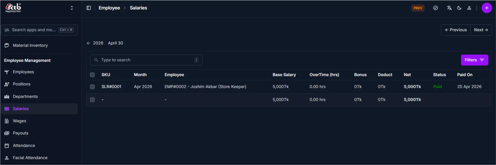

# Salaries Overview

<!-- metadata: owner: hr, last_updated: 2026-07-26, git_ref: main, staging_verified: true -->

## Summary

Use the **Salaries Overview** page to inspect and audit monthly payroll records in CTB Admin. The listing provides a master summary of base salaries, overtime hours, bonuses, deductions, net compensation amounts, and payment status badges.

______________________________________________________________________

## When to use this page

- Auditing monthly payroll vouchers before Payout
- Filtering salary records by coverage month or settlement status
- Searching for specific employee salary vouchers by SKU or name
- Accessing individual salary detail views and generation forms

______________________________________________________________________

## How to access this page

From the sidebar navigation, select **Employee → Salaries** (`/admin/employee/salary/`).

______________________________________________________________________

## Prerequisites

- **Permissions:** `employee.view_salary` permission codename (HR Manager, Accountant, or Superuser role).
- **Active Records:** Active **Employee** profiles.

______________________________________________________________________

## Step-by-step instructions

1. Open **Salaries** from the **Employee** section of the sidebar.
1. Review the list of monthly salary records and payment status pills (`Paid` / `Unpaid`).
1. Use the search bar to locate records by employee name or SKU.
1. Click **Filters** to narrow results by month date range or payment status.
1. Click **Add Salary (+)** to create a new salary voucher, or select a row to view details.

______________________________________________________________________

## Verification and definition of done

- Master listing correctly displays calculated salary components and net amounts.
- Filter controls accurately isolate vouchers for target payroll months.

______________________________________________________________________

## Field reference

### Table summary

| Column         | Required | What to Do  | Description                                       |
| -------------- | -------- | ----------- | ------------------------------------------------- |
| SKU            | No       | Click link  | System-generated tracking code (e.g., `SLR#0001`) |
| Month          | Yes      | View date   | Payroll period month date                         |
| Employee       | Yes      | Click link  | Name and position of employee                     |
| Base Salary    | Yes      | View amount | Base fixed salary rate                            |
| OverTime (hrs) | No       | View hours  | Overtime hours logged                             |
| Bonus          | No       | View amount | Incentive bonus added                             |
| Deduct         | No       | View amount | Deductions subtracted                             |
| Net            | No       | View total  | Net compensation payable                          |
| Status         | Yes      | View pill   | Payment status (`Paid` / `Unpaid`)                |
| Paid On        | No       | View date   | Payout payment timestamp                          |

______________________________________________________________________

## Exception handling and error recovery

| Symptom / Error Message            | Root Cause                                        | Remediation Action                                                                |
| ---------------------------------- | ------------------------------------------------- | --------------------------------------------------------------------------------- |
| Expected salary record missing     | Active month filter excluding target date         | Click **Filters** and reset the month date range                                  |
| Net compensation calculation error | Incorrect base rate, bonus, or deduction recorded | Open record under [Salary Detail](salary-detail.md) and correct line item amounts |

______________________________________________________________________

## Related pages

- [Generate Salary](generate-salary.md) — Create a new monthly salary record
- [Salary Detail](salary-detail.md) — View full breakdown and edit salary components
- [Create Payout](../payouts/create-payout.md) — Disburse salary payments to employees
