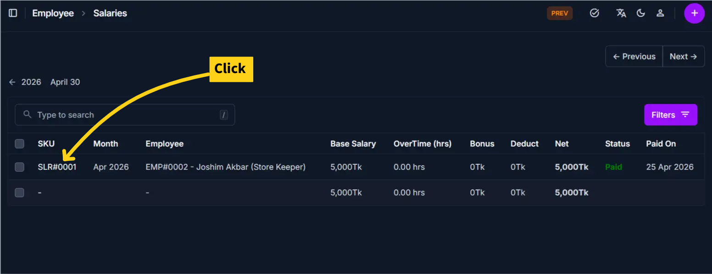
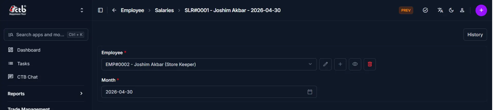
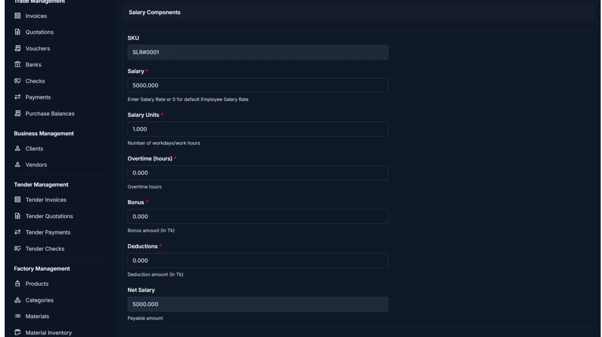
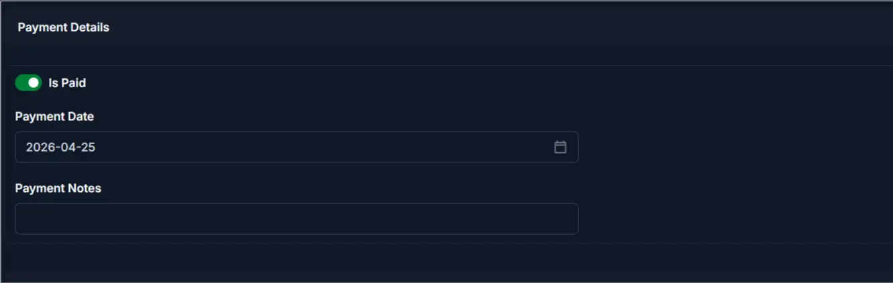

# Salary Detail

Use this page to view and manage a salary record after it has been generated. The salary detail page displays all components of a salary entry — the assigned employee, salary period, salary components, payment details, and related records. You can update salary components, mark the salary as paid, and review linked records from this page.

## When to use Salary Detail

- Reviewing a complete salary record with all components and calculations
- Updating salary components such as bonus, deductions, or overtime
- Marking a salary as paid and recording the payment date
- Reviewing related records linked to this salary entry
- Verifying salary information before processing payroll

## How to access Salary Detail

From the sidebar, go to **Employee Management → Salaries**. On the Salaries List page, click on any salary **SKU** to open the **Salary Detail page**.

______________________________________________________________________

## Salaries List Page

The Salaries List displays all salary records across employees with the following columns:

| Column         | Description                                                            |
| -------------- | ---------------------------------------------------------------------- |
| SKU            | Unique identifier for the salary record; clickable link to detail page |
| Month          | The salary period this record covers (e.g., Apr 2026)                  |
| Employee       | The employee this salary was generated for                             |
| Base Salary    | The base salary amount before adjustments                              |
| Overtime (hrs) | Total overtime hours recorded for this period                          |
| Bonus          | Bonus amount added to the salary                                       |
| Deduct         | Deduction amount subtracted from the salary                            |
| Net            | Final payable amount after all adjustments (shown in bold)             |
| Status         | Payment status — **Paid** (green) or blank if unpaid                   |
| Paid On        | The date the salary payment was made                                   |

Use the **← Previous** and **Next →** buttons to navigate between salary periods, and the **Filters** button to narrow results by employee, month, or status.

______________________________________________________________________

## Page Overview

The Salary Detail page includes an action button at the top-right:

| Button  | Action                                            | Available When |
| ------- | ------------------------------------------------- | -------------- |
| History | View past changes and modifications to the record | Always visible |

______________________________________________________________________

## General Information

The top section shows which employee and period this salary covers:

| Field    | Description                                    |
| -------- | ---------------------------------------------- |
| Employee | The employee this salary record is assigned to |
| Month    | The month and year this salary record covers   |

!!! warning "Required Fields"
Fields marked with a **red star (\*)** are mandatory.

______________________________________________________________________

## Salary Components

This section displays the full salary breakdown:

| Field            | Description                                                            |
| ---------------- | ---------------------------------------------------------------------- |
| SKU              | Auto-generated unique identifier for this salary record (read-only)    |
| Salary           | Salary rate for this period; 0 uses the employee's default salary rate |
| Salary Units     | Number of workdays or work hours used to calculate the salary          |
| Overtime (hours) | Number of overtime hours worked during this period                     |
| Bonus            | Bonus amount in Tk added to the base salary                            |
| Deductions       | Deduction amount in Tk subtracted from the base salary                 |
| Net Salary       | Final payable amount — calculated automatically (read-only)            |

!!! note "Net Salary Calculation"
Net Salary is calculated automatically as: **(Salary × Salary Units) + Overtime + Bonus − Deductions**. It updates in real time whenever any component is changed.

!!! tip
Set **Salary** to **0** to apply the default salary rate configured on the employee's profile.

______________________________________________________________________

## Payment Details

This section records the payment status for this salary:

| Field         | Description                                                        |
| ------------- | ------------------------------------------------------------------ |
| Is Paid       | Toggle to mark the salary as paid or unpaid                        |
| Payment Date  | The date the salary payment was made (required when Is Paid is ON) |
| Payment Notes | Optional notes about the payment method, reference, or remarks     |

!!! note "Payment Fields Visibility"
**Payment Date** and **Payment Notes** are active when **Is Paid** is toggled on. Keep Is Paid off if the salary is still outstanding.

______________________________________________________________________

## Related Records

The **Related Records** section at the bottom is a collapsible section that displays any records linked to this salary entry, such as attendance logs or payout references.

!!! info
Click the **Related Records** header to expand and review all linked data for this salary record.

______________________________________________________________________

## Saving Changes

After making edits:

| Button                    | Action                                            |
| ------------------------- | ------------------------------------------------- |
| Save                      | Save changes and stay on the detail page          |
| Save and continue editing | Save and remain in edit mode                      |
| Save and add another      | Save and immediately open a new blank salary form |

______________________________________________________________________

## Deleting a Salary Record

A **Delete Salary** button is available at the bottom-left of the detail page.

!!! warning "Restricted Action"
Deleting a salary record is permanent. Only delete records that were created in error and have not been linked to any payout or financial transaction. Once a salary has been marked as **Paid** or linked to related records, deletion may not be permitted. Contact your system administrator if a linked salary record needs to be removed.

______________________________________________________________________

## Tips and Common Issues

- **Net Salary updates automatically** — It recalculates in real time whenever Salary, Salary Units, Overtime, Bonus, or Deductions are changed  
- **Salary Units represent workdays or hours** — Enter the correct number based on the employee's salary type (Monthly or Hourly)  
- **Default salary applies when Salary is 0** — The system uses the rate set on the employee's profile  
- **Toggle Is Paid only when payment is confirmed** — Setting Is Paid without a Payment Date may cause payroll reporting inconsistencies  
- **Deductions reduce Net Salary** — Enter deductions carefully as they directly reduce the employee's final payable amount  
- **Always save before leaving** — Use the **Save** button at the bottom of the page; unsaved changes will be lost  
- **History button** — Use the **History** button in the top-right corner to review all changes made to this salary record and who made them  

______________________________________________________________________

## Related Pages

- **Salaries Overview** — View and manage all salary records
- **Generate Salary** — Create a new salary record for an employee
- **Employee Detail** — View the full employee profile and linked salary records
- **Wages** — Manage production-based wage entries
- **Payouts** — Process and track salary disbursements
- **Attendance** — Review attendance records used for salary unit calculation
