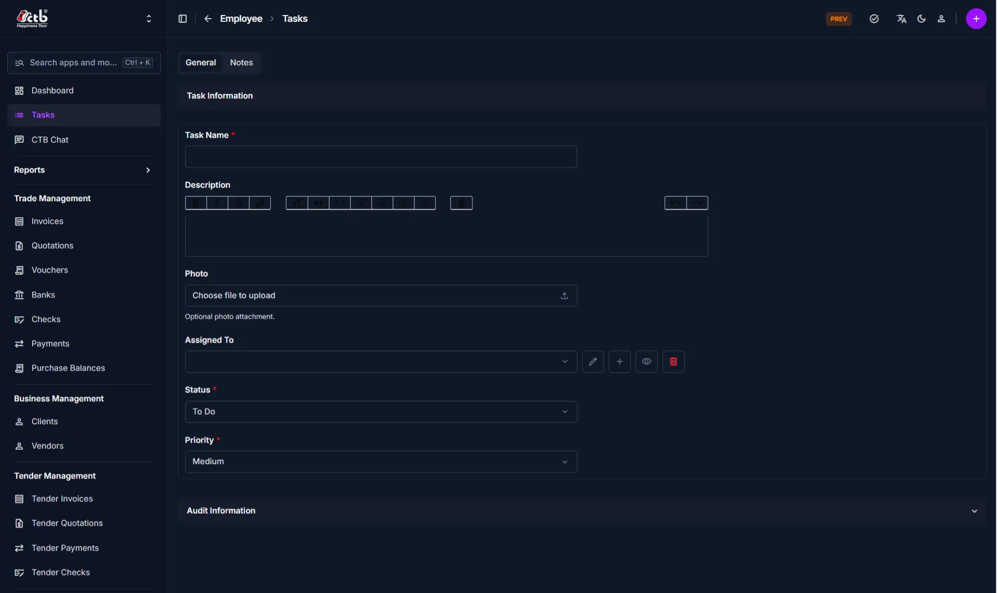

# Create Task

<!-- metadata: owner: hr, last_updated: 2026-07-26, git_ref: main, staging_verified: true -->

## Summary

Use this page to create a new task in CTB Admin. A task records work items, assigns responsibility to specific users, defines priority urgency, and tracks task status through completion.

______________________________________________________________________

## When to use this page

- Assigning operational or administrative tasks to team members
- Setting priority urgency levels for time-sensitive tasks
- Attaching reference photos or documentation to task assignments

______________________________________________________________________

## How to access this page

From the sidebar navigation, select **Employee → Tasks** (`/admin/employee/employeetask/`). Click **Add Task (+)** in the top-right corner.

______________________________________________________________________

## Prerequisites

- **Permissions:** `employee.add_employeetask` permission codename (HR Staff, Manager, or Superuser role).
- **Active Records:** Active **Employee** or **User** account for assignment.

______________________________________________________________________

## Step-by-step instructions

1. Open **Tasks** from the **Employee** section of the sidebar.
1. Click **Add Task (+)**.
1. Enter the **Task Name** and detailed **Description**.
1. Select the assigned staff member in **Assigned To**.
1. Set the task **Status** (`To Do`, `In Progress`, `Completed`, `Cancelled`).
1. Set the task **Priority** (`Low`, `Medium`, `High`, `Urgent`).
1. Click **Save** to create the task assignment.

______________________________________________________________________

## Verification and definition of done

- System assigns a task SKU code (`TSK-YYYYMMDD-XXXX`).
- Task appears in `/admin/employee/employeetask/` list view and notifies the assigned employee.

______________________________________________________________________

## Field reference

### Task information

| Step | Field       | Required | What to Do      | Description                                                      |
| ---- | ----------- | -------- | --------------- | ---------------------------------------------------------------- |
| 1    | Task Name   | Yes      | Enter title     | Title or name of the task                                        |
| 2    | Description | No       | Enter text      | Detailed work instructions                                       |
| 3    | Photo       | No       | Upload file     | Optional reference image or file attachment                      |
| 4    | Assigned To | Yes      | Select user     | Employee responsible for task execution                          |
| 5    | Status      | Yes      | Select status   | Current state (`To Do`, `In Progress`, `Completed`, `Cancelled`) |
| 6    | Priority    | Yes      | Select priority | Urgency level (`Low`, `Medium`, `High`, `Urgent`)                |

______________________________________________________________________

## Exception handling and error recovery

| Symptom / Error Message       | Root Cause                                       | Remediation Action                                                                        |
| ----------------------------- | ------------------------------------------------ | ----------------------------------------------------------------------------------------- |
| `Task Name is required`       | Form submitted without task title                | Enter a valid title in **Task Name**                                                      |
| Assigned user cannot see task | User account deactivated or incorrect assignment | Verify assigned employee profile status in [Employees Overview](../employees/overview.md) |

______________________________________________________________________

## Related pages

- [Tasks Overview](overview.md) — View master list of all tasks
- [Manage Task](manage-task.md) — Update or reassign an existing task
- [Employees Overview](../employees/overview.md) — Manage staff accounts
