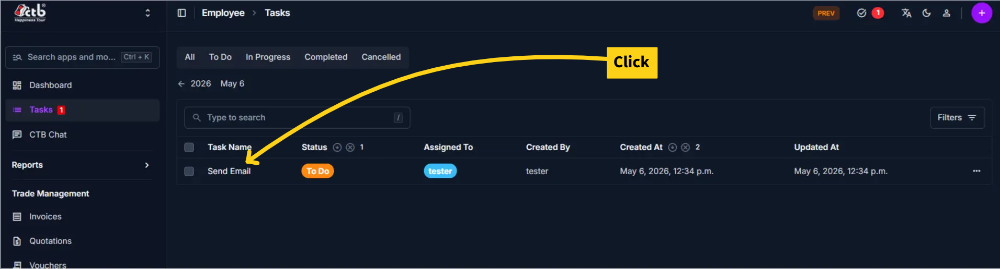
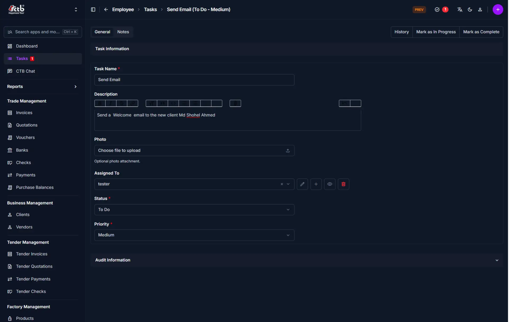

# Manage Task

Use this page to create a new task or update an existing one. Tasks let you assign work to employees with priority levels, due dates, and progress tracking.

## Summary

Use this page to create work items and keep track of employee assignments and task completion. Updates here affect task visibility and help managers monitor workload distribution and progress.

______________________________________________________________________

## When to use this page

- Assigning work to an employee
- Changing task status (To Do, In Progress, Completed)
- Updating task priority or due date
- Adding or modifying task details and notes
- Adjusting task assignments when personnel changes

______________________________________________________________________

## How to access this page

1. Go to **Employee → Tasks** from the sidebar
1. On the Tasks List page, click **Task Name** to edit existing task

1. The system opens the **Task Form**

______________________________________________________________________

## Editing an existing Task

All fields on this page can be updated at any time:

- **Task Name and Description** — Update to clarify or add details
- **Assigned To** — Reassign to another employee if needed
- **Status** — Progress the task through its workflow
- **Priority** — Adjust based on business needs

______________________________________________________________________

## Step-by-step instructions

1. Go to **Employee → Tasks** from the sidebar.
1. Click a **Task Name** to edit an existing task, or click the **purple (+) icon** to create one.
1. Update the task name, description, assigned employee, priority, and due date as needed.
1. Set the **Status** to reflect current progress.
1. Save the task.

______________________________________________________________________

## Field reference

| **Field**       | What to do                     | Description                                            |
| --------------- | ------------------------------ | ------------------------------------------------------ |
| **Task Name**   | Enter a short, specific title  | The name shown in the task list                        |
| **Description** | Add detail or instructions     | Explains what the assigned employee needs to do        |
| **Employee**    | Select the assignee            | The staff member responsible for completing the task   |
| **Priority**    | Select a priority              | Indicates how urgently the task should be completed    |
| **Status**      | Select the current state       | Whether the task is To Do, In Progress, or Completed   |
| **Due Date**    | Choose the expected completion | The date the task is expected to be finished           |
| **Note**        | Add optional context           | Internal comments or additional context about the task |

______________________________________________________________________

## Tips and common issues

- Use a clear task name that can be understood in one sentence
- Always assign a task to an active employee
- Update status regularly to keep management informed of progress
- Set a due date to prevent tasks from remaining open indefinitely
- Use the Description field for instructions that the employee needs to complete the work
- Avoid assigning too many high-priority tasks to one employee

______________________________________________________________________

## Related pages

- **Tasks Overview** — View all tasks and their status
- **Attendance Overview** — Track employee attendance records
- **Salary Overview** — Manage employee payroll
- **Employee** — Update employee information
