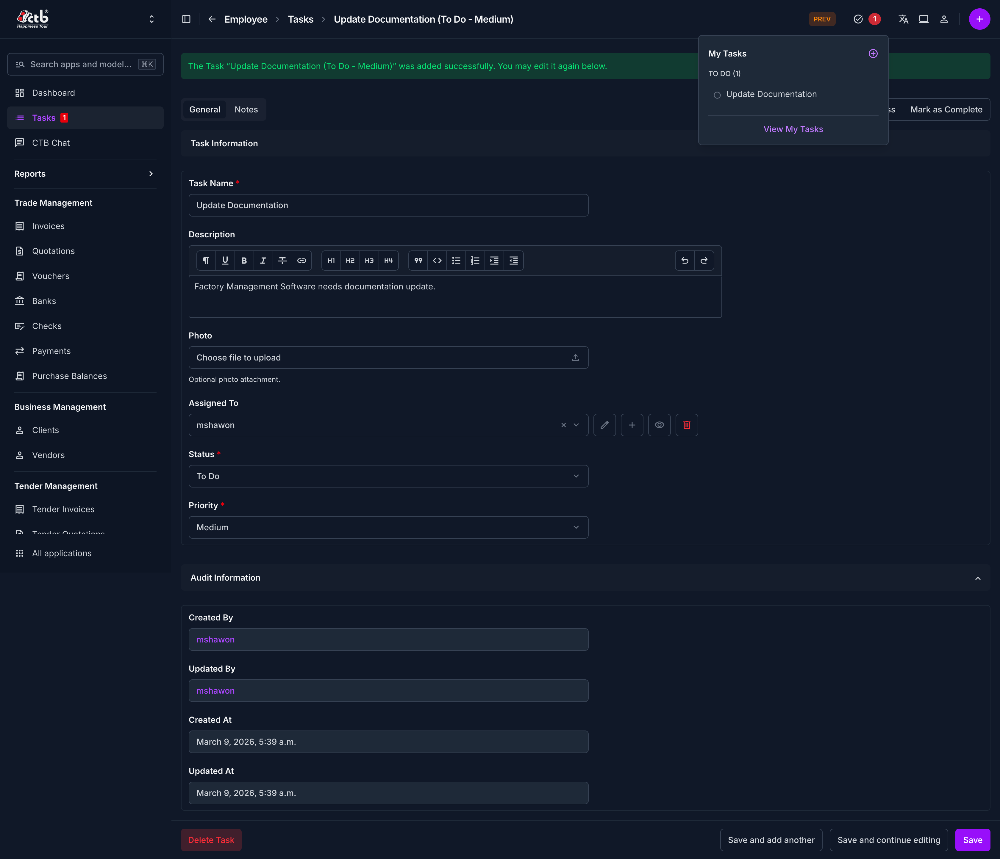

# Tasks Overview

Use this page to review employee tasks, check assignment status, and follow up on work that is still open.

## Summary

The tasks overview gives managers a simple list of work items assigned to employees. Use it to see what is pending, in progress, or completed before you create or update a task.

## When to use this page

- When you want to review assigned employee work.
- When you need to check whether a task is open or completed.
- When you want to open a task and review its details.

## How to access this page

From the sidebar, go to **Employee -> Tasks**.

## Field reference

- **Task title** - The short name for the work item.
- **Employee** - The staff member assigned to complete the task.
- **Due date** - The expected completion date.
- **Priority** - Indicates how urgently the task should be completed.
- **Status** - Shows whether the task is open, active, or completed.
- **Note** - Optional context or instructions for the employee.

## Tips and common issues

- Keep task titles short and action-oriented so employees can understand them quickly.
- Check the status before reassigning a task.
- Add a due date when the task should be tracked against a deadline.

## Related pages

- [Create/Edit Task](manage-task.md)
- [Attendance Overview](../attendance/overview.md)
- [Salary Overview](../salary/overview.md)
