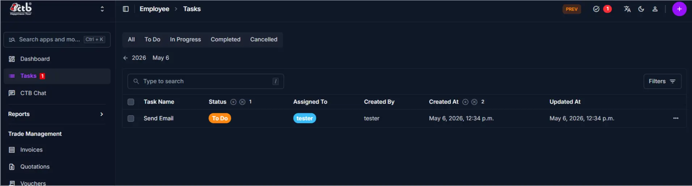

# Tasks Overview

<!-- metadata: owner: hr, last_updated: 2026-07-26, git_ref: main, staging_verified: true -->

## Summary

Use the **Tasks Overview** page to monitor, filter, and track employee work assignments in CTB Admin. The master list displays task titles, assigned personnel, status pills, and priority levels.

______________________________________________________________________

## When to use this page

- Auditing open, in-progress, or completed tasks across teams
- Searching for specific tasks by title or assigned staff member
- Checking priority urgency levels before assigning new work
- Accessing task creation and editing forms

______________________________________________________________________

## How to access this page

From the sidebar navigation, select **Employee → Tasks** (`/admin/employee/employeetask/`).

______________________________________________________________________

## Prerequisites

- **Permissions:** `employee.view_employeetask` permission codename (HR, Manager, Accountant, or Superuser role).
- **Active Records:** Active **Employee** profiles.

______________________________________________________________________

## Step-by-step instructions

1. Open **Tasks** from the **Employee** section of the sidebar.
1. Review the listed task items and status indicators (`To Do`, `In Progress`, `Completed`, `Cancelled`).
1. Use the search bar to locate tasks by title or assigned staff member.
1. Click **Filters** to narrow results by status or priority level.
1. Click **Add Task (+)** to create a new task, or select a row to edit.

______________________________________________________________________

## Verification and definition of done

- Master task directory renders with accurate status badges and priority tags.
- Search and filter queries accurately isolate targeted work assignments.

______________________________________________________________________

## Field reference

### Table summary

| Column      | Required | What to Do    | Description                                                       |
| ----------- | -------- | ------------- | ----------------------------------------------------------------- |
| Task Name   | Yes      | Click link    | Short title describing the task                                   |
| Assigned To | Yes      | View employee | Staff member assigned to complete the work                        |
| Due Date    | No       | View date     | Target completion date                                            |
| Priority    | Yes      | View tag      | Urgency indicator (`Low`, `Medium`, `High`, `Urgent`)             |
| Status      | Yes      | View pill     | Workflow state (`To Do`, `In Progress`, `Completed`, `Cancelled`) |
| Note        | No       | View text     | Internal comments or instructions                                 |

______________________________________________________________________

## Exception handling and error recovery

| Symptom / Error Message    | Root Cause                                        | Remediation Action                                                      |
| -------------------------- | ------------------------------------------------- | ----------------------------------------------------------------------- |
| Task not visible in list   | Filter status setting excluding target task state | Click **Filters** and reset status selection                            |
| Unassigned task in listing | Task saved without selecting an assigned user     | Open record under [Manage Task](manage-task.md) and set **Assigned To** |

______________________________________________________________________

## Related pages

- [Create Task](create-task.md) — Register a new task assignment
- [Manage Task](manage-task.md) — Reassign or update task progress
- [Employees Overview](../employees/overview.md) — View employee directory
