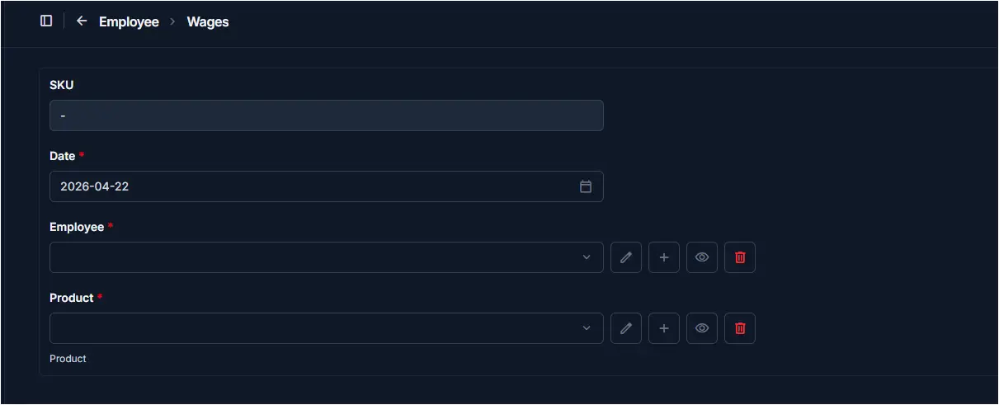
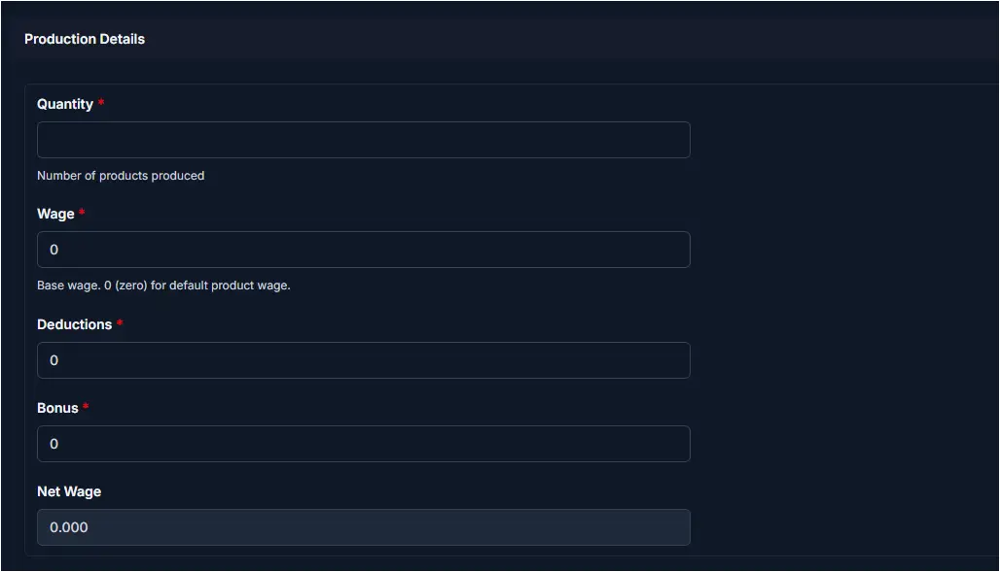
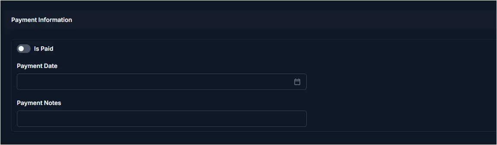

# Add Wage Entry

## Summary

Use this page to record a wage entry for an employee in CTB Admin. A wage entry tracks the number of products produced by an employee, calculates their wage based on production quantity, and records any deductions, bonuses, and payment status. Wage entries are used to manage employee compensation tied to production output.

______________________________________________________________________

## When to use this page

- Recording daily or periodic production-based wages for an employee
- Logging the number of products produced in a work session
- Applying deductions or bonuses to an employee's base wage
- Marking a wage as paid and recording the payment date
- Tracking outstanding wages before processing payroll

______________________________________________________________________

## How to access this page

From the sidebar, go to **Employee → Wages**. On the Wages List page, click the **purple (+) icon** in the top-right corner.

The system opens the **Add Wage Entry Page**.

______________________________________________________________________

## Step-by-step instructions

1. Open **Employee → Wages** and click the add icon.
1. Fill in the **Date**, **Employee**, and **Product** fields.
1. Enter **Production Details** including Quantity, Wage, Deductions, and Bonus.
1. Review the auto-calculated **Net Wage**.
1. Set **Payment Information** if the wage has already been paid.
1. Click **Save** to create the wage entry.

______________________________________________________________________

## Field reference

### General information

Fill in the following fields:

| Step | Field    | What to Do           | Description                                            |
| ---- | -------- | -------------------- | ------------------------------------------------------ |
| 1    | SKU      | Auto-generated       | Unique identifier for this wage entry (read-only)      |
| 2    | Date     | Select date          | The date this wage entry is recorded for               |
| 3    | Employee | Select from dropdown | The employee whose wage is being recorded              |
| 4    | Product  | Select from dropdown | The product the employee produced in this work session |

!!! warning "Required Fields"

    Fields marked with a **red star (\*)** are mandatory. Date, Employee, and Product must all be filled before saving.

### Production details

Enter the production output and wage calculation fields:

| Step | Field      | What to Do      | Description                                              |
| ---- | ---------- | --------------- | -------------------------------------------------------- |
| 1    | Quantity   | Enter number    | Number of products produced by the employee              |
| 2    | Wage       | Enter amount    | Base wage rate; enter 0 to use the default product wage  |
| 3    | Deductions | Enter amount    | Any deductions to subtract from the base wage            |
| 4    | Bonus      | Enter amount    | Any bonus amount to add to the base wage                 |
| 5    | Net Wage   | Auto-calculated | Final wage amount (Wage × Quantity + Bonus - Deductions) |

!!! note "Net Wage Calculation"

    Net Wage is calculated automatically based on Wage, Quantity, Bonus, and Deductions. You do not need to enter it manually.

!!! tip

    Set Wage to **0** to apply the default wage rate configured for the selected product.

### Payment information

Record whether this wage has been paid:

| Step | Field         | What to Do    | Description                                               |
| ---- | ------------- | ------------- | --------------------------------------------------------- |
| 1    | Is Paid       | Toggle ON/OFF | Mark the wage entry as paid or unpaid                     |
| 2    | Payment Date  | Select date   | The date the payment was made (required if Is Paid is ON) |
| 3    | Payment Notes | Enter text    | Optional notes about the payment method or reference      |

!!! note "Payment Date Visibility"

    Payment Date and Payment Notes fields appear when **Is Paid** is toggled on. Leave Is Paid off if the wage is still outstanding.

______________________________________________________________________

## Saving the Wage entry

After completing all sections:

- Click **Save** to create the wage entry
- Click **Save and continue editing** to save and stay on the page
- Click **Save and add another** to save and immediately create another wage entry

______________________________________________________________________

## Tips and common issues

- **Employee is required** — You must select an employee before saving
- **Product is required** — Select the product associated with the production output
- **Default wage applies when Wage is 0** — If no wage is entered, the system uses the product's default wage rate
- **Net Wage updates automatically** — It recalculates whenever Quantity, Wage, Bonus, or Deductions are changed
- **Toggle Is Paid only when payment is confirmed** — Setting Is Paid without a Payment Date may cause reporting inconsistencies
- **Deductions reduce Net Wage** — Enter deductions carefully as they directly reduce the employee's final payment
- **Date affects payroll reporting** — The entry date determines which pay period this wage record appears in

______________________________________________________________________

## Related pages

- **Wages Overview** — View and manage all wage entries
- **Employees** — Manage employee profiles
- **Products** — View product wage rates used in calculations
- **Salaries** — Manage fixed salary records for employees
- **Payouts** — Process and track wage payments
