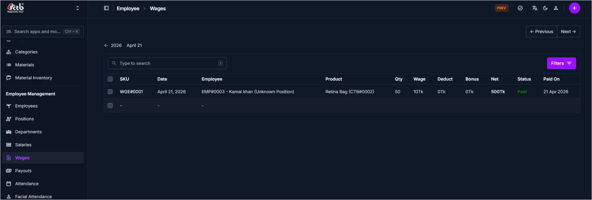

# Wage Overview

## Overview

The **Wages** page lets you review wage payments for employees, including details of each wage transaction. Use this section to track wage status, payment dates, and breakdowns for each employee and product.

______________________________________________________________________

## When to use Wage Overview page

- Review recent wage payments to employees
- Check wage status (Paid/Unpaid) and payment dates
- Verify wage breakdowns including quantity, deductions, and bonuses
- Trace wage history for a specific employee or product

______________________________________________________________________

## How to access Wage Overview page

1. From the sidebar, go to **Employee Management → Wages**.
1. The list page shows wage entries for the selected date.
1. Select a record to view more details about the wage transaction.

______________________________________________________________________

## Page sections

### Wage List

The main list displays each wage transaction for employees on a single page.

Key columns include:

- **SKU** — Wage reference code for the transaction
- **Date** — When the wage was recorded
- **Employee** — Employee name and code
- **Product** — Product or work associated with the wage
- **Qty** — Quantity of work completed
- **Wage** — Wage rate per unit
- **Deduct** — Any deductions applied
- **Bonus** — Any bonuses added
- **Net** — Net wage amount after deductions and bonuses
- **Status** — Payment status (e.g., Paid)
- **Paid On** — Date the wage was paid

### Search and filters

- Use the search field to find wage records by SKU or employee name.
- Use the **Filters** button to narrow results by date, status, or other values.

______________________________________________________________________

## Best practices

- Always verify the **Net** amount before confirming payment.
- Use filters to quickly find unpaid or pending wage records.
- Check the **Product** and **Qty** to ensure accurate wage calculation.

______________________________________________________________________

## Related Pages

- **Employees** — Manage employee details and wage assignments
- **Payouts** — Review and process wage payments
- **Salary** — View monthly salary records and reports
