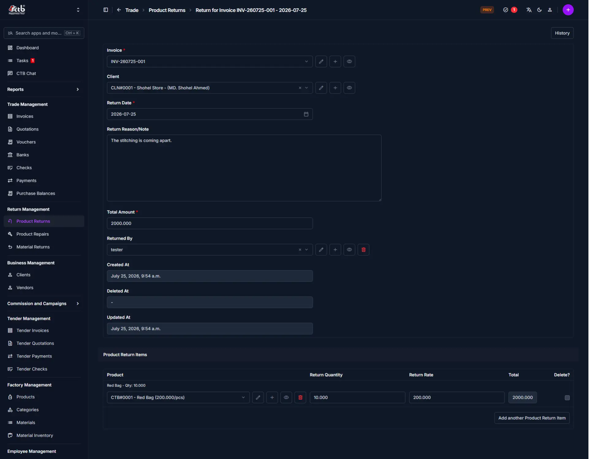

# Manage Product Returns

## Summary

Use this page to record product returns against invoices. Product return records capture the client, invoice, returned quantity, return rate, and total amount for each returned item.

## When to use this page

- When a client returns finished goods
- When you need to link returns to an invoice
- When you update client balances after a return
- When you need accurate inventory and revenue corrections for returned products

## How to access this page

Open **Return Management → Product Returns** in the sidebar. On the Product Returns list page, click the **purple (+) icon** or **Add** to create a new record.

## Prerequisites

- Client records already exist in CTB Admin
- The invoice for the returned product must be available
- Permission to create or edit product return records

______________________________________________________________________

## Field reference

| Field                  | What to do               | Description                                    |
| ---------------------- | ------------------------ | ---------------------------------------------- |
| **Invoice**            | Select invoice           | Links the return to the original sales invoice |
| **Client**             | Select client            | Client returning the product                   |
| **Return Date**        | Choose a date            | Date when the product return was made          |
| **Return Reason/Note** | Enter return note        | Reason or comment for the product return       |
| **Total Amount**       | Enter amount             | Total value of the return across all items     |
| **Returned By**        | Select staff             | Employee or user who handled the return        |
| **Product**            | Select product           | Returned finished product item                 |
| **Return Quantity**    | Enter quantity           | Number of units returned                       |
| **Return Rate**        | Enter rate               | Unit price for the returned item               |
| **Total**              | Review calculated amount | Item total calculated from quantity and rate   |
| **Created At**         | Read-only                | Record creation timestamp                      |
| **Updated At**         | Read-only                | Record update timestamp                        |
| **Deleted At**         | Read-only                | Record deletion timestamp if deleted           |

- **Remove** — Click to delete a product return item row.
- **Add another Product Return Item** — Add a new row for additional returned products.

## Tips and common issues

- Add at least one product item before saving the record.
- Verify the selected **Invoice** matches the returned item.
- If totals do not update, re-enter the **Return Quantity** and **Return Rate** values.
- Save the record before leaving the page to preserve entered data.

______________________________________________________________________

## Related pages

- **[Material Returns](material-returns.md)** — Manage returned raw materials.
- **[Return Management Module](README.md)** — Overview of return workflows.
