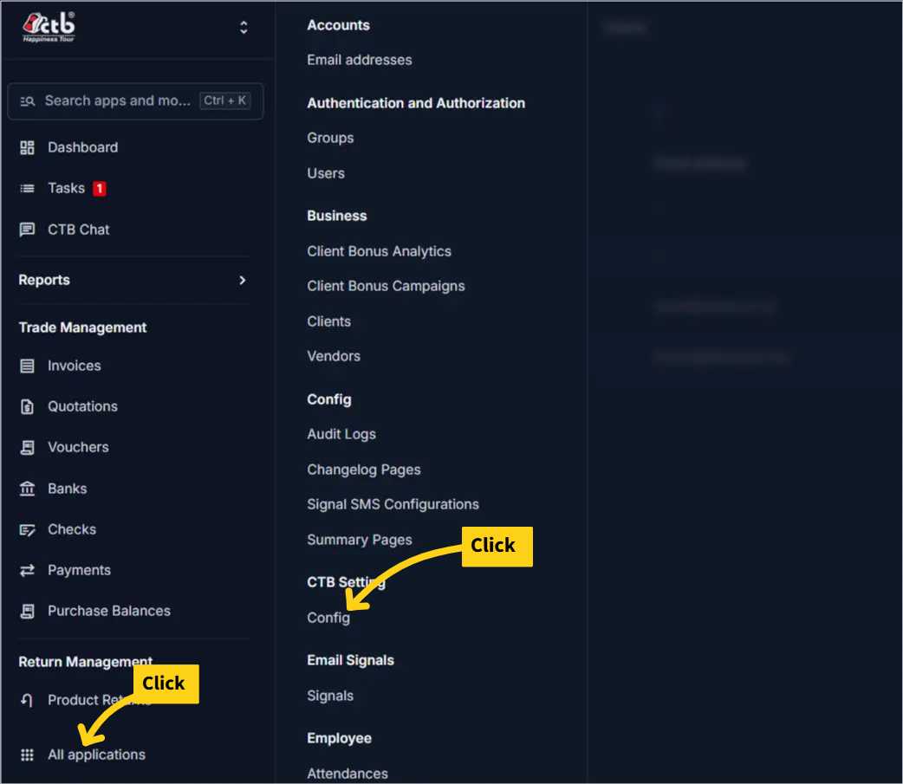
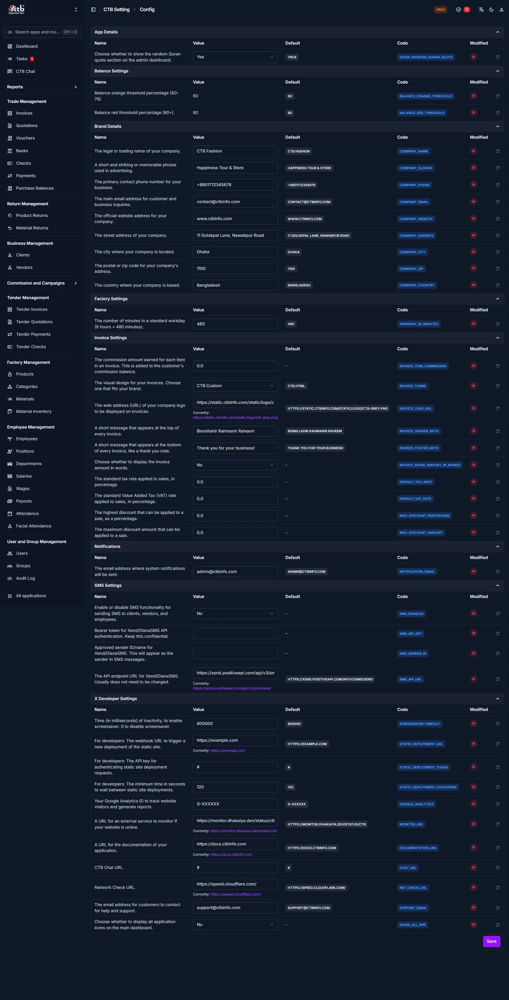

# App Settings

Configure system-wide settings that affect all users and modules across CTB Admin. Only superusers or administrators with permission can access this page.

## Summary

App Settings contains all global configuration for CTB Admin, including company branding, operational defaults, balance thresholds, invoice templates, and integration settings. Changes made here impact all users and workflows immediately.

## When to use this page

- Set up company branding and legal information
- Configure invoice design and display options
- Enable or disable SMS and email notifications
- Adjust factory and operational parameters
- Configure API keys and developer settings
- Set balance warning thresholds
- Manage tax rates and discount limits

## How to access this page

From the sidebar, click **All applications**, then navigate to **CTB Settings** and select **Config**.

______________________________________________________________________

## Prerequisites

- You have superuser or administrator permission
- You understand the system-wide impact before making changes
- You have received approval to modify core settings

______________________________________________________________________

## Setting Groups and Configuration Details

### App Details

Controls dashboard interface and user experience settings:

| Setting                         | Description                                                   | Default |
| ------------------------------- | ------------------------------------------------------------- | ------- |
| **Show the random Quran quote** | Display or hide the random Quran quote on the admin dashboard | `true`  |

!!! info "Info"
When enabled, a new Quran verse appears each time the dashboard loads, providing daily inspiration to users.

______________________________________________________________________

### Balance Settings

Configure thresholds for balance warnings and alerts:

| Setting                                          | Description                                                           | Default |
| ------------------------------------------------ | --------------------------------------------------------------------- | ------- |
| **Balance orange threshold percentage (80-78%)** | Set warning threshold percentage when balance falls into orange range | 80%     |
| **Balance red threshold percentage (80+)**       | Set critical threshold percentage when balance falls into red range   | 80%     |

!!! warning "Alert Thresholds"
These percentages control when balance indicators change color in reports and dashboards. Lower thresholds trigger earlier warnings.

______________________________________________________________________

### Brand Details

Manage company branding and legal information displayed across CTB Admin:

| Setting                                          | Description                                                    | Value Type |
| ------------------------------------------------ | -------------------------------------------------------------- | ---------- |
| **Company Trading Name**                         | Official legal name of your trading business                   | Text       |
| **Company Tagline**                              | Short and striking memorable phrase used in advertising        | Text       |
| **Main contact phone number**                    | Primary business phone number for customer inquiries           | Phone      |
| **Main email address**                           | Primary email address displayed on invoices and communications | Email      |
| **Official company address**                     | Legal business address for formal documents and invoices       | Text       |
| **Geographic location coordinates**              | GPS coordinates of your company office (latitude, longitude)   | Text       |
| **The city where company is located**            | City name for address and shipping information                 | Text       |
| **The postal or zip code for company's address** | Postal code for all business documents                         | Text       |
| **The country where your company is based**      | Country name for legal and shipping purposes                   | Text       |

!!! tip "Best Practice"
Keep all company information consistent across all settings to ensure uniform branding on invoices and customer-facing documents.

______________________________________________________________________

### Factory Settings

Configure factory and production operational parameters:

| Setting                                                                 | Description                                       | Value Type |
| ----------------------------------------------------------------------- | ------------------------------------------------- | ---------- |
| **The number of minutes in a standard workday (8 hours = 480 minutes)** | Standard workday duration for attendance tracking | Number     |

!!! note "Workday Duration"
This setting affects wage calculations and attendance records. A standard 8-hour workday equals 480 minutes.

______________________________________________________________________

### Invoice Settings

Control invoice design, display, and calculation defaults:

| Setting                                                       | Description                                                                                                       | Value Type |
| ------------------------------------------------------------- | ----------------------------------------------------------------------------------------------------------------- | ---------- |
| **The commission amount warred for each item in an invoice**  | The commission amount earned for each item in an invoice. This is added to the customer's commission balance item | Decimal    |
| **The visual design for your invoices**                       | Choose the invoice design template (CTE Custom, CTE HTML)                                                         | Selection  |
| **The web address (URL) of your company logo**                | URL where invoice logo is hosted (can be image or HTML embed)                                                     | URL        |
| **A short message appears at the top of every invoice**       | Header message displayed at invoice top                                                                           | Text       |
| **A short message appears at the bottom of every invoice**    | Footer message displayed at invoice bottom                                                                        | Text       |
| **Choose whether to display the invoice amount in words**     | Show rupee amount as written text on invoices                                                                     | Yes / No   |
| **The standard tax rate applied to sales**                    | Default sales tax percentage for line items                                                                       | Percentage |
| **The standard Value Added Tax (VAT) applied to sales**       | VAT percentage for line items                                                                                     | Percentage |
| **The highest discount that can be applied to a sale**        | Maximum discount percentage allowed per invoice                                                                   | Percentage |
| **The maximum discount amount that can be applied to a sale** | Maximum discount amount in currency units                                                                         | Currency   |

!!! info "Invoice Customization"
All invoice message and design settings affect PDF generation and printed invoices. Test after changes to ensure proper formatting.

______________________________________________________________________

### Notifications

Configure system notification delivery:

| Setting                                                   | Description                                           | Value Type |
| --------------------------------------------------------- | ----------------------------------------------------- | ---------- |
| **Email address where system notifications will be sent** | Destination email for system alerts and notifications | Email      |

!!! tip "Notification Routing"
Ensure this email address is monitored regularly to stay informed of system events and critical alerts.

______________________________________________________________________

### SMS Settings

Enable and configure SMS messaging for notifications and communication:

| Setting                                       | Description                                           | Value Type |
| --------------------------------------------- | ----------------------------------------------------- | ---------- |
| **Enable or disable SMS functionality**       | Master toggle to enable/disable all SMS features      | Yes / No   |
| **Bearer token for Xeno/Clarity SMS API key** | API authentication token for SMS service provider     | Text       |
| **Approved sender ID/Name for SMS messages**  | Sender name or ID that appears in SMS messages        | Text       |
| **The API endpoint URL for Xeno/Clarity SMS** | Base URL for SMS API service (for custom integration) | URL        |

!!! warning "SMS Configuration"
SMS features require valid API credentials with your SMS service provider. Ensure endpoint URL and API key are correct before enabling.

!!! note "Sender ID"
The approved sender ID must be registered with your SMS provider and comply with local telecommunications regulations.

______________________________________________________________________

### X Developer Settings

Advanced developer and API configuration options:

| Setting                                                                                 | Description                                     | Value Type |
| --------------------------------------------------------------------------------------- | ----------------------------------------------- | ---------- |
| **Enable in millisecond(s) of inactivity to enable screensaver**                        | Set inactivity time before screensaver triggers | Number     |
| **For developers: webhook URL to trigger a new deployment of the static site**          | Webhook URL for CI/CD deployment automation     | URL        |
| **For developers: The API key for authenticating static site deployment requests**      | API key for securing deployment webhook         | Text       |
| **For developers: The minimum time in seconds to wait between static site deployments** | Rate-limiting for deployment requests           | Number     |
| **Your Google Analytics ID to track website visitors and generate reports**             | GA4 ID for analytics tracking                   | Text       |
| **A URL for an external service to monitor if your website is available**               | Service URL for uptime monitoring               | URL        |
| **A URL for the documentation of your application**                                     | Documentation URL (e.g., docs site link)        | URL        |

!!! warning "Developer Settings"
These settings should only be configured by technical administrators. Incorrect values may break deployments or tracking.

!!! note "Security"
Keep API keys and webhook URLs confidential. Do not commit sensitive values to version control.

______________________________________________________________________

## Tips and common issues

- **Change one setting at a time** — Modify individual settings one at a time to easily identify which change caused any issues.
- **Test after critical changes** — After changing invoice, balance, or factory settings, verify behavior in a test workflow.
- **Record significant changes** — Keep a team log of major configuration changes for audit purposes.
- **Reset to Default** — If a setting causes unexpected behavior, refer to the **Default** column and reset the value.
- **Settings take effect immediately** — Changes are live once saved; users do not need to log out and back in.
- **Backup sensitive values** — Before changing API keys or URLs, document the old values in a secure location.

______________________________________________________________________

## Related pages

- **[User Management](user-management.md)** — Configure users, roles, and permissions
- **[Audit Log](audit-log.md)** — Review system changes and user activity logs
- **[Maintenance Mode](maintenance-mode.md)** — Take the system offline for updates
- **[SMS Notifications](sms-notifications.md)** — SMS delivery and provider configuration
