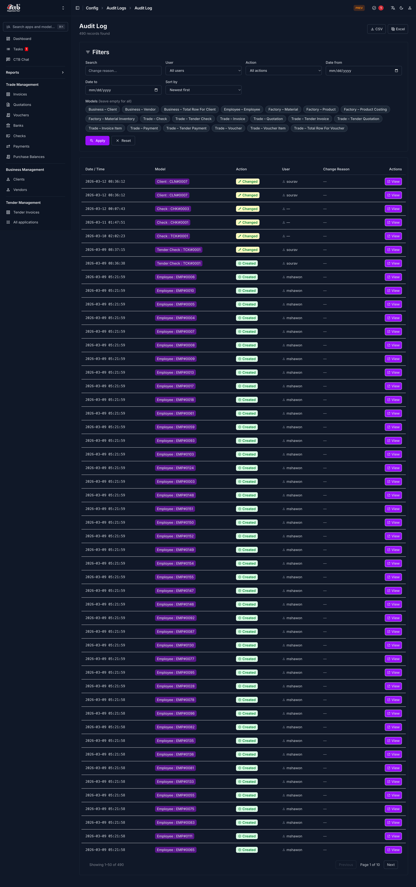

# Audit Log

## Summary

Use this page to review who changed data in CTB Admin, what was changed, and when the action happened. Audit logs help you verify activity, investigate unexpected changes, and support internal control checks.

## When to use this page

- When you need to verify who created, edited, or deleted a record.
- When you investigate incorrect values in business, factory, trade, or employee data.
- When management asks for a history of admin activity.
- When you need evidence for compliance, internal review, or dispute resolution.

## How to access this page

From the left sidebar menu, go to **Audit Log**. It appears as the last item in the menu.

## Prerequisites

- You have permission to view audit records.
- Users have already performed actions in the system, so logs exist to review.

## Field reference

| Field name                   | What to do                                   | Description                                                    |
| ---------------------------- | -------------------------------------------- | -------------------------------------------------------------- |
| **User**                     | Review the account that performed the action | Shows the user or account responsible for the change           |
| **Action**                   | Check the operation type                     | Indicates whether the record was added, changed, or deleted    |
| **Object**                   | Identify the affected record                 | Shows the specific record or entity that was changed           |
| **Module/App**               | Confirm the area of the system involved      | Indicates which part of CTB Admin the change happened in       |
| **Timestamp**                | Check when the event was recorded            | Shows the date and time the action was saved                   |
| **Change Details**           | Review what changed                          | Provides before/after values or a summary of the edited fields |
| **IP/Source (if available)** | Use for security review if needed            | Shows the request origin information when it is available      |

This page reads audit trail data for admin activity. Use it as the system source when checking history related to business records such as clients, invoices, payments, checks, and employee entries.

## Tips and common issues

- Check system date and time settings if log times look inconsistent.
- Filter by a short date range first when there are many records.
- Use both **User** and **Object** together to find the correct event faster.
- If no entries appear, confirm that the action was actually saved and that your account has viewing permission.
- Export or screenshot important entries during incident review so your team has a fixed reference.

## Related pages

- See [User Management](user-management.md) to control who can access and change data.
- See [Maintenance Mode](maintenance-mode.md) before performing controlled system updates.
- See [App Settings](app-settings.md) for global behavior that may affect user activity.
