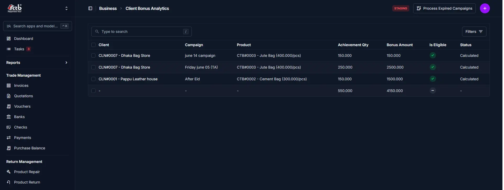
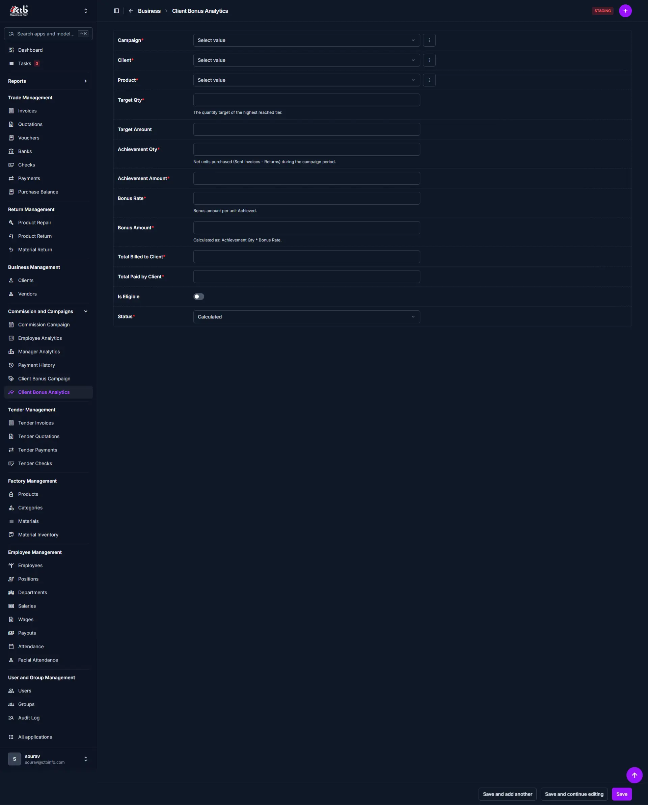

# Client Bonus Analytics

<!-- metadata: owner: sales_team, last_updated: 2026-08-16, git_ref: main, staging_verified: true -->

## Summary

Use this page to review and process client bonus analytics in CTB Admin. The system calculates net units, achievement quantities, payment collection metrics, and bonus amounts for client-level campaigns so Finance and Sales can validate and post client bonus credits.

_____________________________________________________________________

## When to use this page

- Auditing client bonus calculations after a campaign ends
- Verifying qualification and payment collection criteria before posting credits
- Triggering automated snapshot calculations via **Process Expired Campaigns**
- Manually entering or adjusting client bonus analytics rows when exceptions occur

_____________________________________________________________________

## How to access this page

From the sidebar navigation, select **Commission → Client Bonus Analytics** (`/admin/commission/clientbonusanalytics/`).

_____________________________________________________________________

## Prerequisites

- **Permissions:** `commission.view_clientbonusanalytics` / `commission.add_clientbonusanalytics` (Accountant, Sales Manager, or Superuser).
- **Active Records:** Defined Client Bonus Campaigns, Clients, and Products.
- All relevant invoices and return records for the campaign period must be posted so achievement calculations are accurate.

_____________________________________________________________________

## Step-by-step instructions

1. Open **Commission → Client Bonus Analytics** from the sidebar.
2. Review the list of client bonus rows, achievement metrics, and status pills.
3. Use the search box or **Filters** to locate specific clients, campaigns, or products.
4. Click **Process Expired Campaigns** to run snapshot and calculation jobs for finished campaigns.
5. Click **Add Client Bonus Analytics (+)** to create a manual entry for exceptions or adjustments.

_____________________________________________________________________

## Verification and definition of done

- Client bonus rows display the calculated Achievement Qty and Bonus Amount.
- Rows flagged `Is Eligible = True` and `Status = Approved` are suitable for posting as client credits.

_____________________________________________________________________

## Field reference

### List summary

This page is a read-only analytics list that summarizes client performance for configured campaigns. Each row represents a client × product × campaign analytic and shows these columns:

- Client — client code and name. Clicking the client navigates to the Client Bonus Analytics edit page for that analytic row.
- Campaign — campaign name associated with the analytic.
- Product — product reference and label.
- Achievement Qty — net units purchased (Invoices - Returns) during the campaign period.
- Bonus Amount — calculated bonus value for the row.
- Is Eligible — qualification indicator (green tick when rules are satisfied).
- Status — processing state (`Calculated`, `Pending`, `Approved`, `Credited`).

The table footer includes totals for the visible Achievement Qty and Bonus Amount.

### Manual entry fields

| Step | Field                  | Required | What to Do       | Description                                           |
| ---- | ---------------------- | -------- | ---------------- | ----------------------------------------------------- |
| 1    | Campaign               | Yes      | Select campaign  | Parent client bonus campaign                          |
| 2    | Client                 | Yes      | Select client    | Target client account                                 |
| 3    | Product                | Yes      | Select product   | Campaign product item                                 |
| 4    | Target Qty             | No       | View number      | Target defined in campaign (informational)           |
| 5    | Achievement Qty        | Yes      | Enter/adjust     | Net units achieved (Invoices - Returns)              |
| 6    | Achievement Amount     | No       | View amount      | Monetary value of achieved units                     |
| 7    | Bonus Rate             | Yes      | Enter rate       | Bonus per unit (or derived from campaign tiers)      |
| 8    | Bonus Amount           | Yes      | View amount      | Calculated: Achievement Qty × Bonus Rate             |
| 9    | Total Billed to Client | No       | View amount      | Total invoiced value during campaign period          |
| 10   | Total Paid by Client   | No       | View amount      | Payments received against those invoices             |
| 11   | Is Eligible            | Yes      | Toggle switch    | Mark whether row satisfies campaign eligibility      |
| 12   | Status                 | Yes      | Select           | Processing state (Calculated / Pending / Approved)   |

Form actions: Save, Save and continue editing, Save and add another.

_____________________________________________________________________

## Exception handling and error recovery

| Symptom / Error Message              | Root Cause                                      | Remediation Action                                                                                 |
| ------------------------------------ | ----------------------------------------------- | -------------------------------------------------------------------------------------------------- |
| Analytics missing for ended campaign | Snapshot job not executed                        | Click **Process Expired Campaigns** to force snapshot generation                                  |
| Bonus Amount is 0                    | Achievement Qty is 0 or Bonus Rate missing       | Verify invoices/returns and configure campaign bonus rates; re-run snapshot if required           |
| `Is Eligible` shows false            | Payment collection threshold not met             | Check Total Paid by Client and campaign-specific eligibility rules                                |

_____________________________________________________________________

## Related pages

- [Client Bonus Campaigns](client-bonus-campaigns.md) — Configure client campaigns and bonus tiers
- [Payment History](payment-history.md) — Track payments that affect eligibility
- [Clients Overview](../01-business/clients/overview.md) — Client ledger and account balances

<!-- TODO: Add final screenshots to docs/screenshots/commission/ and update image links above -->
