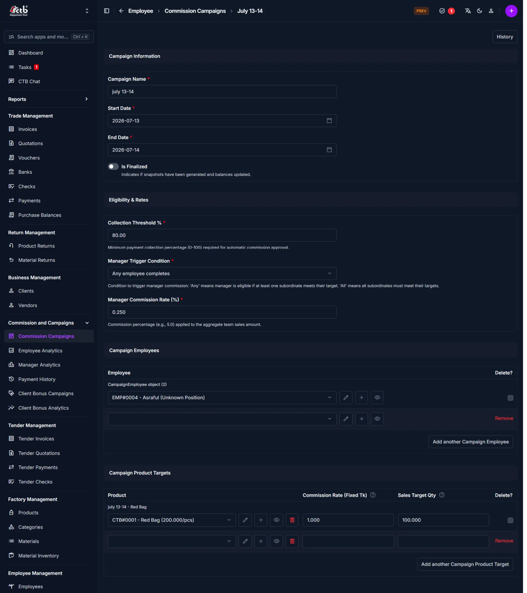

# Commission Campaigns

<!-- metadata: owner: sales_team, last_updated: 2026-07-26, git_ref: main, staging_verified: true -->

## Summary

Use this page to create and configure commission campaigns in CTB Admin. Campaigns define collection thresholds, manager override rates, target products, fixed unit commissions, and eligible sales employees.

______________________________________________________________________

## When to use this page

- Launching a new sales incentive campaign for employees or sales teams
- Setting product target quantities and fixed unit commission amounts
- Configuring manager override conditions and payment collection threshold rules
- Finalizing campaign periods to trigger ledger balance snapshot calculations

______________________________________________________________________

## How to access this page

From the sidebar navigation, select **Commission → Commission Campaigns** (`/admin/commission/commissioncampaign/`).

______________________________________________________________________

## Prerequisites

- **Permissions:** `commission.add_commissioncampaign` / `commission.change_commissioncampaign` permission codenames (Accountant, Sales Manager, or Superuser role).
- **Active Records:** Active **Employee** profiles and **Product** catalog items.

______________________________________________________________________

## Step-by-step instructions

1. Open **Commission → Commission Campaigns** and click **Add Commission Campaign (+)**.
1. Enter the **Campaign Name**, **Start Date**, and **End Date**.
1. Set the **Collection Threshold %** governing automatic payout approval.
1. Select the **Manager Trigger Condition** and enter the **Manager Commission Rate (%)**.
1. Add assigned **Employees** to the campaign table.
1. Add target **Products**, specifying **Commission Rate (Fixed TK)** and **Sales Target Qty**.
1. Click **Save** to create the campaign. Toggle **Is Finalized** only after campaign completion.

______________________________________________________________________

## Verification and definition of done

- System generates a campaign tracking code (`CMP-YYYYMMDD-XXXX`).
- Campaign appears under `/admin/commission/commissioncampaign/` with `Active` or `Finalized` status pills.
- Sales transactions matching campaign parameters calculate eligible commissions automatically.

______________________________________________________________________

## Field reference

### Campaign details

| Step | Field                       | Required | What to Do       | Description                                             |
| ---- | --------------------------- | -------- | ---------------- | ------------------------------------------------------- |
| 1    | Campaign Name               | Yes      | Enter name       | Descriptive campaign title                              |
| 2    | Start Date                  | Yes      | Select date      | First day of campaign billing period                    |
| 3    | End Date                    | Yes      | Select date      | Final day of campaign billing period                    |
| 4    | Is Finalized                | Yes      | Toggle switch    | Indicates whether balance snapshots are generated       |
| 5    | Collection Threshold %      | Yes      | Enter percentage | Minimum collection percentage for payout approval       |
| 6    | Manager Trigger Condition   | No       | Select condition | Target threshold required for manager commission payout |
| 7    | Manager Commission Rate (%) | No       | Enter percentage | Override commission percentage on team sales            |
| 8    | Employee                    | Yes      | Select employee  | Staff assigned to earn campaign commission              |
| 9    | Product                     | Yes      | Select product   | Included catalog product                                |
| 10   | Commission Rate (Fixed TK)  | Yes      | Enter amount     | Fixed commission earnings per unit sold                 |
| 11   | Sales Target Qty            | Yes      | Enter quantity   | Target sales unit quota for campaign                    |

______________________________________________________________________

## Exception handling and error recovery

| Symptom / Error Message              | Root Cause                                           | Remediation Action                                               |
| ------------------------------------ | ---------------------------------------------------- | ---------------------------------------------------------------- |
| Cannot edit campaign targets         | Campaign `Is Finalized` toggle is set to ON          | Uncheck `Is Finalized` before modifying product targets or rates |
| Commission not calculated on invoice | Collection percentage below `Collection Threshold %` | Receive Client payment to meet collection threshold percentage   |

______________________________________________________________________

## Related pages

- [Employee Analytics](employee-analytics.md) — Inspect employee commission performance
- [Manager Analytics](manager-analytics.md) — Monitor manager trigger conditions
- [Client Bonus Campaigns](client-bonus-campaigns.md) — Manage client bonus incentives
