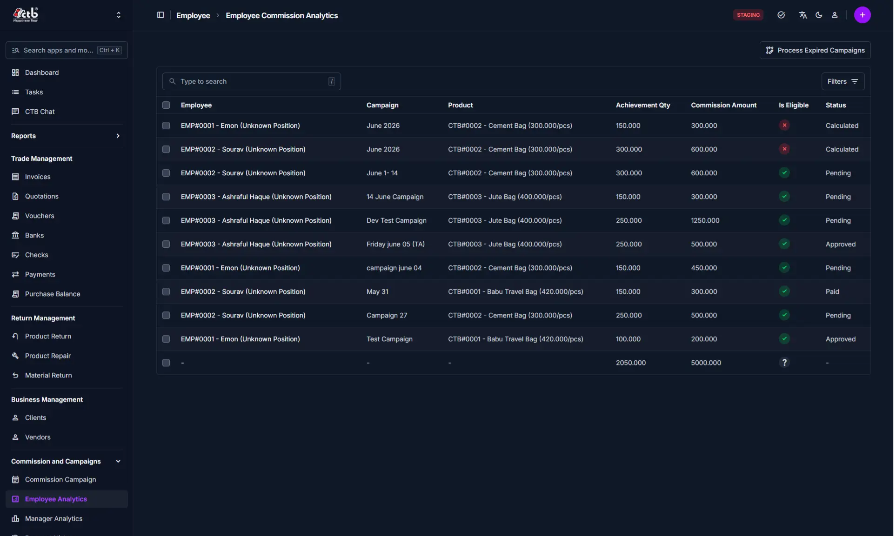
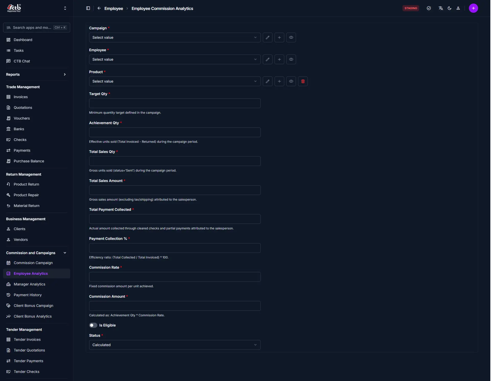

# Employee Analytics

## Summary

Use this page to review employee commission analytics records. The system generates entries automatically for completed campaigns, and you can add records manually when needed.

## When to use this page

- After a commission campaign ends and you want to review employee results.
- When you need to confirm whether a commission entry is eligible.
- When you need to process expired campaigns that have not yet generated analytics.
- When you need to add or correct an employee commission record manually.

## How to access this page

Open **Commission and Campaigns → Employee Analytics** in the sidebar.

## Prerequisites

- The campaign must exist and include employees and product targets.
- The campaign date range should be complete or the campaign should be expired.
- Sales and payment data must be available for the campaign.

## Step-by-step instructions

1. Open the page from the sidebar.
1. Use the search box or click **Filters** to locate the employee, campaign, or product.
1. Review the list of analytics records shown for each employee and campaign.
1. Check the **Status** and **Is Eligible** columns to understand each entry.
1. If a campaign has ended but entries are missing, click **Process Expired Campaigns**.
1. Click the top-right **+** button to add a manual employee commission analytics record.
1. Complete the manual entry form and save after verifying the values.

## Field reference

- **Employee** — The employee assigned to the commission record.
- **Campaign** — The name or date range of the commission campaign.
- **Product** — The campaign product tied to the employee analytics record.
- **Achievement Qty** — Units sold by the employee during the campaign period.
- **Commission Amount** — Commission earned for that record.
- **Is Eligible** — Indicates whether the record meets commission eligibility rules.
- **Status** — Processing state of the analytics record, such as `Calculated`, `Pending`, `Approved`, or `Paid`.

<!-- TODO: screenshot docs/user-guide/06-commission/employee-analytics-list-page.png -->

## Add employee analytics manually

Use the manual entry form when automatic analytics are missing or a correction is required.

1. Open **Commission and Campaigns → Employee Analytics**.
1. Click the top-right **+** button to open the add form.
1. Select the campaign, employee, and product from the required drop-down fields.
1. Enter **Target Qty** from the campaign plan.
1. Enter **Achievement Qty** for the employee during the campaign period.
1. Enter **Total Sales Qty** and **Total Sales Amount** for the campaign product.
1. Enter **Total Payment Collected** and **Payment Collection %**.
1. Enter **Commission Rate** to calculate the commission amount.
1. Confirm **Commission Amount** is correct and set **Is Eligible** if the record qualifies.
1. Select the appropriate **Status** and save the record.

### Manual entry field reference

- **Target Qty** — Minimum quantity target defined in the campaign.
- **Achievement Qty** — Actual units sold (invoiced minus returned) during the campaign.
- **Total Sales Qty** — Gross units sold during the campaign period.
- **Total Sales Amount** — Gross sales amount attributed to the employee.
- **Total Payment Collected** — Collected amount from cleared checks and partial payments.
- **Payment Collection %** — Efficiency ratio: `Total Collected / Total Invoiced × 100`.
- **Commission Rate** — Fixed commission amount per unit achieved.
- **Commission Amount** — Calculated as `Achievement Qty × Commission Rate`.

## Tips and common issues

- Use **Process Expired Campaigns** if the system did not generate records automatically after the campaign end date.
- Manual entries are useful when the automatic commission calculation is incomplete or when a correction is required.
- Confirm the campaign name, employee, and product match the original campaign setup before saving a manual record.
- The manual add form includes fields such as **Target Qty**, **Total Sales Amount**, **Payment Collection %**, and **Commission Rate**.

## Related pages

- **[Commission Campaigns](commission-campaigns.md)** — See how campaigns and eligibility rules affect employee analytics.
- **[Manager Analytics](manager-analytics.md)** — Review manager commission results for related campaigns.
