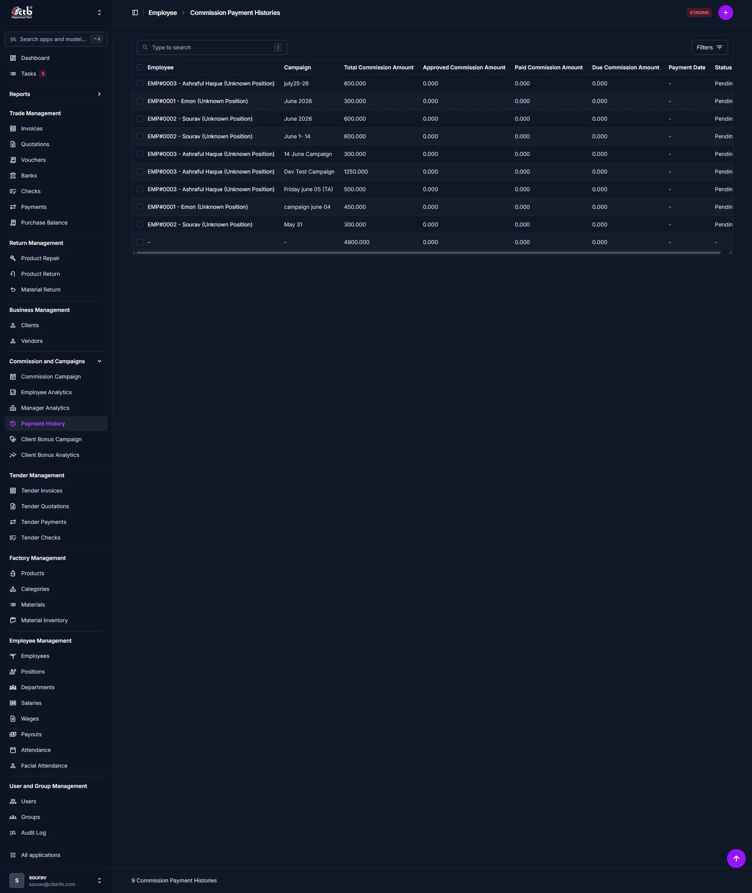
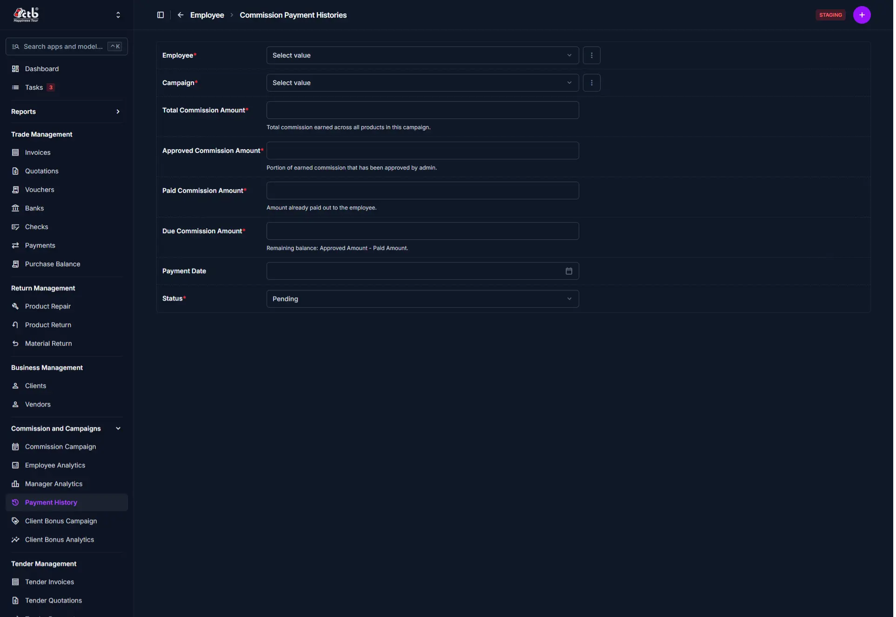

# Payment History

<!-- metadata: owner: sales_team, last_updated: 2026-07-26, git_ref: main, staging_verified: true -->

## Summary

Use this page to audit and track commission and bonus Payouts recorded across campaigns in CTB Admin. Payment History is the authoritative payout ledger: it shows calculated balances, administered approvals, and settled disbursements for employees, managers, and clients.

_____________________________________________________________________

## When to use this page

- Auditing settled commission and bonus disbursements after campaign finalization
- Reconciling approved analytics balances against actual bank or ledger transfers
- Confirming the payment history entries used for payroll and finance reporting
- Investigating payment discrepancies reported by employees, managers, or clients

_____________________________________________________________________

## How to access this page

From the sidebar navigation, select **Commission → Payment History** (`/admin/commission/commissionpaymenthistory/`).

_____________________________________________________________________

## Prerequisites

- **Permissions:** `commission.view_commissionpaymenthistory` permission codename (Accountant, Finance Manager, or Superuser role).
- **Active Records:** Finalized **Commission Campaign** or **Client Bonus Campaign** analytics entries and processed payout vouchers when payments were issued.

_____________________________________________________________________

## Step-by-step instructions

1. Open **Commission → Payment History** from the sidebar.
1. Scan the list for payment rows showing recipients, campaign context, and settlement status.
1. Use the search box to locate specific recipients or campaign names.
1. Use **Filters** to narrow by campaign, date range, payment method, or status.
1. Click a payment row to open details: verify linked campaign analytics, approval notes, and any payout reference codes.

_____________________________________________________________________

## Verification and definition of done

- Payment History displays payment rows with a confirmed Payment Date for all settled transactions.
- Approved and settled payments show matching entries in payroll or bank reconciliation records.
- Clicking a payment row surfaces the linked campaign, recipient profile, and any payout voucher or bank reference.

_____________________________________________________________________

## Field reference

### List summary

| Column                   | What to Do  | Description                                                                             |
| ------------------------ | ----------- | --------------------------------------------------------------------------------------- |
| Employee / Recipient     | Click link  | Employee, manager, or client receiving the payment                                      |
| Campaign                 | View text   | Commission or client bonus campaign name                                                |
| Total Commission Amount  | View amount | Total commission earned across products in this campaign (analytics source)             |
| Approved Commission Amt. | View amount | Portion of the earned commission approved by admin                                      |
| Paid Commission Amount   | View amount | Amount already paid out to the recipient                                                |
| Due Commission Amount    | View amount | Remaining balance: `Approved Amount - Paid Amount`                                      |
| Payment Date             | View date   | Settlement date when the payout was recorded (empty if not settled)                     |
| Status                   | View pill   | Payment state (`Pending`, `Processed`, `Settled`, `Cancelled`)                          |
| Reference / Method       | View text   | Optional payment reference or disbursal method (bank transfer ref, ledger credit, cash) |

### Add / Edit payment (form)

| Field                   | Required | What to Do                 | Description                                                                                     |
| ----------------------- | -------- | -------------------------- | ----------------------------------------------------------------------------------------------- |
| Employee                | Yes      | Select                     | Employee or manager receiving the payment (links to employee record)                            |
| Campaign                | Yes      | Select                     | Related commission or client bonus campaign                                                     |
| Total Commission Amount | No       | View amount (read-only)    | Analytics total for the campaign; populated from campaign calculations                           |
| Approved Commission Amt | Yes      | Enter amount               | Portion of the earned commission approved by admin                                              |
| Paid Commission Amount  | No       | Enter / View amount        | Amount already disbursed prior to the current payment record                                    |
| Due Commission Amount   | Yes      | View amount (calculated)   | Remaining balance: `Approved Amount - Paid Amount`                                              |
| Payment Date            | No       | Pick date                  | Settlement date when the payout was recorded (empty if not settled)                             |
| Status                  | Yes      | Select                     | Payment state (`Pending`, `Processed`, `Settled`, `Cancelled`)                                  |
| Reference / Method      | No       | Enter text                 | Optional payment reference or disbursal method (bank transfer ref, ledger credit, cash)         |

_____________________________________________________________________

## Exception handling and error recovery

| Symptom / Error Message                              | Root Cause                                                                     | Remediation Action                                                                                          |
| ---------------------------------------------------- | ------------------------------------------------------------------------------ | ----------------------------------------------------------------------------------------------------------- |
| Expected payment row not present                      | Payout voucher not created or not posted to Payment History                    | Confirm payout processed in payouts module and re-run posting; see [Create Payout](../04-employee/payouts/create-payout.md) |
| Paid amount shows zero while analytics show positive  | Approved amount not set or payout not completed                                | Verify campaign analytics; ensure `Approved Commission Amount` is populated before issuing payout         |
| Payment Date is blank for a settled-looking row      | Settlement not recorded against payout voucher                                 | Open payout voucher, enter settlement/bank reference, and save; refresh Payment History list               |

_____________________________________________________________________

## Related pages

- [Employee Analytics](employee-analytics.md) — Review individual employee campaign earnings
- [Manager Analytics](manager-analytics.md) — Review manager override earnings
- [Client Bonus Analytics](client-bonus-analytics.md) — Review client bonus earnings
- [Create Payout](../04-employee/payouts/create-payout.md) — Issue employee payouts
