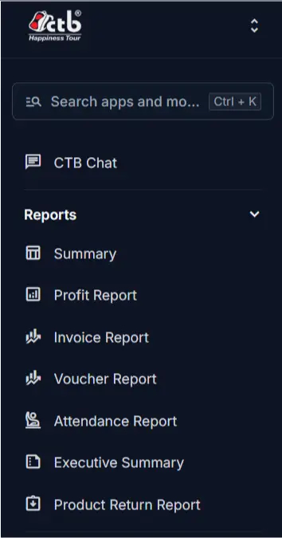

# Reports Module

The **Reports** module provides business and finance analytics for invoices, payments, vouchers, attendance, and profit analysis.

______________________________________________________________________

## Summary

Use this section to open report pages that help you review sales activity, expense records, employee attendance, and financial performance.

______________________________________________________________________

## When to use this page

- When you need a consolidated view of financial and operational reports.
- When you want to compare invoice, payment and voucher activity.
- When you want to analyze profit and margin across the business.
- When you need attendance or payroll-related reports for employees.
- When you want a management summary of current business performance.

______________________________________________________________________

## How to access this page

Open **Reports** in the sidebar, then choose the report page you need from the module.

______________________________________________________________________

## Prerequisites

- Permission to view the **Reports** module.
- Existing invoices, payments, vouchers, checks, attendance, or salary records for the selected report.

______________________________________________________________________

## Related pages

- **[Summary Report](summary-report.md)** — Review a combined report of invoices, payments, vouchers, checks, and balances.
- **[Invoice Report](invoice-report.md)** — Review detailed invoice line-item analytics and margins.
- **[Voucher Report](voucher-report.md)** — Analyze vouchers and supplier expense records.
- **[Profit Report](profit-report.md)** — Review profit, margin, and expense summaries.
- **[Executive Summary](executive-summary.md)** — See a high-level business performance summary.
- **[Product Return Report](product-return-report.md)** — Track returned product totals and customer returns.
- **[Attendance Report](attendance-report.md)** — Review employee attendance and payroll-related patterns.
