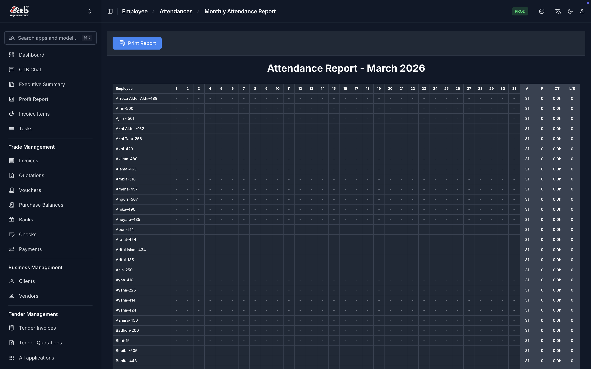

# Attendance Report

## Summary

The Monthly Attendance Report provides a day-by-day attendance matrix for all employees for a selected month, along with aggregate tallies for days present, lateness, overtime hours, and leaves. Use it to audit staff presence, export printable records, and feed monthly payroll calculations.

______________________________________________________________________

## When to use this page

- Auditing monthly employee attendance prior to generating monthly salaries.
- Verifying daily attendance patterns and lateness trends across departments.
- Preparing a printable monthly attendance summary for HR management.
- Reconciling overtime hours or unexcused absence deductions.

______________________________________________________________________

## How to access this page

Open **Employee → Attendances → Monthly Attendance Report** in the left sidebar.

______________________________________________________________________

## Prerequisites

- Active user session with `employee.view_attendance` or HR manager permissions.
- Active employee profiles must exist in **Employee → Employees**.
- Daily attendance entries must be recorded for the target month.

______________________________________________________________________

## Step-by-step instructions

1. Open **Employee → Attendances → Monthly Attendance Report**.
1. Select the target **Month** and **Year** using the header date picker.
1. Click **Apply Filter** to render the monthly attendance grid.
1. Inspect the per-employee rows across date columns `1` through `31`.
1. Review right-hand summary tallies for **Present (P)**, **Absent (A)**, **Late (L)**, and **Overtime (OT)**.
1. Refer to the color-coded legend below the grid to distinguish full shifts, leaves, and late arrivals.
1. Click **Print Report** (top-left) to export a clean PDF or print hard copy attendance sheets.

______________________________________________________________________

## Verification & definition of done

- **Grid completion**: Every active employee has an attendance status icon or code for each calendar day of the month.
- **Summary reconciliation**: The sum of Present + Absent + Leave days equals total working days in the month.

______________________________________________________________________

## Field reference

- **Employee** — Full name and ID of the employee (first column).
- **Date Columns (1–31)** — Calendar day cells indicating shift attendance status for that date.
- **Present (P)** — Total count of days the employee worked a complete shift.
- **Absent (A)** — Total count of days marked absent or unrecorded.
- **Late (L)** — Total count of shift arrivals exceeding the grace period.
- **OT (Hours)** — Aggregate overtime hours accumulated during the month.
- **Leave (LV)** — Total count of approved paid or unpaid leave days.

______________________________________________________________________

## Exception handling & error recovery

| Error Code / Symptom      | Root Cause                                                 | Step-by-step remediation procedure                                                                                       | Actionable role required |
| ------------------------- | ---------------------------------------------------------- | ------------------------------------------------------------------------------------------------------------------------ | ------------------------ |
| Empty grid cells          | Attendance not recorded or automated biometric sync failed | 1. Open **Employee → Attendances → Record Attendance**. 2. Manually enter time-in/time-out records for missing dates. | `hr` / `staff`           |
| Unexpected overtime tally | Shift start/end times misconfigured                        | 1. Open **Employee → Shift Settings**. 2. Confirm official working hours and overtime threshold rules.                | `hr` / `admin`           |

______________________________________________________________________

## Related workflows & next steps

- **[Record Attendance](../04-employee/attendance/record-attendance.md)** — Enter or correct daily attendance records.
- **[Generate Salary](../04-employee/salary/generate-salary.md)** — Process monthly payroll based on verified attendance tallies.

______________________________________________________________________

## Related pages

- **[Reports](../README.md)** — All available reporting tools across CTB Admin.
