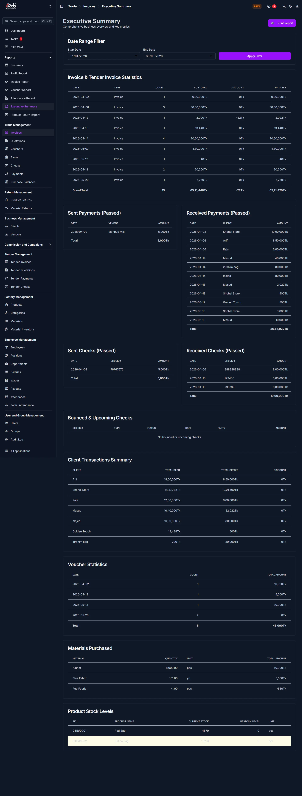

# Executive Summary

## Summary

The Executive Summary page provides a consolidated, printable report of key business metrics across invoices, payments, checks, vouchers, materials purchased and product stock levels for a selectable date range. Use it to get a quick management-level view and to drill into specific transactions.

______________________________________________________________________

## When to use this page

- You need a one-page overview of recent invoicing and payment activity
- Preparing a printable summary for management review
- Verifying cashflow items (sent/received payments and checks) for a date range
- Reviewing material purchases and current product stock levels

______________________________________________________________________

## How to access this page

Open **Reports → Executive Summary** in the left sidebar under **Reports**.

______________________________________________________________________

## Prerequisites

- You must have permission to view Reports pages (reporting or finance role)
- Relevant transactions (invoices, payments, checks, vouchers, purchases, stock) must exist for the selected date range

______________________________________________________________________

## Step-by-step instructions

1. Go to **Reports → Executive Summary**.
1. Set the **Start Date** and **End Date** in the Date Range Filter to the period you want to review
1. Click **Apply Filter** to refresh all sections on the page for the selected date range
1. Review the top table: **Invoice & Tender Invoice Statistics** for per-date invoice counts and totals and the reported Grand Total
1. Scan the four payment/check panels to verify Sent Payments, Received Payments, Sent Checks and Received Checks (only passed items are shown)
1. Check the **Bounced & Upcoming Checks** area for any returned or scheduled checks
1. Review the **Client Transactions Summary** for client-level debit/credit balances and discounts
1. Inspect **Voucher Statistics**, **Materials Purchased**, and **Product Stock Levels** for purchasing and inventory insights
1. Click **Print Report** (top-right) to export or print the current view

______________________________________________________________________

## Field reference

- **Start Date** — First date included in the report filter

- **End Date** — Last date included in the report filter

- **Apply Filter** — Button that refreshes the report data for the chosen date range

- **Invoice & Tender Invoice Statistics** — Table listing per-date invoice/tender invoice rows with these columns:

    - **Date** — Transaction date
    - **Type** — `Invoice` or `Tender Invoice`
    - **Count** — Number of invoices on that date
    - **Subtotal** — Sum of invoice line subtotals before discounts
    - **Discount** — Total discounts applied
    - **Payable** — Net amount payable after discounts
    - **Grand Total** — Sum of the **Payable** column for the date range (shown at table bottom)

- **Sent Payments (Passed)** — List of sent/cleared payments with **Date**, **Vendor**, **Amount** and a **Total** row

- **Received Payments (Passed)** — List of received/cleared payments with **Date**, **Client**, **Amount** and a **Total** row

- **Sent Checks (Passed)** / **Received Checks (Passed)** — Tables showing cleared checks with **Date**, **Check #**, **Amount** and a **Total** row

- **Bounced & Upcoming Checks** — Table showing check number, type, status, scheduled/cleared date, party and amount; displays a message when none are present

- **Client Transactions Summary** — Per-client summary with **Client**, **Total Debit**, **Total Credit**, and **Discount** columns

- **Voucher Statistics** — Date-wise count and total amount for vouchers within the filter range and a **Total** row

- **Materials Purchased** — List of purchased materials showing **Material**, **Quantity**, **Unit**, and **Total Amount** (negative values indicate returns or corrections)

- **Product Stock Levels** — Inventory snapshot with **SKU**, **Product Name**, **Current Stock**, **Restock Level**, and **Unit**

______________________________________________________________________

## Tips and common issues

- If the page shows zero results, expand the date range or verify that transactions exist for the period
- Large date ranges may slow down loading; filter narrower ranges for quicker responses
- Negative totals in Materials Purchased typically indicate returns or stock corrections — verify related purchase records
- If totals don't match your accounting system, check for unposted or draft transactions excluded from the report
- Timezone or server date mismatches can shift which day a transaction appears on; confirm server timezone settings if dates look off

______________________________________________________________________

## Related pages

- **[Reports](../README.md)** — All pages in this module.
