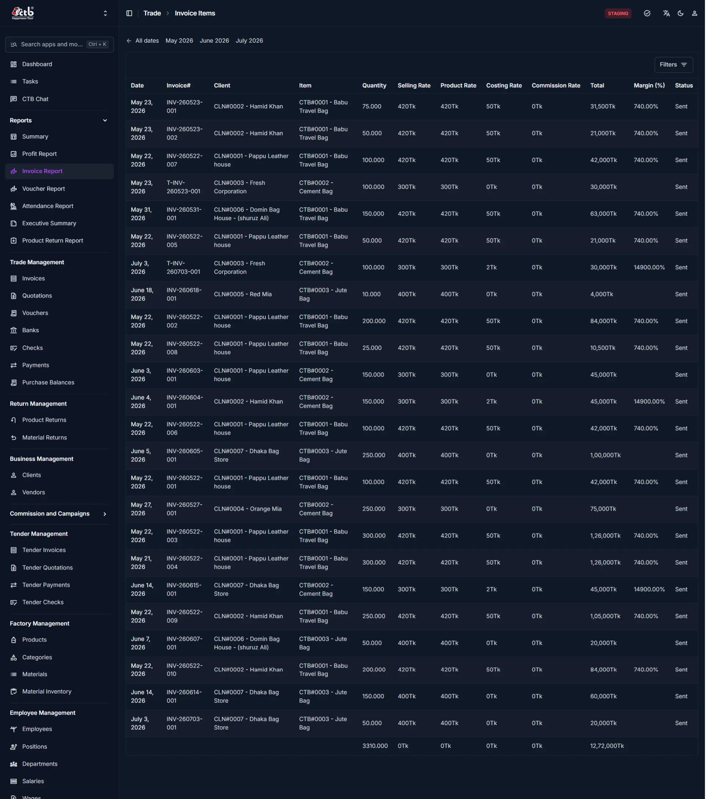
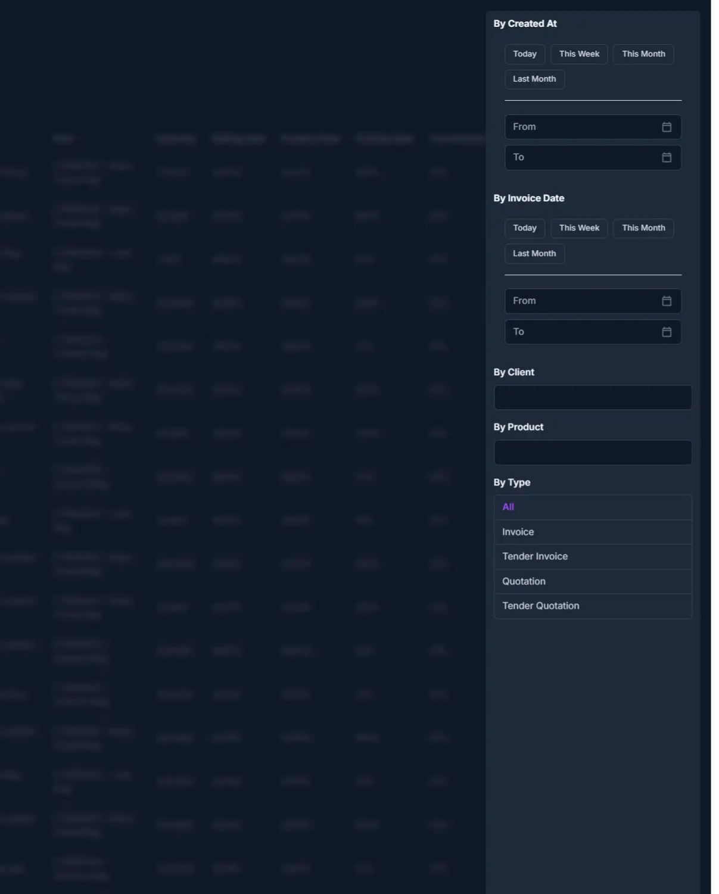

# Invoice Report

## Summary

This page displays a detailed, line-item breakdown of all invoices — including regular invoices, tender invoices, quotations, and tender quotations — showing pricing, quantity, margin, and status for each item sold. It also provides quick month-based navigation and advanced filtering to narrow down results.

## When to use this page

- When you need to see a detailed list of individual invoice line items rather than summary totals.
- When you want to check pricing details (selling rate, product rate, costing rate, commission rate) for specific transactions.
- When you need to verify the margin (%) earned on a particular item or invoice.
- When you want to filter invoices by date, client, product, or document type (Invoice, Tender Invoice, Quotation, Tender Quotation).
- When you need to check the status of an invoice (e.g., Sent).

## How to access this page

Open **Reports → Invoice Report** in the sidebar.

## Prerequisites

- User must have access to the **Reports** module.
- Invoices, tender invoices, or quotations must exist in the system for data to appear.

## Step-by-step instructions

1. Open **Invoice Report** from the sidebar under **Reports**.
1. Use the **month tabs** (All dates, May 2026, June 2026, July 2026) near the top to quickly switch between reporting periods.
1. Click **Filters** (top right) to open the advanced filter panel.
1. Under **By Created At** or **By Invoice Date**, choose a quick range (**Today**, **This Week**, **This Month**, **Last Month**) or manually set a custom **From** and **To** date.
1. Enter a name in **By Client** or **By Product** to search for a specific client or product.
1. Under **By Type**, select **All**, **Invoice**, **Tender Invoice**, **Quotation**, or **Tender Quotation** to filter by document type.
1. Click **Apply Filters** to update the table with the selected criteria.
1. Optionally, click **Show counts** to display record counts alongside the filtered results.
1. Review the table for line-item details, and check the bottom summary row for totals across quantity and value.

## Field reference

- **Date** — The invoice date on which the transaction was recorded.
- **Invoice#** — The unique reference number of the invoice (e.g., `INV-260523-001`, `T-INV-260523-001` for tender invoices).
- **Client** — The client associated with the invoice, shown with client code and name (e.g., `CLN#0002 - Hamid Khan`).
- **Item** — The product included in the invoice line, shown with product code and name (e.g., `CTB#0001 - Babu Travel Bag`).
- **Quantity** — The number of units sold for that line item.
- **Selling Rate** — The price per unit charged to the client.
- **Product Rate** — The base listed rate of the product.
- **Costing Rate** — The internal cost per unit of the product.
- **Commission Rate** — Any commission amount applied per unit, if applicable.
- **Total** — The total value of the line item (Quantity × Selling Rate).
- **Margin (%)** — The profit margin percentage earned on that line item, calculated from selling rate versus costing rate.
- **Status** — The current status of the invoice (e.g., Sent).

## Filter panel reference

- **By Created At** — Filters records based on when they were created in the system, with quick options (Today, This Week, This Month, Last Month) or a custom From/To range.
- **By Invoice Date** — Filters records based on the actual invoice date, with the same quick options or a custom From/To range.
- **By Client** — Text search field to filter results by a specific client name.
- **By Product** — Text search field to filter results by a specific product name.
- **By Type** — Filters results by document type: **All**, **Invoice**, **Tender Invoice**, **Quotation**, or **Tender Quotation**.
- **Apply Filters** — Applies the selected filter criteria to refresh the table.
- **Show counts** — Displays the number of matching records alongside the filtered results.

## Notes

!!! note

    Margin (%) may appear blank for some line items when the Commission Rate is 0Tk, since margin depends on the commission and costing values entered for that transaction.

!!! tip

    Use the month tabs for quick, one-click navigation between recent periods instead of manually setting a date range in the Filters panel.
