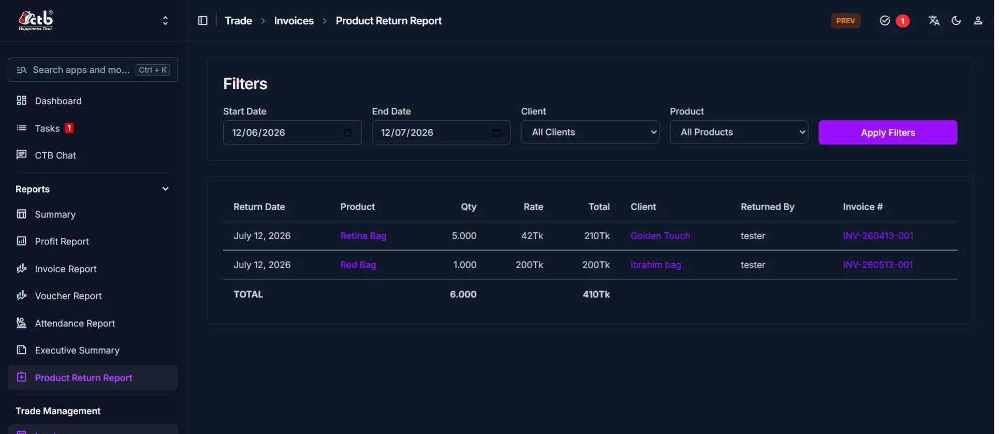

# Product Return Report

## Summary

The Product Return Report details all product returns recorded within a selected date range, displaying return date, product, quantity, rate, total amount, client, returned-by user, and originating invoice reference. Return totals adjust the client balance directly upon processing.

______________________________________________________________________

## When to use this page

- Reviewing products returned by clients or processed by sales staff.
- Reconciling returned goods with sales invoices and client balance ledgers.
- Preparing a printable summary of returns for inventory restock and accounting adjustments.
- Auditing return reason notes and individual return user attributions.

______________________________________________________________________

## How to access this page

Open **Trade → Invoices → Product Return Report** in the left sidebar under **Trade**.

______________________________________________________________________

## Prerequisites

- Active user session with `trade.view_productreturn` or accountant permissions.
- Invoice and return records must exist for the selected date range.
- Active client accounts must exist to process balance credits.

______________________________________________________________________

## Step-by-step instructions

1. Open **Trade → Invoices → Product Return Report**.
1. Set the **Start Date** and **End Date** filters for the target audit period.
1. Optionally select a specific **Client** or **Product** from the dropdown filters.
1. Click **Apply Filters** to render matching return entries.
1. Inspect each row displaying **Return Date**, **Product**, **Qty**, **Rate**, **Total**, **Client**, **Returned By**, and **Invoice #**.
1. Verify the summary **TOTAL** row at the bottom of the table for aggregate quantity and credit totals.
1. Click any **Invoice #** link to inspect the originating sales invoice.
1. Click **Print Report** (top-right) to generate a PDF or print hard copy report sheets.

______________________________________________________________________

## Verification & definition of done

- **Balance reconciliation**: The total credit amount in the **TOTAL** row equals the sum of credit balance adjustments posted to client ledgers for that date range.
- **Inventory sync**: Returned product quantities reflect corresponding restock increases in finished goods inventory.

______________________________________________________________________

## Field reference

- **Start Date** — First date included in the return report filter range.
- **End Date** — Last date included in the return report filter range.
- **Client** — Dropdown filter to isolate returns for a specific client account.
- **Product** — Dropdown filter to isolate returns for a specific finished product.
- **Apply Filters** — Refreshes the return report table for chosen parameters.
- **Return Date** — Date the product return was processed in CTB Admin.
- **Product** — Name of the returned product item.
- **Qty** — Quantity of product returned to inventory.
- **Rate** — Unit selling rate applied to calculate the credit refund.
- **Total** — Total credit amount (`Qty × Rate`) credited back to the client account.
- **Client** — Name of the client receiving the balance credit.
- **Returned By** — User account responsible for logging the return entry.
- **Invoice #** — Clickable reference link to the original sales invoice.

______________________________________________________________________

## Exception handling & error recovery

| Error Code / Symptom            | Root Cause                                    | Step-by-step remediation procedure                                                                          | Actionable role required           |
| ------------------------------- | --------------------------------------------- | ----------------------------------------------------------------------------------------------------------- | ---------------------------------- |
| Credit missing on client ledger | Return recorded as draft or unposted          | 1. Open **Trade → Invoices**. 2. Select the invoice return entry and confirm posting status.             | `accountant`                       |
| Negative return quantity        | Stock correction or return cancellation entry | 1. Verify return entry note. 2. Confirm corresponding stock ledger adjustment in **Factory → Products**. | `staff` $\rightarrow$ `accountant` |

______________________________________________________________________

## Related workflows & next steps

- **[Create Invoice](../03-trade/invoices/create-invoice.md)** — Inspect original sales invoices before processing returns.
- **[Add Client](../01-business/clients/add-client.md)** — Check updated client balance and credit limit.

______________________________________________________________________

## Related pages

- **[Reports](../README.md)** — All available executive and operational reporting tools.
