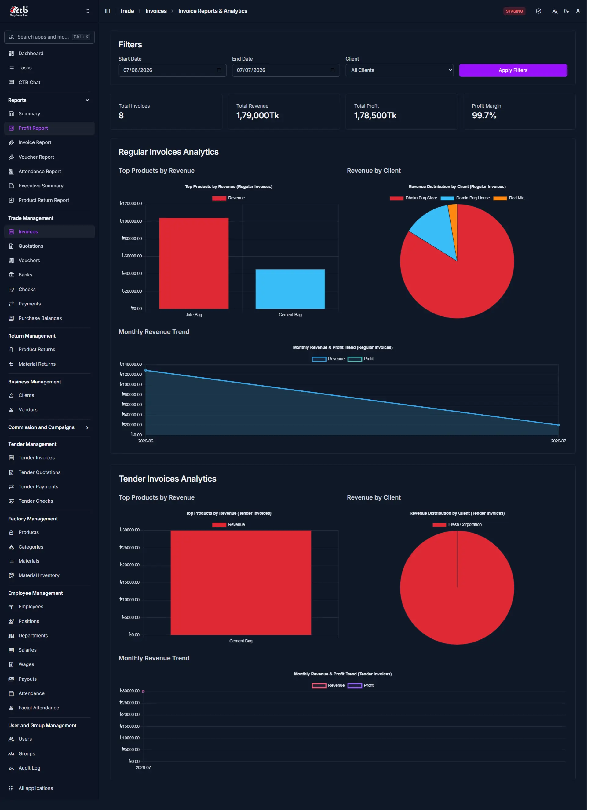

# Profit Report

## Summary

This page provides a consolidated financial overview of invoices — both regular trade invoices and tender invoices — for a selected date range. It combines summary metrics, product-level revenue breakdowns, client distribution, and monthly trends to help users understand overall business performance and profitability.

## When to use this page

- When you need to review total revenue, profit, and profit margin over a specific period.
- When you want to identify top-performing products by revenue.
- When you need to see which clients are contributing the most revenue.
- When you want to track how revenue and profit are trending month over month.
- When you need to compare performance between **Regular Invoices** and **Tender Invoices** separately.

## How to access this page

Open **Report → Profit Report** in the sidebar.

## Prerequisites

- User must have access to the **Trade Management** module.
- At least one invoice (regular or tender) must exist within the selected date range for data to appear.

## Step-by-step instructions

1. Open **Reports** from the sidebar under **Profit Report**.
1. Set the **Start Date** and **End Date** to define the reporting period.
1. Optionally, select a specific **Client** from the dropdown, or leave as **All Clients**.
1. Click **Apply Filters** to refresh the report with the selected criteria.
1. Review the **summary cards** at the top for a quick snapshot of totals.
1. Scroll to **Regular Invoices Analytics** to review standard trade invoice performance.
1. Scroll to **Tender Invoices Analytics** to review tender-specific invoice performance.
1. Use the charts to identify top products, top clients, and monthly trends.

## Section reference

### Filters

- **Start Date / End Date** — Defines the date range for which report data is calculated.
- **Client** — Filters the report to show data for a single client, or all clients combined.
- **Apply Filters** — Button that refreshes all report data based on the selected filter values.

### Summary Cards

- **Total Invoices** — The total number of invoices issued within the selected date range.
- **Total Revenue** — The combined revenue (in Tk) generated from all invoices in the period.
- **Total Profit** — The combined profit (in Tk) earned from all invoices in the period.
- **Profit Margin** — Profit expressed as a percentage of revenue, indicating overall profitability.

### Regular Invoices Analytics

This section covers performance data for standard (non-tender) invoices.

- **Top Products by Revenue** — A bar chart showing which products generated the highest revenue among regular invoices (e.g., Test School Bag, hazi bag, Seven Rings, DP-19).
- **Revenue by Client** — A pie chart showing the percentage share of revenue contributed by each client (e.g., Unicef, Mahbub Mia, European Bag, Bismillah Bag Bazar).
- **Monthly Revenue Trend** — A line chart comparing **Revenue** and **Profit** month by month, helping identify whether performance is increasing or declining over time.

### Tender Invoices Analytics

This section covers performance data specifically for tender-based invoices, mirroring the structure of the Regular Invoices section.

- **Top Products by Revenue** — A bar chart showing which products generated the highest revenue among tender invoices (e.g., Seven Rings).
- **Revenue by Client** — A pie chart showing the percentage share of tender revenue contributed by each client (e.g., Seven Rings Bag, Mahbub Mia).
- **Monthly Revenue Trend** — A line chart comparing **Revenue** and **Profit** for tender invoices month by month.

## Notes

!!! note

    Regular Invoices and Tender Invoices are tracked and visualized **separately** throughout this page, since they represent different business workflows (standard trade vs. tender-based contracts).

!!! tip

    Use the **Client filter** combined with a narrow date range to analyze performance for a single customer over a specific period.

## Related pages
