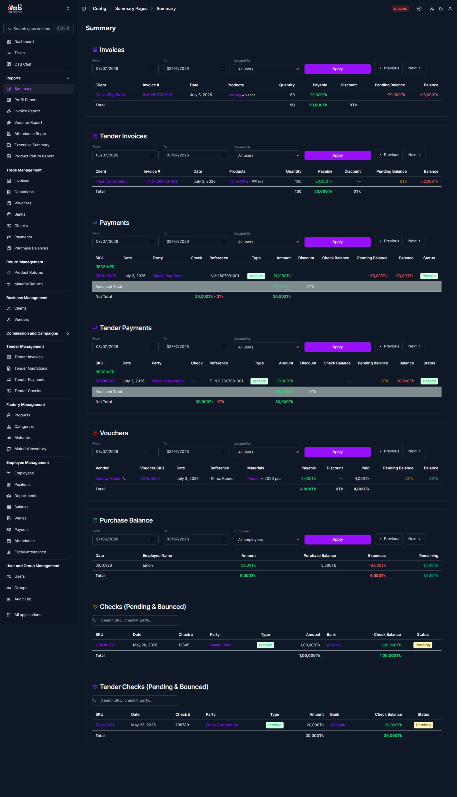

# Summary Report

## Summary

Use this page to review a combined report of invoices, tender invoices, payments, vouchers, purchase balance, and checks.

## When to use this page

- When you need one place to compare regular and tender transactions.
- When you want to check pending balance and final totals.
- When you need an overview of vouchers, purchase balance, and checks together.
- When you want to review current sales and payment status.

## How to access this page

Open **Reports → Summary** in the sidebar.

## Prerequisites

- Permission to view reports.
- Existing invoices, tender invoices, payments, vouchers, checks, or purchase balance records.

## Step-by-step instructions

1. Open **Reports → Summary** from the sidebar.
1. Set **From** and **To** dates for the reporting period.
1. Choose a user in **Created By** to filter the page by creator.
1. Click **Apply** to refresh the selected section.
1. Review the totals for each report section.
1. Use **Previous** and **Next** only when a section has multiple pages.

## Common controls

- **From** — Start date for the report.
- **To** — End date for the report.
- **Created By** — User filter for record creators.
- **Apply** — Refreshes the sections using the current filters.
- **Previous** — Moves to the previous page of records in the current section.
- **Next** — Moves to the next page of records in the current section.

## Report sections

### Invoices

Use this section to review regular invoices for clients.

- **Client** — Customer name for the invoice.
- **Invoice #** — Invoice identifier.
- **Date** — Invoice date.
- **Products** — Products sold in the invoice.
- **Quantity** — Quantity sold.
- **Payable** — Amount due.
- **Discount** — Discount applied.
- **Pending Balance** — Unpaid amount.
- **Balance** — Final balance after payments.

### Tender Invoices

Use this section to review tender invoices separately from regular invoices.

- **Client** — Customer name for the tender invoice.
- **Invoice #** — Tender invoice identifier.
- **Date** — Tender invoice date.
- **Products** — Products sold in the tender invoice.
- **Quantity** — Quantity sold.
- **Payable** — Amount due.
- **Discount** — Discount applied.
- **Pending Balance** — Unpaid amount.
- **Balance** — Final balance.

### Payments

Use this section to review received payments.

- **SKU** — Payment record identifier.
- **Date** — Payment date.
- **Party** — Client or vendor involved.
- **Check** — Linked check identifier.
- **Reference** — Payment reference number.
- **Type** — Payment type.
- **Amount** — Amount received.
- **Discount** — Discount amount.
- **Check Balance** — Balance on the linked check.
- **Pending Balance** — Remaining due amount.
- **Balance** — Final balance after the payment.
- **Status** — Payment status.

### Tender Payments

Use this section to review tender payments.

- **SKU** — Tender payment record identifier.
- **Date** — Tender payment date.
- **Party** — Client or vendor involved.
- **Check** — Linked check identifier.
- **Reference** — Tender payment reference number.
- **Type** — Tender payment type.
- **Amount** — Amount received.
- **Discount** — Discount amount.
- **Check Balance** — Balance on the linked check.
- **Pending Balance** — Remaining due amount.
- **Balance** — Final balance.
- **Status** — Tender payment status.

### Vouchers

Use this section to review voucher records and their payment details.

- **Vendor** — Supplier name.
- **Voucher SKU** — Voucher identifier.
- **Date** — Voucher date.
- **Reference** — Voucher reference number.
- **Materials** — Materials listed on the voucher.
- **Payable** — Amount due.
- **Discount** — Discount applied.
- **Paid** — Amount paid against the voucher.
- **Pending Balance** — Remaining amount due.
- **Balance** — Final voucher balance.

### Purchase Balance

Use this section to review employee purchase balance records.

- **Date** — Record date.
- **Employee Name** — Employee associated with the balance.
- **Amount** — Balance amount.
- **Purchase Balance** — Total purchase balance.
- **Expenses** — Expense amount.
- **Remaining** — Remaining balance.

### Checks (Pending & Bounced)

Use this section to review pending or bounced checks.

- **SKU** — Check record identifier.
- **Date** — Check date.
- **Check #** — Check number.
- **Party** — Party receiving or issuing the check.
- **Type** — Check type.
- **Amount** — Check amount.
- **Bank** — Bank name.
- **Check Balance** — Balance on the check.
- **Status** — Check status.

### Tender Checks (Pending & Bounced)

Use this section to review tender checks.

- **SKU** — Tender check record identifier.
- **Date** — Tender check date.
- **Check #** — Tender check number.
- **Party** — Party receiving or issuing the tender check.
- **Type** — Tender check type.
- **Amount** — Tender check amount.
- **Bank** — Bank name.
- **Check Balance** — Balance on the tender check.
- **Status** — Tender check status.

## Related pages

- **[Profit Report](profit-report.md)** — Review profit and margin details for the same period.
- **[Invoice Report](invoice-report.md)** — Review invoice-specific sales data and totals.
- **[Voucher Report](voucher-report.md)** — Review vouchers and accounting entries.
- **[Executive Summary](executive-summary.md)** — Review a higher-level management summary.
- **[Product Return Report](product-return-report.md)** — Review returned product activity and totals.
