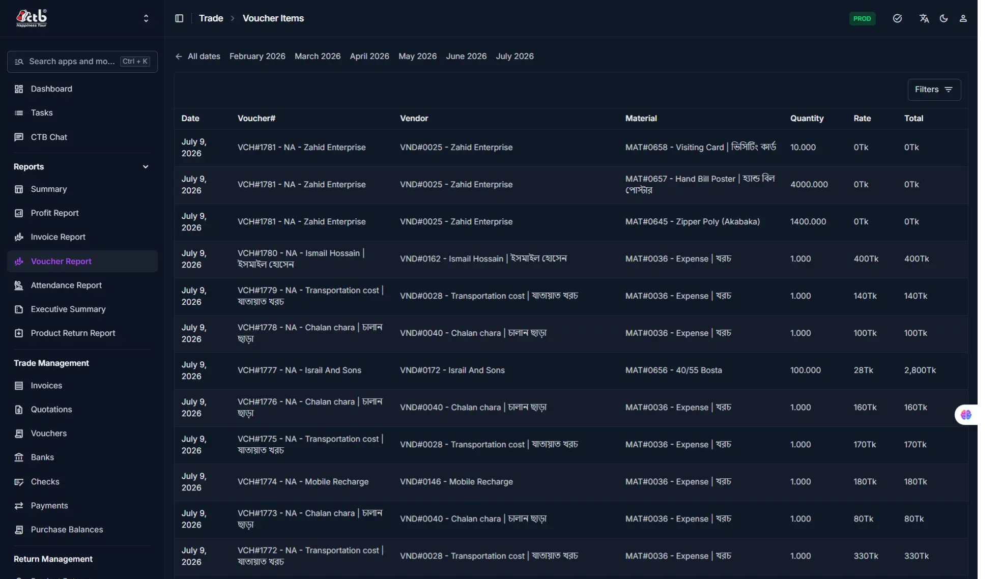
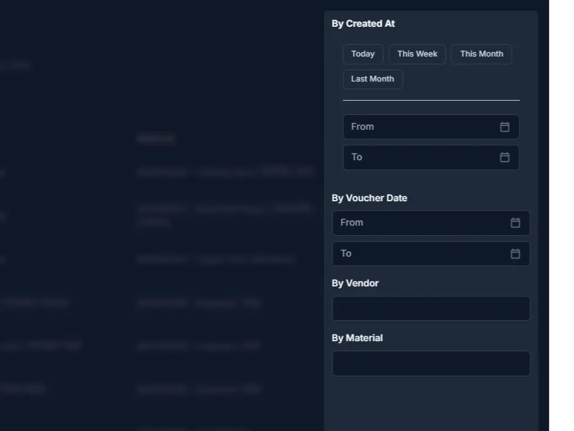

# Voucher Report

## Summary

This page displays a detailed, line-item breakdown of all vouchers and accounting entries — including vendor transactions, material purchases, and expense records — showing quantity, rate, and total amounts for each entry. It also provides advanced filtering to narrow down results by date, vendor, and material.

______________________________________________________________________

## When to use this page

- When you need to see a detailed list of individual voucher line items rather than summary totals.
- When you want to verify transaction amounts and rates for specific vouchers or vendors.
- When you need to filter vouchers by creation date, voucher date, vendor, or material.
- When you want to track material purchases and associated costs across the reporting period.
- When you need to review accounting entries for reconciliation or audit purposes.

______________________________________________________________________

## How to access this page

Open **Reports → Voucher Report** in the sidebar.

______________________________________________________________________

## Prerequisites

- You have access to the **Reports** module.
- Vouchers or accounting entries must exist in the system for data to appear.

______________________________________________________________________

## Step-by-step instructions

1. Open **Voucher Report** from the sidebar under **Reports**.
1. Click **Filters** (top right) to open the advanced filter panel.
1. Under **By Created At**, choose a quick range (**Today**, **This Week**, **This Month**, **Last Month**) or manually set a custom **From** and **To** date to filter by creation date.
1. Under **By Voucher Date**, select a quick range or set a custom **From** and **To** date to filter by voucher transaction date.
1. Enter a vendor name in **By Vendor** to search for transactions from a specific vendor.
1. Enter a material name in **By Material** to filter vouchers by specific materials or expense types.
1. Click **Apply Filters** to update the table with the selected criteria.
1. Review the table for line-item details, and check the summary row for totals across quantity and value.

______________________________________________________________________

## Field reference

| Field        | Description                                                                                                                                               |
| ------------ | --------------------------------------------------------------------------------------------------------------------------------------------------------- |
| **Date**     | The voucher date on which the transaction was recorded                                                                                                    |
| **Voucher#** | The unique reference number of the voucher (e.g., `VCH#1781 - NA - Zahid Enterprise`)                                                                     |
| **Vendor**   | The vendor associated with the voucher, shown with vendor code and name (e.g., `VND#0025 - Zahid Enterprise`)                                             |
| **Material** | The material or expense category included in the voucher line, shown with material code and description (e.g., `MAT#0658 - Visiting Card \| ভিজিটিং কার্ড`) |
| **Quantity** | The number of units or quantity amount for that line item                                                                                                 |
| **Rate**     | The rate per unit for the material or service                                                                                                             |
| **Total**    | The total value of the line item (Quantity × Rate)                                                                                                        |

______________________________________________________________________

## Filter panel reference

| Filter              | Description                                                                                                                                                 |
| ------------------- | ----------------------------------------------------------------------------------------------------------------------------------------------------------- |
| **By Created At**   | Filters records based on when they were created in the system, with quick options (Today, This Week, This Month, Last Month) or a custom From/To date range |
| **By Voucher Date** | Filters records based on the actual voucher transaction date, with quick options or a custom From/To date range                                             |
| **By Vendor**       | Text search field to filter results by a specific vendor name or code                                                                                       |
| **By Material**     | Text search field to filter results by a specific material or expense type                                                                                  |
| **Apply Filters**   | Applies the selected filter criteria to refresh the table                                                                                                   |

______________________________________________________________________

## Tips and common issues

!!! tip

    Use the quick date filters (**By Created At** or **By Voucher Date**) for faster navigation instead of manually setting date ranges.

!!! note

    Vouchers may include both material purchases and expense entries. Filter by **Material** to isolate specific types of transactions.

______________________________________________________________________

## Related pages

- **[Reports](../README.md)** — All pages in this module.
