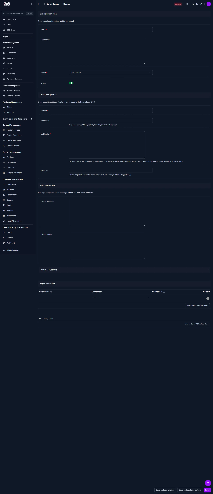

# SMS Notifications

Use this page to create and manage notification signals for SMS and email messaging. The page lets you define target models, compose message content, and add SMS-specific routing rules.

## Summary

Use SMS Notifications to configure how CTB Admin sends alerts and reminders by SMS. Define the signal name, target model, message templates, and constraints so automated notifications trigger correctly.

______________________________________________________________________

## When to use this page

- When creating a new SMS notification signal.
- When updating the message content for a notification.
- When changing the target model or recipient list.
- When adding conditions or constraints for when a notification should fire.

______________________________________________________________________

## How to access this page

From the sidebar, go to **ALL Application → Email Signal → Signal**. Open the SMS notifications page and click the purple (+) icon add action to create a new signal.

______________________________________________________________________

## Step-by-step instructions

1. Go to **Settings and Admin → SMS Notifications** from the sidebar.
1. Review the current SMS configuration and the events that trigger a message.
1. Update the settings you need to change.
1. Save the configuration.
1. Send a test message where available to confirm delivery before relying on it.

______________________________________________________________________

## Field reference

| Field name             | What to do           | Description                                                             |
| ---------------------- | -------------------- | ----------------------------------------------------------------------- |
| **Name**               | Enter a name         | Unique label for the notification signal                                |
| **Description**        | Enter details        | Optional description of the signal's purpose                            |
| **Model**              | Select a model       | The data model the signal monitors for changes                          |
| **Active**             | Toggle on or off     | Enable or disable the notification signal                               |
| **Subject**            | Enter a subject      | Subject line used for email or internal message identification          |
| **From email**         | Enter sender address | The email address that appears as the sender when email is used         |
| **Mailing list**       | Enter recipients     | Comma-separated list of emails or functions to receive the notification |
| **Template**           | Enter template path  | Optional template path used for rendered email or SMS content           |
| **Plain text content** | Enter text           | Message content that is sent as plain text                              |
| **HTML content**       | Enter HTML           | Message content that is sent as HTML when email is used                 |
| **Signal constraints** | Add constraint rows  | Conditions that control when the signal is dispatched                   |
| **SMS Configuration**  | Add SMS settings     | SMS-specific sending rules and provider parameters                      |

______________________________________________________________________

## Page overview

This page is divided into sections for general signal setup, email/SMS message content, and advanced notification rules.

______________________________________________________________________

## Tips and common issues

- Use a clear signal **Name** so you can identify the notification later.
- Keep the **Mailing list** current to avoid sending alerts to old addresses.
- Test the signal after changing content or constraints.
- Add only the necessary constraints to avoid blocking valid notifications.
- If SMS messages are not sent, verify the SMS configuration and provider settings.

______________________________________________________________________

## Related pages

- **[User Management](user-management.md)** — Manage users and roles who can configure notifications.
- **[App Settings](app-settings.md)** — Configure global settings that may affect message delivery.
- **[Audit Log](audit-log.md)** — Review changes and notification-related audit entries.
