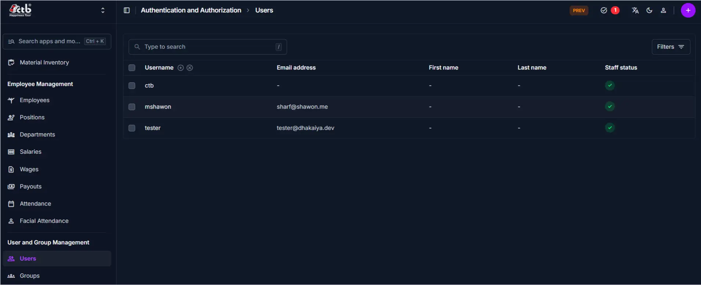
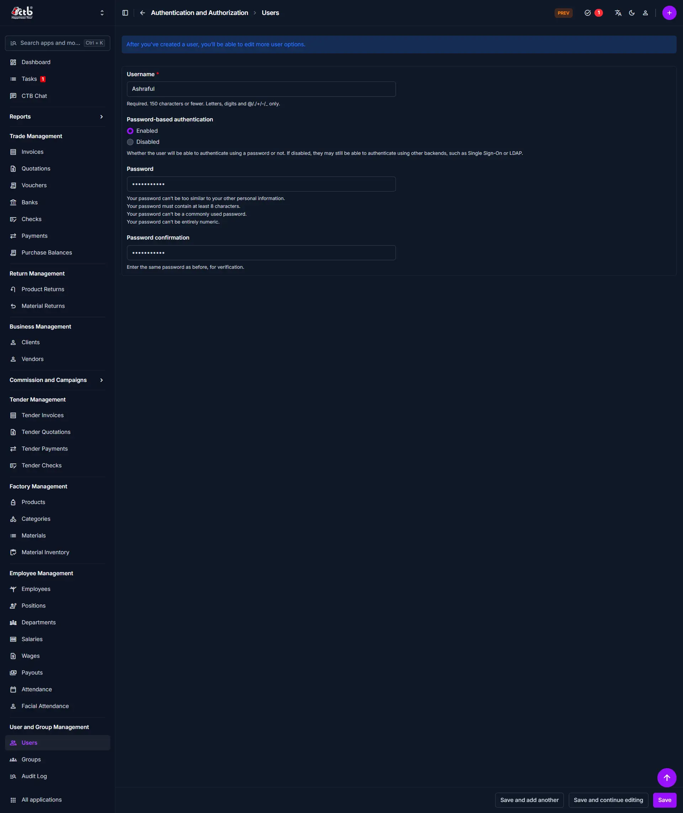
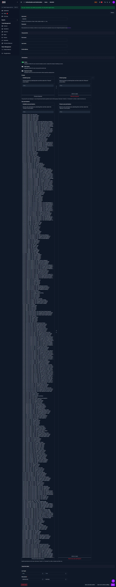

# User Management

## Summary

The User Management page allows administrators to create, edit, deactivate, and assign role-based access permissions (`auth.user`) to staff accounts in CTB Admin. Access controls dictate which modules, views, and form actions each user is authorized to perform.

______________________________________________________________________

## When to use this page

- Onboarding new employees who require system access to CTB Admin.
- Provisioning department-specific staff accounts with restricted module access.
- Assigning elevate superuser or staff status flags.
- Deactivating user accounts when an employee offboards or changes roles.

______________________________________________________________________

## How to access this page

From the sidebar navigation, select **Authentication → Users** (`/admin/auth/user/`).

______________________________________________________________________

## Prerequisites

- Active user session with `auth.add_user` / `auth.change_user` or superuser privileges.
- Standard employee profile details established in **Employee → Employees**.

______________________________________________________________________

## Step-by-step instructions

1. Open **Authentication → Users** from the sidebar and click **Add User (+)**.
1. Enter a unique **Username** and secure **Password** meeting complex strength rules.
1. Re-enter the password in **Password Confirmation** and click **Save and continue editing**.
1. In the **Permissions** section, toggle **Staff status** (`is_staff = True`) to grant admin UI login access.
1. Select target **Groups** or assign specific module permission codenames (e.g. `trade.add_invoice`, `employee.change_salary`).
1. Click **Save** to finalize user account creation.

______________________________________________________________________

## Verification & definition of done

- **Account provisioned**: User account appears in the user list and can successfully authenticate.
- **Access restricted**: User interface displays only authorized sidebar navigation links and action buttons based on assigned permission codenames.

______________________________________________________________________

## Field reference

- **Username** — Unique account identifier used for login authentication.
- **Is Active** — Account status switch (`True` enables login; `False` disables access).
- **Staff Status (`is_staff`)** — Grants access to the CTB Admin web application.
- **Superuser (`is_superuser`)** — Bypasses all explicit permission checks and grants unrestricted global access.
- **Permissions** — Multi-select list of Django permission codenames (`app.action_model`).

### Django permission codename reference

| Module       | Codename Pattern            | Example Permission                                  |
| ------------ | --------------------------- | --------------------------------------------------- |
| **Trade**    | `trade.<action>_<model>`    | `trade.add_invoice`, `trade.change_payment`         |
| **Business** | `business.<action>_<model>` | `business.add_client`, `business.change_vendor`     |
| **Employee** | `employee.<action>_<model>` | `employee.add_attendance`, `employee.change_salary` |
| **Factory**  | `factory.<action>_<model>`  | `factory.add_product`, `factory.change_material`    |

______________________________________________________________________

## Exception handling & error recovery

| Error Code / Symptom              | Root Cause                                                       | Step-by-step remediation procedure                                                                                                   | Actionable role required      |
| --------------------------------- | ---------------------------------------------------------------- | ------------------------------------------------------------------------------------------------------------------------------------ | ----------------------------- |
| Account created but cannot log in | `Staff status` (`is_staff`) or `Is Active` disabled              | 1. Open user profile under **Authentication → Users**. 2. Enable **Staff status** and **Is Active** switches. 3. Save profile. | `admin`                       |
| Permission changes not visible    | Active user session caching old permission state                 | 1. Instruct user to click **Log Out** in top navbar. 2. Sign back in to generate a fresh permission session token.                | `staff` $\rightarrow$ `admin` |
| Password validation failure       | Password under 8 characters, matches username, or purely numeric | 1. Enter password with at least 8 characters. 2. Include mixed alphanumeric and special characters.                               | `admin`                       |

______________________________________________________________________

## Related workflows & next steps

- **[App Settings](app-settings.md)** — Configure global system parameters and security controls.
- **[Audit Log](audit-log.md)** — Monitor user authentication logs and administrative edits.

______________________________________________________________________

## Related pages

- **[Settings and Admin](../README.md)** — All system configuration and security administration tools.
