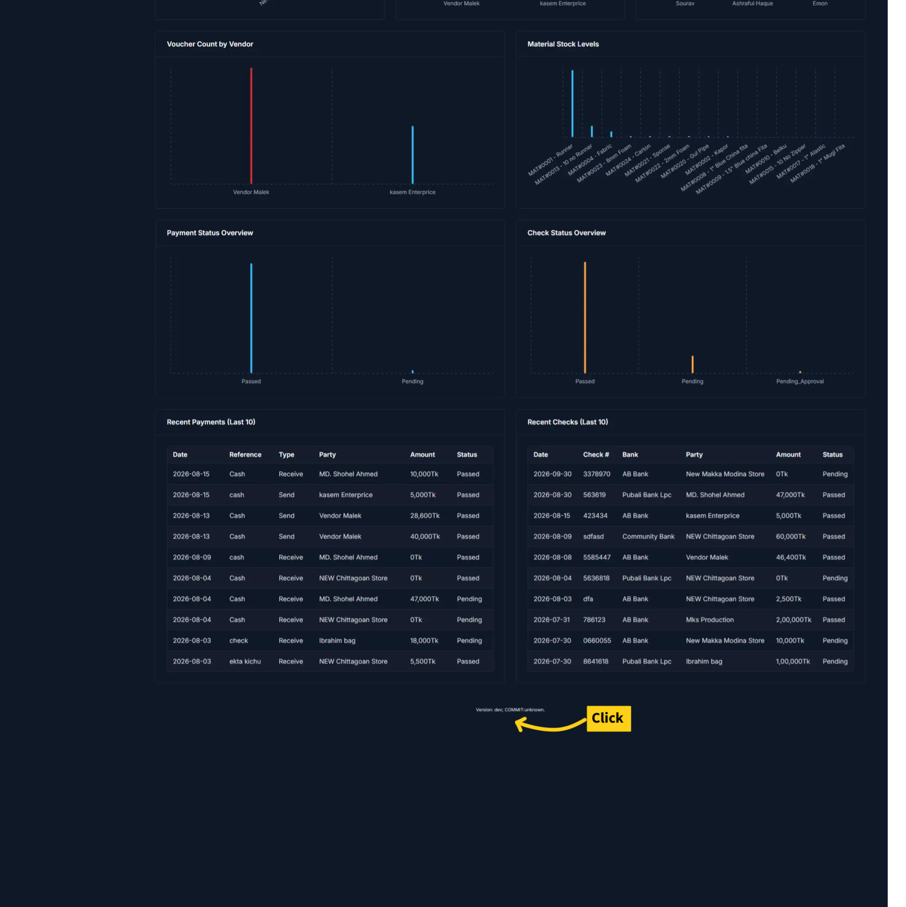
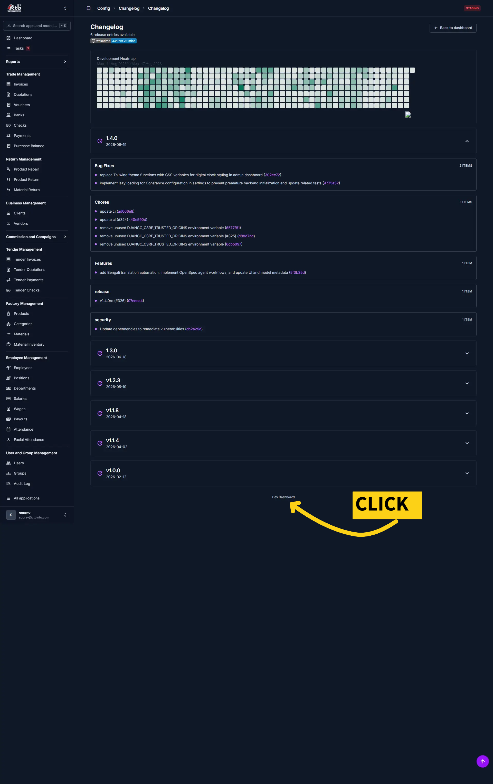
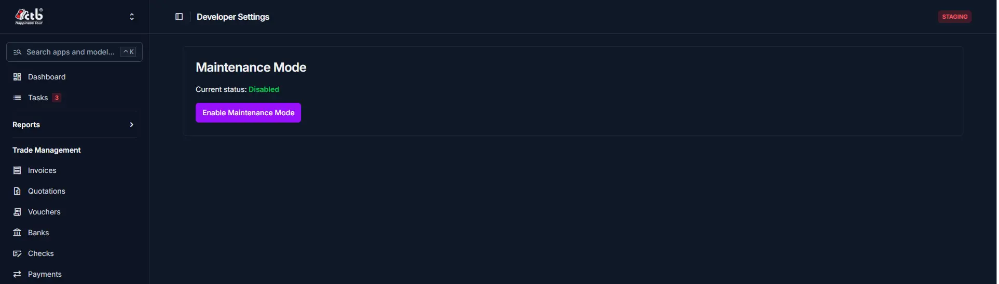

---
tags: [module:reference, task:troubleshoot, role:staff]
---

# Maintenance Mode
<!-- metadata: owner: admin, last_updated: 2026-08-17, git_ref: TBD, staging_verified: false -->

Maintenance Mode puts the entire application into a read-only, fake loading state so no user can continue working while maintenance is active.

_____________________________________________________________________

## Summary

Use this page to temporarily prevent all users from interacting with the system by showing a loading screen to every visitor. Maintenance Mode remains active until you disable it.

_____________________________________________________________________

## When to use this page

- When you must make short-term maintenance changes and want users to see the system as unavailable
- When you want a simple way to stop all user activity without performing a full deployment or shutting down services
- During demonstrations where you want the site to appear under maintenance to outside observers

_____________________________________________________________________

## How to access this page

1. Open the **Dashboard**.
1. Scroll down to the bottom of the Dashboard and click the marked link shown in the screenshot below — this is the first action that leads toward Developer Settings.

1. After clicking that link, follow the highlighted entry to open the Developer/Changelog area (second screenshot). From there, open the **Maintenance** page.

1. The Maintenance page shows the **Current status** and the **Maintenance Mode** button (third screenshot). Use that button to enable or disable the loading state.

_____________________________________________________________________

## Prerequisites & Role Permissions

- You must have access to the Maintenance page in CTB Admin. This page appears under the Developer or Settings area in the sidebar
- Keep a browser tab available where you can see and control the Maintenance page while the system is in Maintenance Mode

_____________________________________________________________________

## Step-by-step instructions

1. Open a new browser tab and sign in to CTB Admin if required
1. Go to the **Developer Settings** area and open the **Maintenance** page
1. Confirm the **Current status** shown at the top of the page (for example, `Disabled` when maintenance is not active)
1. Click the **Maintenance Mode** button to enable the loading state for all users
1. Keep this Maintenance page open in the tab you used so you can return to it to disable Maintenance Mode when maintenance is complete

_____________________________________________________________________

## Verification & Definition of Done

- Other users see a loading screen instead of the normal application pages
- You can confirm the behaviour by opening the application in a separate browser or in an incognito/private window and observing the loading state
- The Maintenance page shows the changed status (for example, `Enabled`) while the mode is active

_____________________________________________________________________

## Field reference

- **Current status** - Shows whether Maintenance Mode is `Enabled` or `Disabled`
- **Maintenance Mode** (button) - Toggles enabling or disabling the maintenance loading state. When enabled, the UI prevents all normal use until it is disabled again

_____________________________________________________________________

## Exception Handling & Error Recovery

| Symptom | Possible cause | Recovery steps |
| ------- | -------------- | -------------- |
| Cannot open Maintenance page | You do not have access or the page is not visible in your sidebar | Verify you are signed in and have the same account that can see Developer/Settings pages; try another browser or contact your administrator |
| Enabling does not appear to affect other users | Browser cache or you tested on the same session tab | Open the app in a separate browser or an incognito/private window to verify; ask a colleague to check from another machine |
| Unable to disable Maintenance Mode later | You closed the controlling tab or lost access | Reopen the Maintenance page with an account that has access and click the Maintenance Mode button to disable; if access is lost, contact an administrator who can open the page and disable the mode |

_____________________________________________________________________

## Related Workflows & Next Steps

- **[Dashboard](D:/CTB2025.docs/docs/user-guide/00-getting-started/dashboard.md)** — Return to the Dashboard after maintenance
- **[Login and Logout](D:/CTB2025.docs/docs/user-guide/00-getting-started/login-and-logout.md)** — Sign in and out when testing maintenance behaviour

