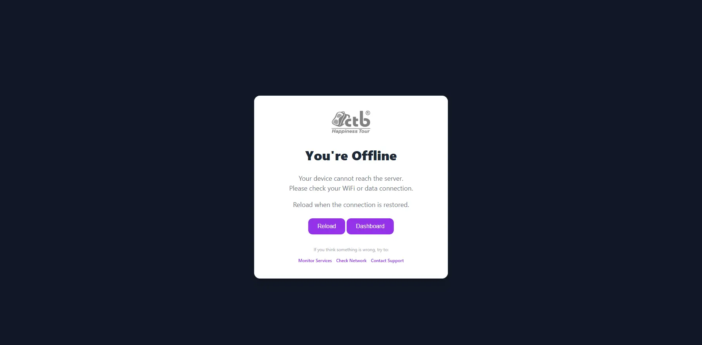
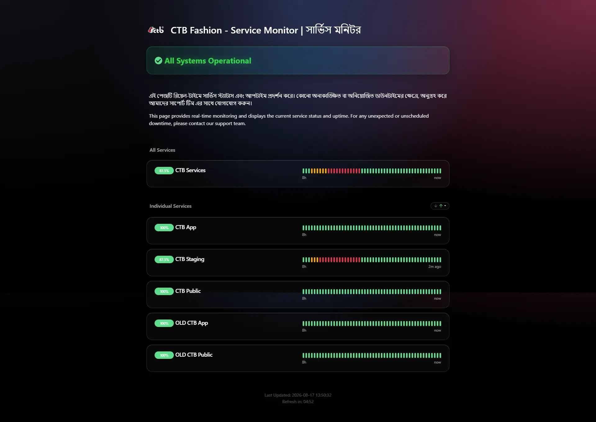
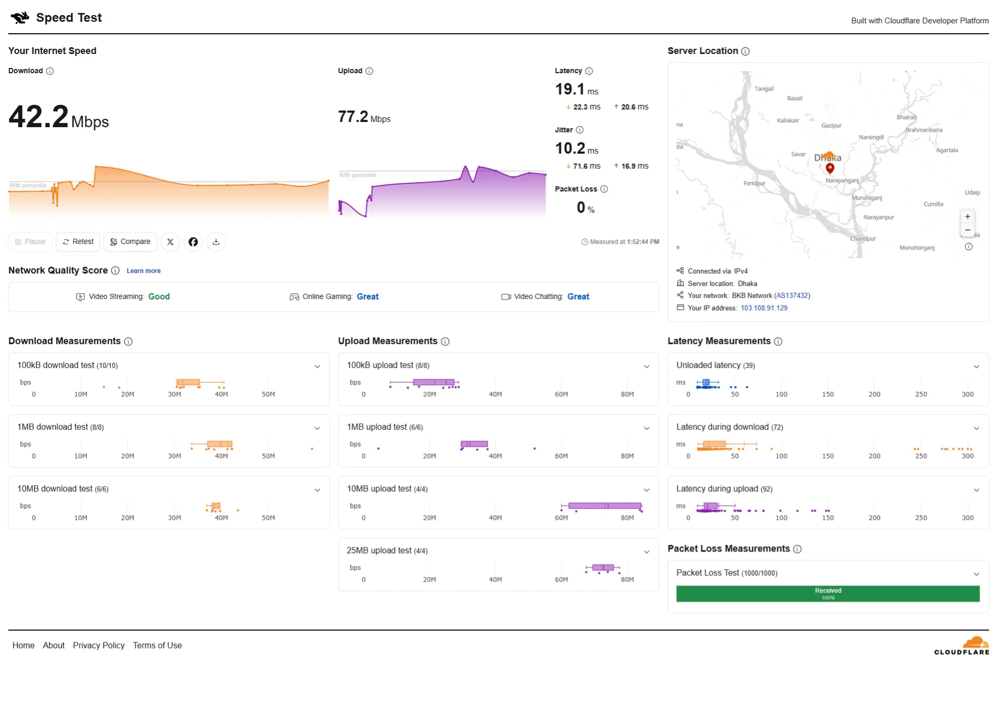

# Offline Mode

<!-- metadata: owner: staff, last_updated: 2026-07-26, git_ref: main, staging_verified: true -->

Learn how CTB Admin handles network disconnections and Service Worker caching.

## Summary

CTB Admin uses Progressive Web App (PWA) Service Worker caching to store visited documentation pages, stylesheets, scripts, and media files locally in your browser. During a network disconnection, users can continue browsing previously cached documentation pages offline.

______________________________________________________________________

## Offline fallback page actions

When an unvisited page is requested while the browser is offline, CTB Admin shows the offline fallback dialog. The dialog provides three quick actions to help diagnose and recover from the condition. Each action navigates to a diagnostic view — the screenshots below show the exact pages the user is taken to when selecting the corresponding action.

### Monitor Services

- Purpose: View platform-wide operational status and per-service timelines to identify outages or degradations.
- Action: Click **Monitor Services** in the offline dialog to open the public service status page.

*Service Monitor — real-time status and individual service timelines (click opens Service-Monitor.png).*

---

### Check Network

- Purpose: Run a network speed and packet-loss measurement to verify local connectivity, latency, and packet reliability.
- Action: Click **Check Network** in the offline dialog to open the network speed test page.

*Network Speed Test — download/upload throughput, latency, jitter, and packet loss graphs (click opens Internet-Speed-Test-Measure-Network-Performance.png).*

---

## Contact Support {#contact-support}

If the diagnostic actions do not resolve the problem, contact the CTB support team with the information below. When emailing support include: the page URL, timestamps, browser and OS, and a short description of what you were doing when the error occurred.

- Support Link: [help.dhakaiya.dev](http://help.dhakaiya.dev)(replace with your organisation's configured support address)
- Required information in the message:
  - Page URL and breadcrumb path
  - Local time and timezone when the error occurred
  - Any relevant screenshots or exported network test results

After sending the email, include the ticket reference number (if provided) when following up with your manager or IT team.

---

______________________________________________________________________

## Exception handling & error recovery

| Error Code / Symptom | Root Cause                                                     | Step-by-step remediation procedure                                                                                                                    | Actionable role required |
| -------------------- | -------------------------------------------------------------- | ----------------------------------------------------------------------------------------------------------------------------------------------------- | ------------------------ |
| Outdated content     | Browser Cache retains stale Service Worker asset bundle        | 1. Reconnect to the internet. 2. Perform a hard refresh (**Ctrl+F5** or **Cmd+Shift+R**). 3. Clear browser site cache if content remains stale. | `staff`                  |
| Fallback screen      | Attempted to access unvisited page while offline               | 1. Reconnect to active network. 2. Click link to download page to browser cache store.                                                             | `staff`                  |
| SW fails to register | Browser privacy settings block local storage / Service Workers | 1. Open browser settings. 2. Enable local site storage and Service Workers.                                                                        | `staff` / `admin`        |

______________________________________________________________________

## Related workflows & next steps

- **[Error Pages](error-pages.md)** — Diagnose standard HTTP status error screens.
- **[Troubleshooting Guide](troubleshooting.md)** — General browser and network resolution steps.

______________________________________________________________________

## Related pages

- **[Reference](../README.md)** — Glossary, error matrices, and shortcut guides.
