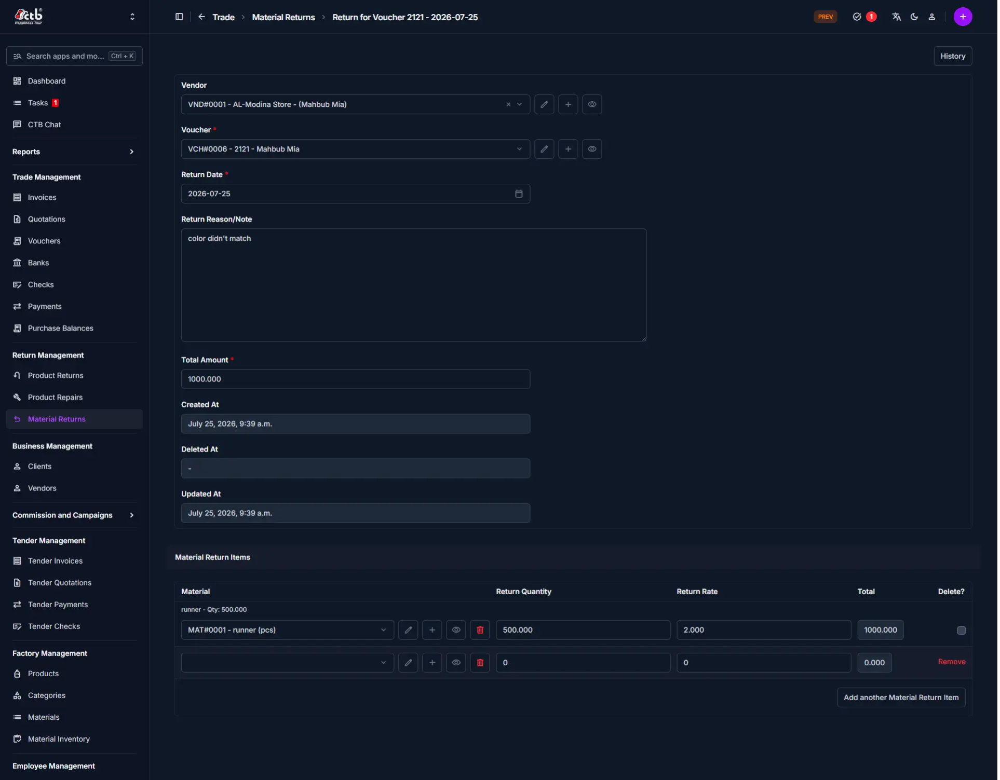

# Manage Material Returns

## Summary

Use this page to record and process returned raw materials. Material return records track vendor returns, return quantities, return rates, and the total amount for each return.

## When to use this page

- When you return raw materials to a vendor
- When you need to record a material return voucher
- When you adjust inventory for returned materials
- When you update vendor balances after a material return

## How to access this page

Open **Return Management → Material Returns** in the sidebar. On the Material Returns list page, click the **purple (+) icon** or **Add** to create a new record.

## Prerequisites

- Vendor records already exist in CTB Admin
- A return voucher may be required before saving
- Permission to create or edit material return records
  
_____________________________________________________________________

## Field reference

| Field                  | What to do                 | Description                                                                                                       |
| ---------------------- | -------------------------- | ----------------------------------------------------------------------------------------------------------------- |
| **Vendor**             | Select vendor              | The supplier returning raw materials                                                                              |
| **Voucher**            | Choose an existing voucher | Links the return to a return voucher or adjustment                                                                |
| **Return Date**        | Choose a date              | Date when the material return took place                                                                          |
| **Return Reason/Note** | Enter return note          | Reason or comment for the material return                                                                         |
| **Total Amount**       | Auto-calculated            | Automatically calculated as the sum of the Total column across all Material Return Items — no manual input needed |
| **Material**           | Select material            | The returned material item                                                                                        |
| **Return Quantity**    | Enter quantity             | Number of units returned                                                                                          |
| **Return Rate**        | Enter rate                 | Unit rate used to calculate the item amount                                                                       |
| **Total**              | Auto-calculated            | Automatically calculated as Return Quantity × Return Rate once both values are entered — no manual input needed   |
| **Created At**         | Read-only                  | Record creation timestamp                                                                                         |
| **Updated At**         | Read-only                  | Record update timestamp                                                                                           |
| **Deleted At**         | Read-only                  | Record deletion timestamp if deleted                                                                              |

- **Remove** — Click to delete a material return item row.
- **Add another Material Return Item** — Add a new item row for additional returned materials.

## Tips and common issues

- Add at least one material item before saving the record.
- Use the **Voucher** field to link the return to the correct purchase or adjustment.
- If the total does not update, recheck the **Return Quantity** and **Return Rate** values.
- Save the record before leaving the page to avoid losing entered data.

______________________________________________________________________

## Related pages

- **[Product Returns](product-returns.md)** — Manage returned finished goods.
- **[Return Management Module](README.md)** — Overview of return workflows.

