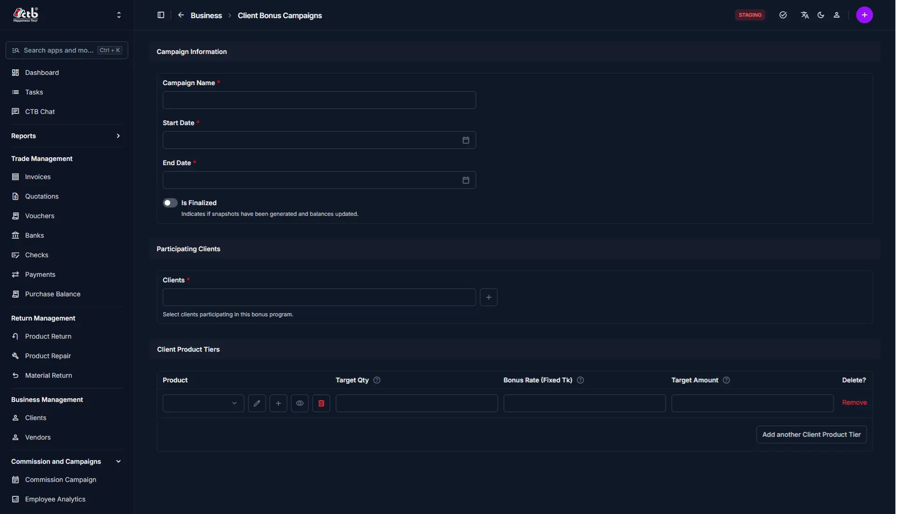

# Client Bonus Campaigns

## Summary

Use this page to create and manage client bonus campaigns, including campaign dates, participating clients, and product bonus tiers.

## When to use this page

- When you need to start a new client bonus campaign.
- When you want to add or remove clients from a bonus program.
- When you want to define product targets for a client campaign.
- When you want to finalize a campaign after the bonus period ends.

## How to access this page

Open **Commission and Campaigns → Client Bonus Campaigns** in the sidebar.

## Prerequisites

- You must have permission to manage bonus campaigns.
- Client records must exist before you can add them to a campaign.
- Products must exist before you can create client product tiers.

## Field reference

| **Field**                       | **What to do**          | **Description**                                                          |
| ------------------------------- | ----------------------- | ------------------------------------------------------------------------ |
| **Campaign Name**               | Enter a name            | Name of the client bonus campaign.                                       |
| **Start Date**                  | Choose a date           | First day of the bonus campaign period.                                  |
| **End Date**                    | Choose a date           | Last day of the bonus campaign period.                                   |
| **Is Finalized**                | Toggle on/off           | Marks the campaign as complete and ready for snapshot processing.        |
| **Clients**                     | Select clients          | Clients participating in the bonus program.                              |
| **Product**                     | Select a product        | Product included in the campaign bonus tier.                             |
| **Target Qty**                  | Enter a quantity        | Quantity target that qualifies the client for the bonus.                |
| **Bonus Rate (Fixed Tk)**       | Enter an amount         | Fixed bonus amount awarded per product unit.                             |
| **Target Amount**               | Enter a value           | Total bonus amount for the product tier.                                 |
| **Remove**                      | Click the action        | Delete a client product tier row from the campaign.                      |
| **Add another Client Product Tier** | Click the button     | Add a new product tier to the campaign.                                  |

!!! Tips and common issues

    - Finalize the campaign only after the client list and product tiers are correct.
    - Run **Process Expired Campaigns** after the end date to update campaign status.
    - Remove any empty product tier rows before saving.
    - Verify that the selected clients match the campaign incentives.

## Related pages

- **[Commission Campaigns](commission-campaigns.md)** — Create and manage employee and manager commission campaigns.
- **[Client Bonus Analytics](client-bonus-analytics.md)** — Review results and performance for client bonus campaigns.
